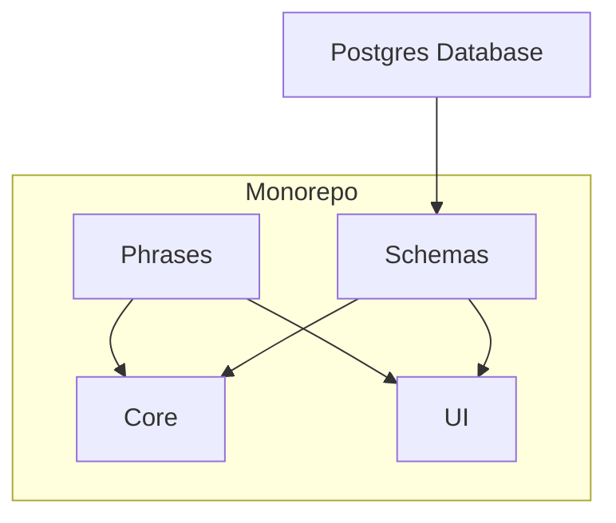

# TypeScript all-in-one: Monorepo with its pains and gains

## Intro

I always had a dream of monorepo.

I saw the monorepo approach while working for Airbnb, but it was for the frontend only. With a deep love of the JavaScript ecosystem and the “happy” TypeScript developing experience, I started to align frontend and backend code in the same language from ~three years ago. It was great (for hiring) but not that great for developing since our projects were still scattered across multiple repos.

{/* truncate */}

:::info FYI
There are quotes around the word “happy” since TypeScript did bring me a lot of fun and a-ha moments, but it also let me think “how could this doesn’t work” sometimes.
:::

As it says, “the best way of refactoring a project is to start a new one”. So when I was starting my startup about one year ago, I decided to use a total monorepo strategy: put frontend and backend projects, even database schemas, into one repo.

In this article, I won’t compare monorepo and polyrepo since it’s all about philosophy. Instead, I’ll focus on the building and evolving experience and assume you are familiar with the JS/TS ecosystem.

The final result is available on [GitHub](https://github.com/logto-io/logto).

## Why TypeScript?

Frankly speaking, I’m a fan of JavaScript and TypeScript. I love the compatibility of its flexibility and rigorousness: you can fall back to `unknown` or `any` (although we banned any form of `any` in our codebase), or use a super-strict lint rule set to align the code style across the team.

When we were talking about the concept of “fullstack” before, we usually imagine at least two ecosystems and programming languages: one for frontend and one for backend.

One day, I suddenly realized it could be simpler: Node.js is fast enough (believe me, in most cases, code quality is more important than running speed), TypeScript is mature enough (works well in big frontend projects), and the monorepo concept has been practiced by a bunch of famous teams (React, Babel, etc.) - so why don’t we combine all the code together, from frontend to backend? This can make engineers do the jobs without context switch in one repo and implement a complete feature in (almost) one language.

## Choosing package manager

As a developer, and as usual, I couldn’t wait to start coding. But this time, things were different.

The choice of the package manager is critical to the dev experience in a monorepo.

:::info 🔨 TL; DR
We chose lerna with pnpm.
:::

### The pain of inertia

It was July 2021. I started with `yarn@1.x` since I’ve been using it for a long time. Yarn was fast, but soon I met several issues with Yarn Workspaces. E.g., [not hoisting dependencies correctly](https://github.com/yarnpkg/yarn/issues/7572), and tons of issues are tagged with “[fixed in modern](https://github.com/yarnpkg/yarn/issues?q=label%3Afixed-in-modern+)”, which redirects me to the v2 ([berry](https://github.com/yarnpkg/berry)).

“Okay fine I’m upgrading now.” I stopped struggling with v1 and started to migrate. But the long [migration guide](https://yarnpkg.com/getting-started/migration) of berry frightened me, and I gave up after several failed tries.

### It just works

So the research about package managers began. I was absorbed by `pnpm` after a trial: fast as yarn, native monorepo support, similar commands to `npm`, hard links, etc. Most importantly, it just works. As a developer who wants to get started with a product but NOT develop a package manager, I just wanted to add some dependencies and start the project without knowing how a package manager works or any other fancy concepts.

Based on the same idea, we chose an old friend `lerna` for executing commands across the packages and publishing workspace packages.

:::info
Now pnpm has a -w option to run commands in the workspace root and --filter for filtering. Thus you can probably replace lerna with a more dedicated package publishing CLI.
:::

## Defining package scopes

It’s hard to clearly figure out the final scope of each package in the beginning. Just start with your best try according to the status quo, and remember you can always refactor during development.

Our [initial structure](https://github.com/logto-io/logto/tree/af7e6ccd83723d623555dafa4650e115fa795838/packages) contains four packages:

- `core`: the backend monolith service.
- `phrases`: i18n key → phrase resources.
- `schemas`: the database and shared TypeScript schemas.
- `ui`: a web SPA that interacts with `core`.

## Tech stack for fullstack

Since we are embracing the JavaScript ecosystem and using TypeScript as our main programming language, a lot of choices are straightforward (based on my preference 😊):

- `koajs` for the backend service (core): I had a hard experience using `async/await` in `express`, so I decided to use something with native support.
- `i18next/react-i18next` for i18n (phrases/ui): like its simplicity of APIs and good TypeScript support.
- `react` for SPA (ui): Just personal preference.

### How about schemas?

Something is still missing here: database system and schema &lt;-&gt; TypeScript definition mapping.

#### General v.s. opinionated

At that point, I tried two popular approaches:

- Use ORM with a lot of decorators.
- Use a query builder like Knex.js.

But both of them produce a strange feeling during previous development:

- For ORM: I’m not a fan of decorators, and another abstract layer of the database causes more learning effort and uncertainty for the team.
- For query builder: It’s like writing SQL with some restrictions (in a good way), but it’s not actual SQL. Thus we need to use `.raw()` for raw queries in many scenarios.

Then I saw this article: “[Stop using Knex.js: Using SQL query builder is an anti-pattern](https://gajus.medium.com/stop-using-knex-js-and-earn-30-bf410349856c)”. The title looks aggressive, but the content is great. It strongly reminds me that “SQL is a programming language”, and I realized I could write SQL directly (just like CSS, how could I miss this!) to leverage the native language and database features instead of adding another layer and reducing the power.

In conclusion, I decided to stick with Postgres and [Slonik](https://github.com/gajus/slonik) (an open-source Postgres client), as the article states:

> …the benefit of allowing user to choose between the different database dialects is marginal and the overhead of developing for multiple databases at once is significant.

#### SQL &lt;-&gt; TypeScript

Another advantage of writing SQL is we can easily use it as the single source of truth of TypeScript definitions. I wrote a [code generator](https://github.com/logto-io/logto/tree/af7e6ccd83723d623555dafa4650e115fa795838/packages/schemas/src/gen) to transpile SQL schemas to TypeScript code that we’ll use in our backend, and the result looks not bad:

```tsx
// THIS IS AN AUTOGENERATED FILE. DO NOT EDIT THIS FILE DIRECTLY.

import { OidcClientMetadata } from '../foundations';

export type OidcClient = {
  clientId: string;
  metadata: OidcClientMetadata;
  createdAt: number;
};
// ...
```

We can even connect `jsonb` with a TypeScript type and process type validation in the backend service if needed.

:::note 🤔 Why not use TypeScript as the SSOT?
It’s a plan I’ve thought of. It sounds attractive initially, but SQL will precisely describe database schemas and keep the flow in one direction (see the following section) instead of using TypeScript and then “transpile back” to SQL.
:::

### Result

The final dependency structure looks like:



You may notice it’s a one-direction diagram, which greatly helped us to keep a clear architecture and the ability to expand while the project grows. Plus, the code is (basically) all in TypeScript.

## Dev experience

### Package and config sharing

#### Internal dependencies

`pnpm` and `lerna` are doing an awesome job on internal workspace dependencies. We use the command below in the project root to add sibling packages:

```bash
lerna add --scope=@logto/core @logto/schemas
```

It will add `@logto/schemas` as a dependency to `@logto/core`. While keeping the semantic version in `package.json` of your internal dependencies, `pnpm` can also correctly link them in `pnpm-lock.yaml`. The result will look like this:

```json
// packages/core/pacakge.json
{
  "dependencies": {
    "@logto/schemas": "^1.0.0-beta.3"
  }
}
```

```yaml
# pnpm-lock.yaml
packages/core:
  dependencies:
    '@logto/schemas': link:../schemas
```

#### Config sharing

We treat every package in monorepo “independent”. Thus we can use the standard approach for config sharing, which covers `tsconfig`, `eslintConfig`, `prettier`, `stlyelint`, and `jest-config`. See [this project](https://github.com/logto-io/logto/tree/6327eb6c577cdf36c8f44b55bac8195f7d6a6335/packages/console) for example.

### Code, lint, and commit

I use VSCode for daily development, and in short, nothing is different when the project is configured properly:

- ESLint and Stylelint work normally.
    - If you are using VSCode ESLint plugin, add the VSCode settings below to make it honors the per-package ESLint config (replace the value of `pattern` with your own):
    
    ```json
    {
    	"eslint.workingDirectories": [
    	  {
    	    "pattern": "./packages/*"
    	  }
    	]
    }
    ```
    
- husky, commitlint, and lint-staged work as expected.

### Compiler and proxy

We are using different compilers for frontend and backend: `parceljs` for UI (React) and `tsc` for all other pure TypeScript packages. I strongly recommend you to try `parceljs` if you haven’t. It’s a real “zero-config” compiler that gracefully handles different file types.

Parcel hosts its own frontend dev server, and the production output is just static files. Since we’d like to mount APIs and SPA under the same origin to avoid CORS issues, the strategy below works:

- In dev environment, use a simple HTTP proxy to redirect the traffic to the Parcel dev server.
- In production, serve static files directly.

You can find the frontend middleware function implementation [here](https://github.com/logto-io/logto/blob/6327eb6c577cdf36c8f44b55bac8195f7d6a6335/packages/core/src/middleware/koa-spa-proxy.ts).

### Watch mode

We have a `dev` script in `package.json` for each package that watches the file changes and re-compile when needed. Thanks to `lerna`, things become easy using `lerna exec` to run package scripts in parallel. The root script will look like this:

```yaml
"dev": "lerna --scope=@logto/{core,phrases,schemas,ui} exec -- pnpm dev"
```

### Summary

Ideally, only two steps for a new engineer/contributor to get started:

1. Clone the repo
2. `pnpm i && pnpm dev`

## Closing notes

Our team has been developing under this approach for one year, and we are pretty happy with it. Visit our [GitHub repo](https://github.com/logto-io/logto) to see the latest shape of the project. To wrap up:

**Pains**

- Need to be familiar with the JS/TS ecosystem
- Need to choose the right package manager
- Require some additional one-time setup

**Gains**

- Develop and maintain the whole project in one repo
- Simplified coding skill requirements
- Shared code styles, schemas, phrases, and utilities
- Improved communication efficiency
    - No more questions like: What’s the API definition?
    - All engineers are talking in the same programming language
- CI/CD with ease
    - Use the same toolchain for building, testing, and publishing

This article remains several topics uncovered: Setting up the repo from scratch, adding a new package, leveraging GitHub Actions for CI/CD, etc. It’ll be too long for this article if I expand each of them. Feel free to comment and let me know which topic you’d like to see in the future.
