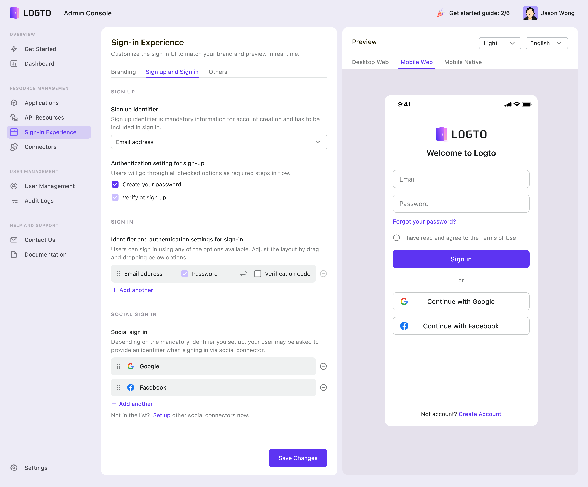
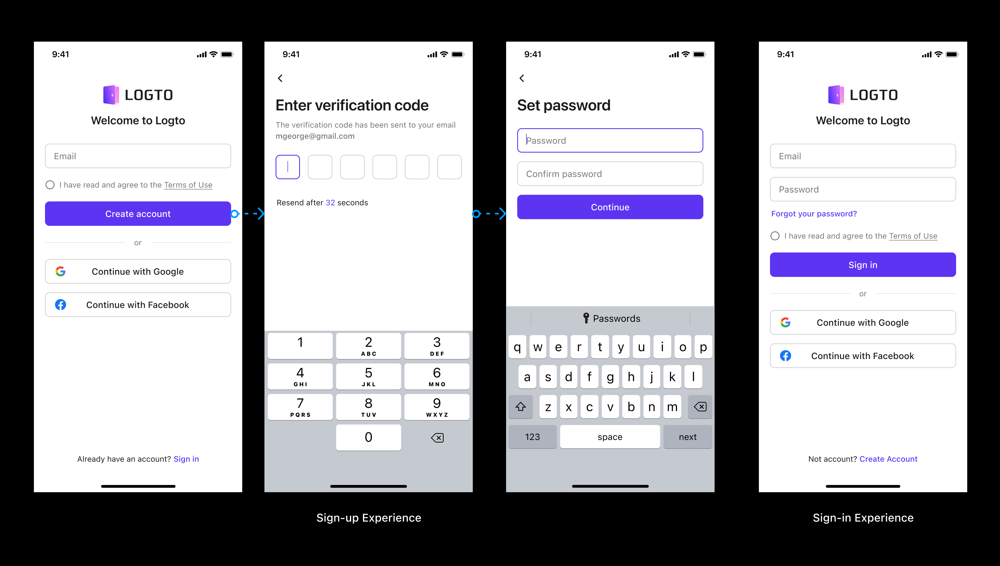
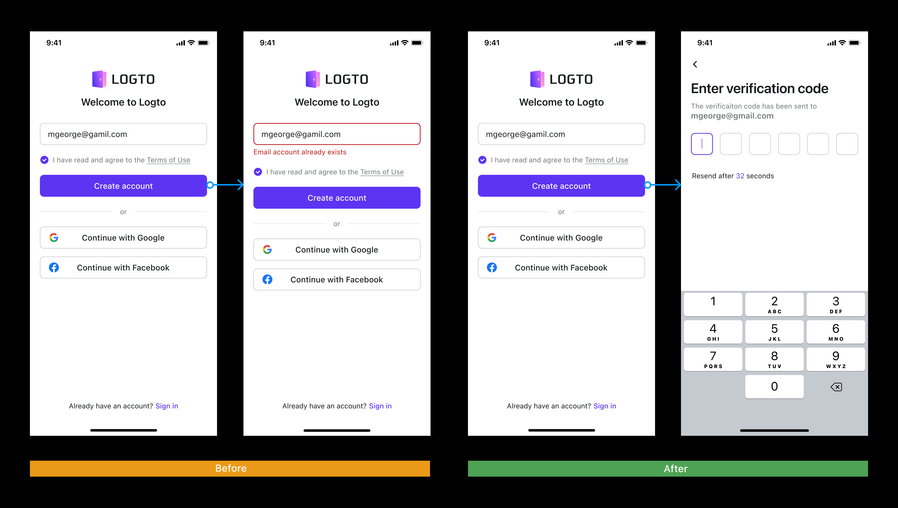
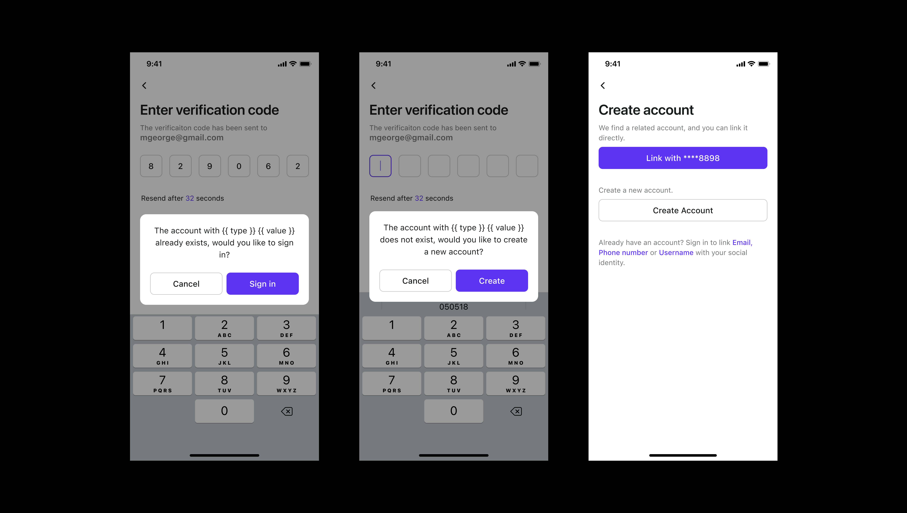
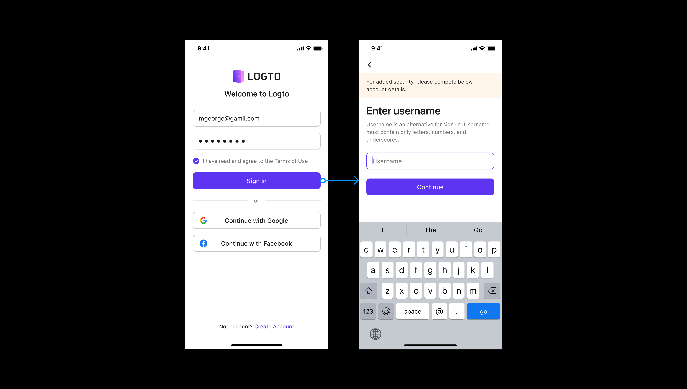

import architecture from './architecture.png';

# The design considerations for a seamless sign-in experience (First Chapter)

We are thrilled to announce the release of the newest version of the Sign-in Experience, which includes more ways to sign-in and sign-up, as well as a framework that is easier to understand and more flexible to configure in the Admin Console. When compared to Sign-in Experience V1, this version's capability was expanded so that it could support a greater variety of flexible use cases. We hope that this will be able to assist developers in delivering a successful sign-in flow, which will also be appreciated by the end users.

<!--truncate-->

In this article, we'll go over the history of Sign-in Experience, including its conception, design decisions, and product tradeoffs. You will also gain a better grasp of how to construct a successful and frictionless sign-in or sign-up experience.

If you're unfamiliar with Logto, let me back up a bit and define it, as well as the connection between Logto and the Sign-in Experience.

As an OIDC-based identity service, Logto is available as open source software allowing professionals, groups, and companies to set up the necessary sign-in and identity infrastructure in a matter of minutes.

  

    
  

  

    <i>Our portfolio and key components of Logto</i>
  

Providing a straightforward sign-up process forms one of our top priorities. The sign-in process can be quickly customized by developers using the Admin Console without the need for any custom coding.

## Why do we design an end-to-end Sign-in Experience?

We saw a lot of challenges and problems in the market before we started Logto, and that's why we spent tonnes of time researching and talking to customers, developers, and businesses that were having trouble with their sign-up processes.

### Painpoints

#### Developer, Team (Builders)

Creating a smooth sign-up process is a mundane but intricate endeavor. Tasks like composing 0-1 front-end code and ensuring platform consistency is a challenging problem. Unfortunately, this problem is exacerbated for the early-stage startup or for individual developers because there is no professional design or product team to help them. If developers didn't have to deal with and manage the chore, they could put more effort into the main product and other impactful priorities.

#### Business stakeholders

A self-serve Sign-up flow is a standard tactic for user acquisition. It takes into account the requirements of multiple disciplines and data growth. Building a Sign-in and sign-up process that has everyone happy requires a lot of back-and-forth because of all the decisions that need to be made.

#### End customers

Quick and smooth is the key and a single blocker can ruin the whole game. For example, multiple unnecessary accounts, blocked by terribly designed flow are definitely huge concerns for the end users. Security and privacy are seriously taken care of too. An untrusted flow or sign-in UI can prevent users from moving forwards and end up dropping off the product.

#### Similar solutions in the market

We're not naive; we know there are other open-source sign-in flow solutions out there. However,
few authentication and identification options are supported.

- Their user interface lacks polish and personalization and neglects user experience and accessibility.
- The latest trends, such as supporting localization and a "dark mode," are rarely implemented.
- There is a lack of end-user testing and verification of the entire process.
- There are only a handful of industry-tested solutions, and they are prohibitively expensive, making them unattainable for most individuals, small teams, and startups.

Furthermore, the final user experience between consumer-facing apps and B2B SaaS products is very different. Focusing on customer identity first and being business and industry-agnostic — taking on the Sign-in Experience happening in our daily lives, such as e-commerce, food delivery, and entertainment — is important to us because it will allow us to make an accessible product and build the strong foundation step by step. In the meantime, think ahead and keep exploring extensive user cases of sign-in for different verticals that can be simply applied to many types of businesses in the near future.

With that in mind, we aim to make this step so easy that even those with no prior experience with programming may set up a self-serve sign-up process. Logto V1 was released in July 2022 and has since had a lot of positive feedback from users all across the world, helping us reach 4.4k stars in just two months with limited promotional resources. This motivates us to keep going! It was important to us to make sure that our global audience could use our service, therefore we added support for additional sign-in methods in version 2. Compare Version 1 to Version 2 and see what we backed first.

## Our solutions so far

_Logto Sign-in Experience v2 Preview_

Now that you know what we brought to the table in V2, let's examine the road we took to get there and the backstory that led us here.

## Modularize Sign-in Experience like LEGO blocks, atomic but scalable

Our difficulty as an open-source project is that Logto should be flexible enough to meet the needs of developers working on a wide range of products and with varying degrees of customization. That said, our product might inevitably become a complex monster devoid of special opinions if we aim to cover every possible circumstance.

Our strategic solution to the above is to base ourselves in the actual world while approaching Sign-in Experience as though it were a LEGO set—individual pieces that may be combined to become something larger.

As a first step, we surveyed the login procedures of over a hundred apps in various industries and held one-on-one discussions with app creators and end users in the Logto Discord Community. We organized the product challenges into four pillars after considering many viewpoints; they are also the most common issues encountered by construction professionals.

- Define methods
- Design an ideal flow
- Guided by UX strategies
- Customize the look and feel

The market's validation of usage frequency and popularity was used to determine the priority of certain features under each pillar.

We seek to provide the best practices within the scope of fundamental functions (both universal and extensible), bridge the gap between scenarios, and make it easy for developers to grasp Admin Console's complicated logic in the critical 0-1 window. Whether a developer is highly experimental and has no ideas at all, or highly targeted and has a precise UI design in hand, Sign-in Experience may be configured seamlessly in any case.

So, let's take a closer look at these four cornerstones:

### Step 1: Define methods

We break down the example sign-in into four categories: identifier, authentication factor, third-party connector, and personal information. Components like these make up the sign-in process for thousands of users. The final user experience, however, varies widely depending on the specifics of each situation. There are benefits to each approach; developers should consider their needs before settling on one.

#### Identifier

Let's first take a look at the popular identifiers and their pros and cons:

<table>
  <tbody>
    <tr>
      <td>
        <b>Username</b>
      </td>
      <td>
        

          A user's username is frequently disclosed anonymously as a unique identifier. It is
          appropriate for social products such as content, games, instant messaging, and so on. It
          can be configured by the user or selected by the system.
        

        

          When registering, a username can be used in conjunction with an email address or a phone
          number to offer users one more reminder information. A username is also a secure
          identifier that does not reveal too much personal information.
        

      </td>
    </tr>
    <tr>
      <td>
        <b>Email</b>
      </td>
      <td>
        

          In the long run, users can simply recall their email addresses, and there are no device
          restrictions for getting verification emails. Subscriptions or win-back campaigns can also
          be sent to users' email addresses for marketing objectives.
        

      </td>
    </tr>
    <tr>
      <td>
        <b>Phone</b>
      </td>
      <td>
        

          The use of a phone number as an identity is more mobile and accessible to the elderly. Its
          advantages include real-name authentication, timely interaction with the user, and access
          to the user's contacts list for connection.
        

        

          However, there are issues like changing mobile phone numbers, using used numbers, leaking
          contact information, and requiring devices to be present while signing in or signing up.
        

      </td>
    </tr>
  </tbody>
</table>

#### Authentication Factor

<table>
  <tbody>
    <tr>
      <td>
        <b>Password</b>
      </td>
      <td>
        

          Password sign-in is convenient, but users sometimes forget it. Low-complexity password is
          at risk of theft.
        

      </td>
    </tr>
    <tr>
      <td>
        <b>Email verification</b>
      </td>
      <td>
        

          Email Verification Codes or Magic links are the most popular ways for verification. It has
          higher security but is cheaper than SMS.
        

      </td>
    </tr>
    <tr>
      <td>
        <b>SMS</b>
      </td>
      <td>
        

          SMS is also more secure. The autofill feature of the keyboard facilitates mobile input.
          However, it may result in additional SMS charges.
        

      </td>
    </tr>
  </tbody>
</table>

#### Third-party connector

<table>
  <tbody>
    <tr>
      <td>
        <b>Social Connector</b>
      </td>
      <td>
        

          According to Google Account and Facebook data, implementing Social Sign-in can strengthen
          the acquisition funnel and raise registration rates. Users may sign in with a single
          click, synchronize personal information with a more convenient and confident sense, and
          avoid forgetting passwords or email addresses used to sign up.
        

        

          The drawback is that third-party service quality and product life will limit the Sign-in
          Experience. If the social connector does not give trustworthy contact information, the
          user must provide the necessary contact information; otherwise, the user cannot be
          contacted.
        

      </td>
    </tr>
  </tbody>
</table>

#### Personal information

<table>
  <tbody>
    <tr>
      <td>
        <b>Personal information</b>
      </td>
      <td>
        

          Contact information, name, gender, age, region, address, user preferences, and other
          personal information provided by users can be used for display, account recovery,
          personalized recommendations, product data analysis, and other purposes. It is a standard
          affiliate and business-neutral component of the sign-up process.
        

      </td>
    </tr>
  </tbody>
</table>

### Step 2: Design an ideal flow

**What does flow mean in Sign-in Experience？**

There is more to the Sign-in Experience than just the layout. The layout is simple, and a preview may be seen on the left while you work on it. In this context, "flow" refers to the entire sign-up process that a user would go through. We intend to handle the entire trip, which has traditionally been a difficult job for developers.

**Atomized the flow**

Developers can utilize the Logto Sign-in Experience in a flexible manner by breaking down the full process into its component parts. With this mental modal, you will then develop a mindmap like below, which is all you need to consider when you design an end-to-end sign-in experience for your end customer.

**Standardized the flow and guard by carefully considered product logic**

To establish the framework, we have to provide the best practice for each individual flow mentioned above. Those best practices were based on well-considered product logic, user-center design principles, and business objectives. We keep generality and inclusiveness at the same time.

A lot of Logto competitor treats the flow like an easy permutation and combination task but it is definitely not true. Let’s talk about the constraints and laws between them:

1. **Sign in ≠ Create Account**

Methods of sign-in and registration are neither equal nor inclusive. Some programs, for example, request "Email+Password+Email Verification code" when signing up but only support "Email+Password" as a sign-in method.

In another case, requiring to enter a username when registering, but there is no option for Username sign-in.

Distinct scenarios have different goals, resulting in various product logic. We will not only examine the variety of logic but also delve deeper into why. In summary, the difference between creating an account and sign-in is listed below:

<table>
  <thead>
    <tr>
      <td></td>
      <td>
        <b>Purpose</b>
      </td>
      <td>
        <b>Flow</b>
      </td>
    </tr>
  </thead>
  <tbody>
    <tr>
      <td>
        <b>Create account</b>
      </td>
      <td>
        

          The purpose of creating an account is to ask consumers for identifying information while
          also acquiring users with the least amount of effort from a commercial standpoint.
        

        

          There is a trade-off between doing the fewest steps and gathering more information from
          end users. Fewer steps indicate higher conversion rates, but they may result in
          low-quality targeted users and leads, which could harm future customer support and product
          growth.
        

        
Simultaneously, the registration rate might be increased.

      </td>
      <td>
        

          Between various IDs, the logic is "and." Because this is a product requirement, consumers
          must fill all of them at the same time (some factors can be skipped).
        

        

          There is just one exception, "Phone or Email," because consumers validating two pieces of
          contact information at the same time is time-consuming and unneeded.
        

      </td>
    </tr>
    <tr>
      <td>
        <b>Sign in</b>
      </td>
      <td>
        

          Sign-purpose is to allow users to access the product quickly, securely, and successfully.
        

      </td>
      <td>
        

          Between various IDs, the logic is "or." That implies consumers can use whichever sign-in
          technique they like. The less complicated, the better. (Multi-factor authentication
          instances are excluded here)
        

      </td>
    </tr>
  </tbody>
</table>

2. **Sign in + Create an account ≤ Profile**

All sign-in and registration information is stored in a profile. However, don't feel rushed to obtain all of the information during registration. Allow users to register successfully first and then access user information incrementally in specified instances. The contact information that the user enters proactively in the Profile may be used in the sign-in procedures. As a result, sign-in methods may be more than just sign-up methods.

1. **Restrictions between Sign-in, Registration, and Authentication Factors, for example:**

- If password is used as an authentication factor → sign-in should support it as well, and all other identifiers must support password as well. We don't want consumers to complete pointless efforts or to disregard their security intentions while registering. The fact that a password is necessary for sign-up with a username but not for email or phone password sign-in makes no sense and confuses the user.
- If users enabled multiple identifiers during registration, such as email or phone number, both of those identifiers must be available for sign-in. For example, if a person signs up using their email address but only founds phone number sign-in option, they will be unable to use the product in the end.
- A password is necessary if the username is the only identifier used during registration. This is owing to the limitations and characteristics of using a username as an identifier.

### Step 3: Guide by UX design strategies

Logto delivers flows that are governed by a few end-user-centered tactics to enable the finest end-user experience. You can get a sense of what we insist on in terms of UX design by looking at the examples below.

- **Security first**

  Security is unquestionably crucial in terms of sign-in experience and user identity. We took this approach seriously and put it into action. For example, when a user wants to verify an email address, we only alert the user that the account already exists until the user enters the verification code and verifies. In this strategy, we prevent someone from hacking a list of emails that do not exist.

  

- **Anticipate user needs and avoid meaningless attempts**

  This is done to prevent pointless efforts at creating a successful outcome. The login process is convoluted and full of edge cases. When an account is found, for instance, the user is prompted to log in. When a person attempts to sign in and their account already does not exist, we will ask them if they would want to create an account.

  This foresight allows customers to get up and running with the product with minimal delay.

  

- **Consider account upgrades**

  Account upgrades may also result in a change in the sign-in or sign-up flow. This will also have an influence on our end-user engagement. This scenario should also be considered. For example, if the administrator makes some modifications and adds new sign-in methods in the admin dashboard, existing end users will be required to sign in to the app.

  

- **Making the choice easier for users**

  For example, we advise developers not to use too many social sign-in methods and if they are too many they will be hidden in another view because this would result in a poorer conversion. We don't include everything equally in the UI layout of the sign-in experience, but we do have a focus. This is to adhere to general design principles of usability and a better acquisition approach. At the same time, this is done to reduce users’ cognitive load.

### Step 4: Brand and look and feel

Last but not least, we provide users with lots of flexibility to customize their look and feel.

- Modification of Brand elements, such as the selection of theme color, the replacement of a logo image, changes to component settings, and the selection of standard layouts, can all be accomplished with just one click when working with developers.
- Maintain as much uniformity as possible across all multi-end design plans in order to make it easier for developers to intuitively comprehend and adjust UI. Mobile and web, for instance, use layouts, processes, components, and styles that are equivalent to one another.
- In comparison to more conventional business tools, we put in a lot of work to ensure that the design is elegant. We came up with the formulas for calculating the brand colors, the dark mode, the internationalization of languages, and the barrier-free strategy.

## Closing notes

Thank you for spending time reading about our Logto Sign-in Experience. You might have the following questions:

1. How can this be accomplished with the least amount of work in Logto Admin Console?
2. How does your configuration experience vary from existing market solutions? Why is it the greatest option for my company?
3. How can the success of sign-ups be measured from a business standpoint? Have you thought about it yet?
4. What is Logto’s upcoming plan for supporting you and your product?
