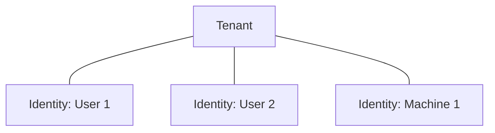
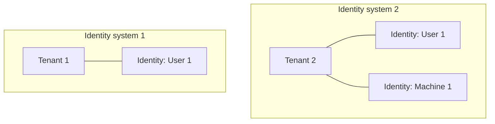
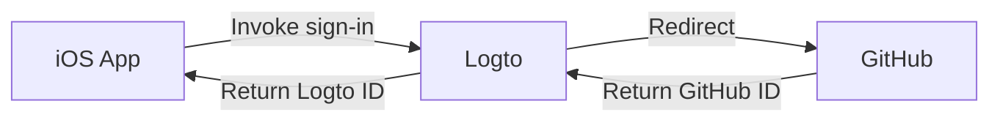
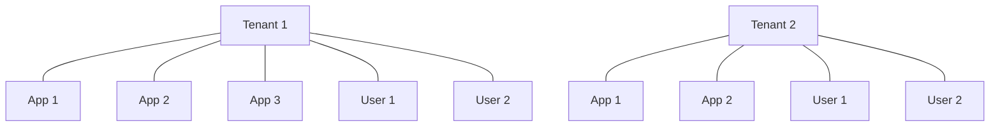
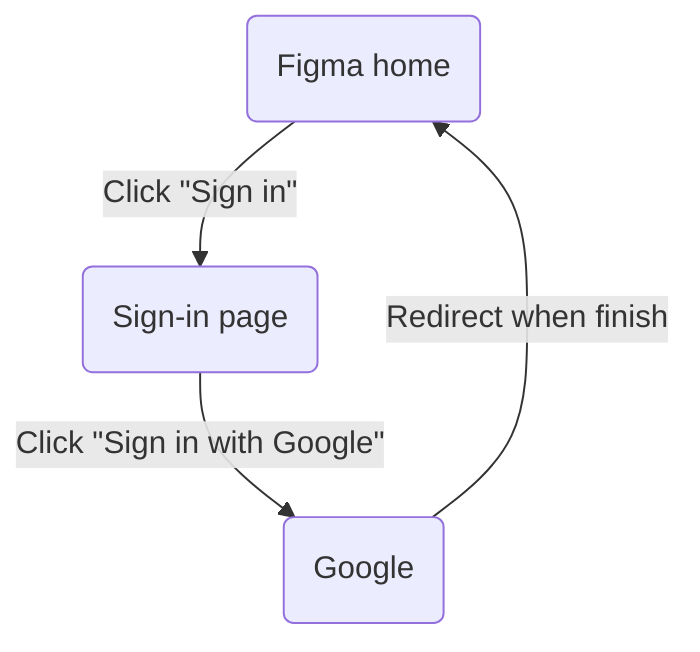
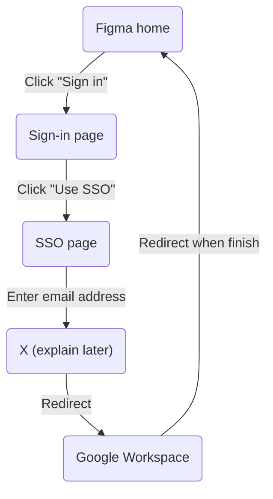
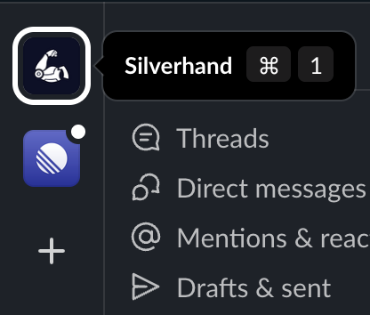

# CIAM 101: Authentication, Identity, SSO

## Background

I began the build Logto because I noticed that Identity and Access Management (IAM) had become increasingly complex and expansive over time. The concept of IAM is even large enough to give rise to new concepts, such as WIAM (Workforce IAM) and CIAM (Customer IAM).

While WIAM and CIAM share the same foundation, they have distinct use cases: WIAM is typically used for internal users, while CIAM is used for external customers.<!--truncate--> Some examples:

- **WIAM** Your company has a unified identity system for employees, thus every one can use the same account to access company resources, such as software subscriptions, cloud computing services, etc.
- **CIAM** Your online bookstore requires a user identity system for customers and sellers. The sign-in experience is a critical part of onboarding, as it is located at the top of the conversion funnel.

Logto started with the CIAM for various reasons (we’ll have another article talking about this). During development, we realized that building a unified understanding across the team would be beneficial before taking our product to the next level. We hope this will also help you gain a better grasp of the IAM landscape.

Let’s get started!

## The basics of CIAM

:::info
Regardless of their differences, WIAM and CIAM both have the same foundation: authentication and authorization. These two concepts are at the core of their features.
:::

In this article, we'll focus on the fundamental concepts of CIAM and problems we may meet during or after the authentication flow. We’ll also discuss Single Sign-On (SSO) and its related scenarios.

### Authentication and authorization

:::info Definition
- Authentication (AuthN) answers the question “Who are you?”
- Authorization (AuthZ) answers the question “What can you do?”
:::

If you discover something that does not fit into either of these two categories, it is likely not essential to the identity business.

- **Examples for authentication**
  - Password sign-in, passwordless sign-in, social sign-in, etc.
  - Machine-to-Machine authentication
- **Examples for authorization**
  - Role-based Access Control
  - Attribute-based Access Control
- **Examples for exceptions**
  - Non-identity data
  - Web hooks

### Identity and Tenant

Identity typically represents either a user or a machine. Upon successful authentication, an ID Token is issued as an Identity.

In other words, the main purpose of authentication is to obtain an Identity.

A Tenant is a group of identities:

When we discuss "Multi-tenant", we are referring to multiple Logto instances that are identity-isolated from one another. In other words, multiple Logto instances.

Note it has two **isolated** identity systems, i.e. you cannot use the Identity of Tenant 1 in Tenant 2, even for the same identifier (email,  phone, etc.). It's like your Costco membership not being valid at Whole Foods.

:::info
🧱 In short, there are “physical walls” between Tenants.
:::

:::note
The definition of "Tenant" varies across CIAM products. Some refer to the term "Organization" in Logto, which will be introduced later.
:::

### App and Tenant

Just like Identity, an App also belongs to a Tenant. Several things to remember:

- There is typically no direct relationship between an App and an Identity.
    - An Identity can represent an App, but there is no direct connection between them.
- Like users, apps are also Tenant-level.
- Apps are code, while users are human.
- The sole purpose of Apps are to complete authentication, i.e. to obtain an Identity.

### Identity Provider (IdP) and Service Provider (SP)

The difference between these two providers is tricky but important.

- **Identity Provider** is a service that provides authentication (AuthN) and issues identities.

You can find various explanations about Service Provider from Google, though they may not be satisfactory. In my mind, Service Provider is a relative concept:

- **Service Provider (or Relying Party in [OIDC](https://openid.net/specs/openid-connect-core-1_0.html))** is a service or client that initiates authentication (AuthN) and requests the result from Identity Providers.

#### Quiz

Consider a typical social sign-in scenario:

**❓ How many Service Providers and Identity Providers in this graph?**

Answer

    
Both have two.
iOS App is a service provider to Logto, while Logto is an identity provider.
Logto is also a service provider to GitHub, while GitHub is an identity provider.
Thus, Logto is a Service Provider also a Identity Provider.

## Case study: A tech solution company

You are a CTO of a tech solution company, you have over 100 business partners and you have delivered over 300 projects.

- Each project is either a web app or a mobile app with a backend service.
- For each business partner, you want to refactor the user system to provide SSO across its projects.

**❓ How can Logto (or a CIAM product) help?**

Answer

    
Create a Logto instance for each business partner. Each partner holds a Tenant. Projects are mapped to "Apps" in Logto.

Logto offers a universal sign-in experience (i.e. SSO) within a Tenant, so users don’t need to sign in again when accessing another app in the same Tenant if they already signed in.

## What we talk about when we talk about SSO

We found the term “SSO” often causes confusion. We consider Single Sign-On(In) to be a behavior, not a business concept. Therefore, SSO does not equate to “SSO in WIAM”.

When we say “it needs SSO”, it can refer to one of the following cases:

### SSO Case 1

> 👉🏽 In a big corp, employees use the same credentials to sign in to all company-licensed resources (e.g. email, IM, cloud services).

It is the typical WIAM scenario. In this case, only one Identity Provider is involved. We don’t care for now.

### SSO Case 2

> 👉🏽 End-users use the same credentials to sign in to all services developed by the same company (e.g. GSuite).

Logto is currently focusing on the approach outlined above. Multiple external identity providers, such as a third-party social sign-in provider, may exist independently and without connection.

Despite this, Logto remains the single source of truth for Identities, simply "borrowing" them from other providers. In this case, Logto acts as both an Identity Provider (to GSuite apps) and a Service Provider (to external Identity Providers).

### SSO Case 3

> 👉🏽 End-users can only use the specific Identity Provider within the corresponding email domain to complete authentication. For example, signing in to Figma with Google Workspace.

This is the most common use case for SSO in CIAM. Let’s take a closer look.

If we want to sign in to Figma using our @silverhand.io email, we can use either Social sign-in or SSO. The figures below illustrate the difference between the two:

*Social sign-in*

*SSO*

In words:

- After social sign-in, users are free to set a password or change the email address in Figma
- After SSO, users cannot set password or change any personal info including email address, since their Identities are managed by Google Workspace

In this case, Logto is both an Identity Provider and a Service Provider. It appears that SSO is more complex than a normal sign-in process. What are the benefits for the identity owner?

- **Centralized control:** Keep identity information and authentication processes in one place, and ensure user information is always up-to-date. There is no need to add and remove licenses across different applications for changes.
- **Improved user experience:** Identity owners who require SSO are usually corporations. Their employees can use the same credentials and shared session for cross-company applications, such as Figma, Zoom, Slack, etc.
- **Enhanced security:** You may have noticed that some corporations require specific sign-in methods, such as dynamic verification codes. Using SSO can ensure that every employee uses the same sign-in method combination for accessing all resources.

> 🤔 Smart like you must have noticed that this is actually **SSO Case 1** from the SaaS perspective.

It’s time to discuss the "X" in the SSO graph. This represents the process of Figma connecting the email domain to a specific Identity Provider. But, how does it work?

## SSO mapping

Since the request often comes from enterprise clients, we refer to the process of "SSO Case 3" from the previous section as "Enterprise SSO" for clarity.

We can easily devise a naive solution: create a mapping between email domains and SSO methods, then manually update it.

The action of process “X” is now clear:

> 🔍 **Find the mapped Enterprise SSO method of the given email domain**

Thus, if you configure `silverhand.io` as a valid email domain that connects with a Google Workspace SSO URL, users who try to sign in with an `@silverhand.io` email will be redirected to the corresponding Google Workspace sign-in page, instead of being processed in-place.

When you only have a few dozen clients that need Enterprise SSO, manually managing the mapping is okay. However, there are more considerations to take into account:

1. *What if there are hundreds or thousands Enterprise SSO clients?*
2. *What’s the relationship between “normal users” and “Enterprise SSO users”?*
3. *Should data be isolated between different Enterprise SSO clients?*
4. *Is there a need to provide a dashboard for the Enterprise SSO admins to view active users, audit logs, etc.?*
5. *How can accounts be automatically deactivated when a user is removed from the Enterprise SSO Identity Provider?*

And a lot more. Since almost all Enterprise SSO are email-domain-based, we can quickly figure out a better solution:

- If the user can prove ownership of that domain, they can set up the enterprise SSO of that domain in a self-serve manner.

This solution addresses the first two questions:

> *1. What if there are hundreds or thousands Enterprise SSO clients?*

- They can configure Enterprise SSO in a self-serve way.

> *2. What’s the relationship between “normal users” and “Enterprise SSO users”?*

- We open all possible sign-in methods to normal users except Enterprise SSO; While we limit the sign-in method to Enterprise SSO only to the users who are trying to sign in with the configured domains.

As for the third question:

> *3. Should I isolate data between different Enterprise SSO clients?*

- Yes and no. It‘s time to introduce organization.

## Organization

We mentioned using email domains to recognize the specific Enterprise SSO method to use; in other words, applying a specific treatment for a specific batch of users.

However, the client requirements are often more than just Enterprise SSO; for example, questions 4 and 5 in the previous section. Over the years, a mature model have been developed by outstanding SaaS companies to address these kinds of problems: Organizations.

**Organizations rules**

1. An organization is a group of identities, typically smaller than a Tenant.
2. All organizations are associated with a Tenant.

You may see other terms, such as "Workspace", “Team”, or even "Tenant" in the software. To identify if it is the concept we are discussing, just check if it represents “a group of Identities”.

In this article, we will use the term "Organization" for consistency.

:::note
🤹🏽‍♀️ In most cases, "a group of Identities" is equivalent to "a group of users". However, **the same Identity can exist in multiple Organizations**.
:::

In Notion, you can create and join multiple workspaces (i.e. Organizations) with the same email address and switch between them easily.

For Slack, it appears to be the same, but we suspect it uses different Identities behind the scenes since we need to create a new account for each workspace.

*Slack workspaces*

*Notion workspaces*

Notion has a “Personal Plan” available, which is normally an Organization under the hood, with the sole user (you) inside. We don't know the exact implementation of Notion, but this explanation is reasonable and archivable for our model.

Each Organization also has an identifier, usually referred to as the “Organization domain”.

:::info
An "Organization domain" is an internal identifier used to distinguish Organizations. It may differ from the "email domain", as the former is managed by the Service Provider, while the latter is usually provided by an external Identity Provider.

For example, you can use `foo` as the Organization domain in Slack, but use `@bar.io` as the email domain for this Organization.
:::

### Quiz

**❓ Can an app be associated with an Organization?**

Answer

    
Yes yes. As we discussed in the beginning, an app can have an Identity. Can you elaborate a business scenario of this?

## Questions remain

> *3. Should data be isolated between different Enterprise SSO clients?*

- **Yes:** Isolate business data, such as messages and documents, at the Organization level.
- **No:** Keep Identities independent, since they do not need to be associated with an Organization.
- Note there are three distinct entities involved here: Identities, Organizations, and Enterprise SSO configurations; which notably increased the complexity. The question itself is not specific enough.

> *4. Is there a need to provide a dashboard for the Enterprise SSO admins to view active users, audit logs, etc.?*
>
> *5. How to automatically deactivate account when user is removed for the Enterprise SSO Identity Provider?*

- These demands are more business-oriented and can be implemented at Organization level. We'll leave them open here.

## Closing notes

We've introduced several concepts: Authentication (AuthN), Authorization (AuthZ), Identity, Tenant, Application, Identity Provider (IdP), Service Provider (SP), Single Sign-On (SSO), and Enterprise SSO (Organization). It may take some time to understand them all.

As I wrote this article, I noticed that interestingly, the most expensive plans of online services often include exclusive features related to authorization, which is totally unmentioned in this article. You may already have some questions about authorization, such as:

- How can we assign permissions to a user and verify them?
- What authorization model should I use?
- What is the best practice for applying an authorization model?

:::note
🔥 Take a break, and see you in CIAM 102!
:::
