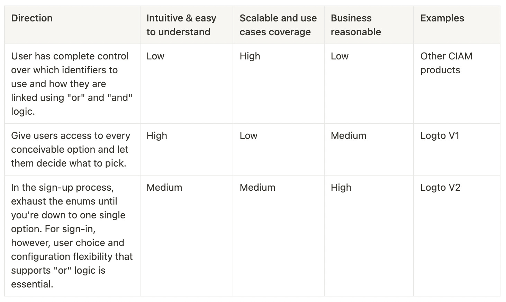
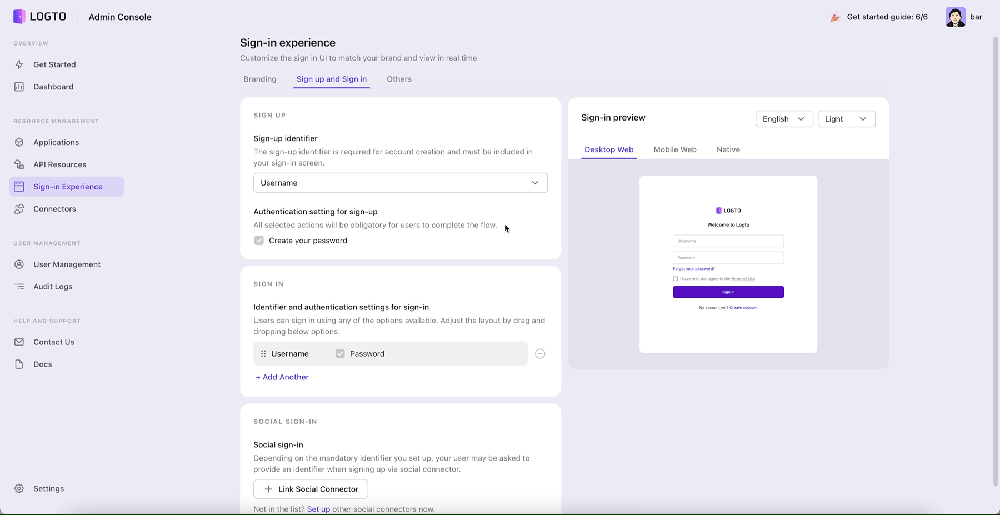
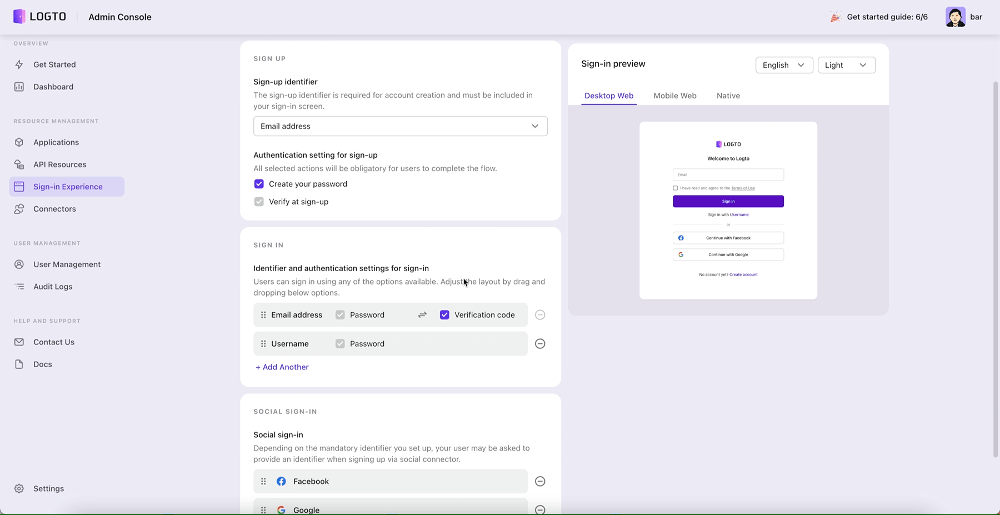
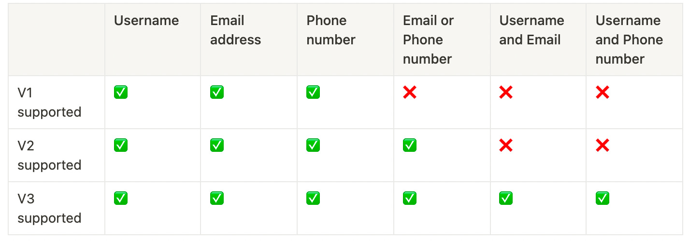
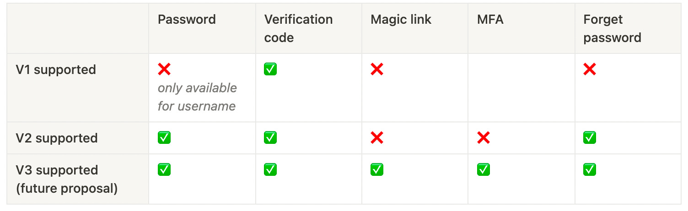
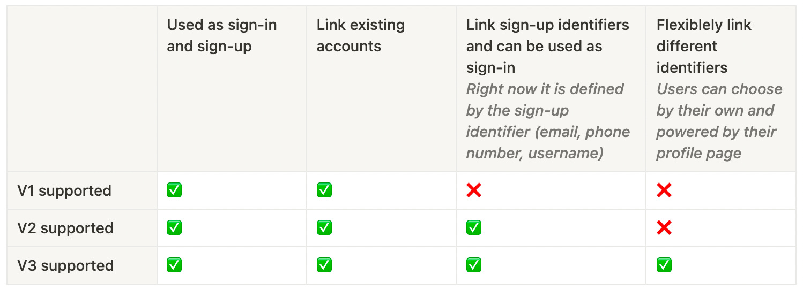
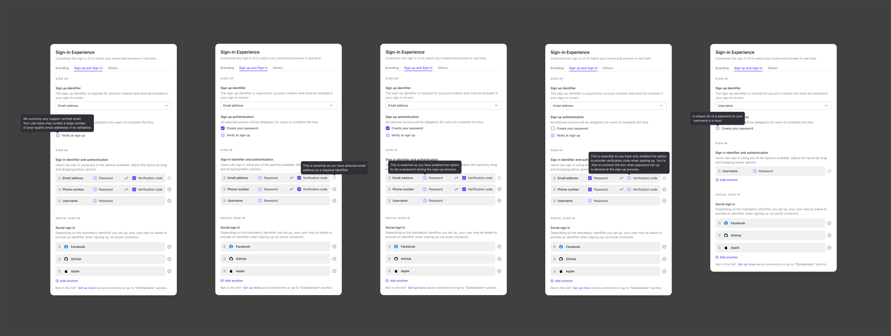
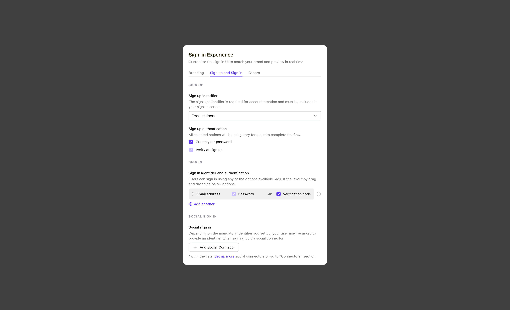
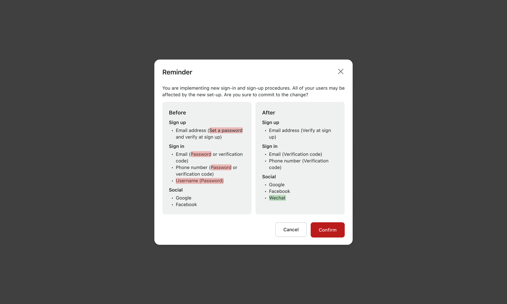
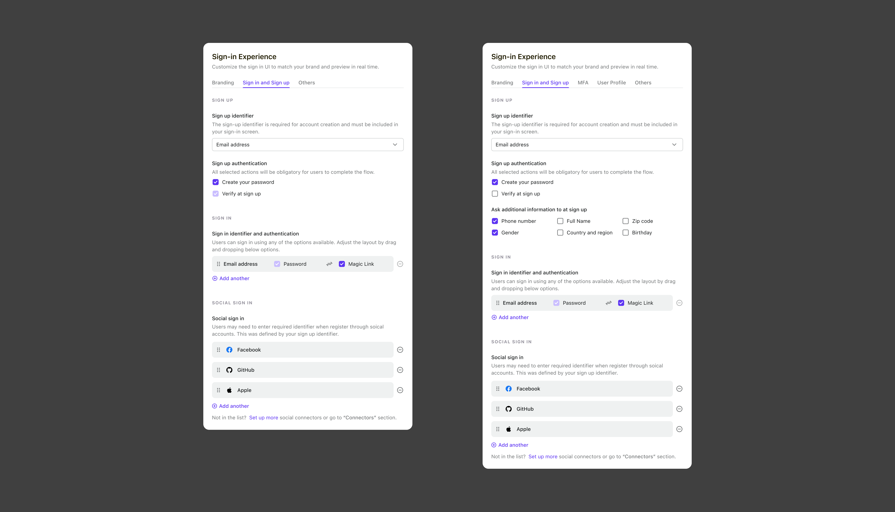

# The design considerations for a seamless sign-in experience (Second Chapter)

In the previous piece, we discussed the development of the Sign-in Experience, and what makes a positive end-user encounter, and we ended on some thought-provoking topics.

1. How can I do this with as little effort as possible using the Logto Admin Console?
2. When compared to currently available market solutions, how does Logto’s configuration experience stand out? Curious to understand why this is the best choice for my business.
3. From a business perspective, how can sign-up be evaluated?
4. What does Logto have in store for future service and product development?

In this article, we'll answer these questions and show you how the Logto Admin Console can help.

{/* truncate */}

## Make Admin Console thoughtful and educational

The permutation and combination of identifier, Authentication Factor, Connector, and Personal information is a complex interaction design question. It’s very ambitious and there are lots of directions we can go. We listed them out, evaluated them and made the decision with the aligned trade-off on our team.

To enable the sign-in and sign-up, there are three high-level directions we explored.

A sign-in experience is never complete without the Admin Console. We never lose sight of the fact that the Admin Console exists to support the experience we have suggested, and not the other way around. Many of the solutions out there that let users choose their own sign-in and sign-up processes end up making things more complicated for our developers and lowering the quality of the experience for end users because they don't cater for actual use cases.

In the end, we picked direction 3.

- There are far too many illogical outcomes when following Option 1.
- The second direction is not consistent with the principle of progressive disclosure. The amount of mental effort required is excessive, and there is no way to make it more scalable in the future.

First, we'll look at our sample of the Admin Console and run through the two most common use cases. You may learn more about how we make it possible with a robust tool like this.

The first scenario:

- _Sign up: Email with a password and verify email at sign up._
- _Sign in: Email with a password, Social account_

The second scenario:

- _Sign up: Email or Phone number with a password and verify at sign up._
- _Sign in: Email or Phone number with a password, Social accounts._

We have three guiding principles that we stick to as a group to ensure success.

### Optimal balance between adaptability and solving real use cases

In order to accommodate the vast majority of use cases, we strive to provide consumers with as much customization as possible. However, we must be strict about any identifier combination that makes no sense to real users as those can have a negative effect on business.

#### Flexibility

As previously stated, we divided the Sign-in Experience into four categories: "Identifier, Authentication Factor, Social Connector, and Personal Information.”

:::info
The most significant change in Sign-in Experience V2 is the establishment of a flexible and scalable framework to support more scenarios in the long run.
:::

This framework allows developers to combine and categorize components based on their choices. Here's how we prioritize features and put them on the roadmap.

##### Sign-up identifier

##### Authentication factors

##### Social connector

##### Personal information

We currently do not have a profile page that users can modify and update on their own. This, on the other hand, is on our priority list and will be ready before the end of the year. Following this implementation, the entire sign-in experience can be integrated as a whole.

#### Be true to real use cases

However, based on the permutations and combinations, there are numerous possibilities, many of which make no sense at all. We must make trade-offs and implement features gradually so as not to overwhelm users in the first place. In v2, for example, we only defined four options as sign-up identifiers because these are the most common scenarios, covering 90%+ of the market.

Another example is that for nonsensical use cases, we disable them and use tooltips to explain why. The rules discussed in the previous article are then applied.

> **Restrictions between Sign-in, Registration and Authentication Factor, for example:**
>
> - _If password is chosen as an authentication factor, sign-in should support it as well, and all other identifiers must as well. We don't want users to do meaningless work or disregard their security intentions when registering. The fact that a password is required for sign-up with a username but not for email or phone password sign-in makes no sense and confuses the user._
> - _If users enabled multiple identifiers during sign-in, such as email or phone number, both of those identifiers must be available for sign-in. For example, if a person signs up using their email address but only signs in with their support phone number, they will be unable to use the product in the end._
> - _If the sole identifier used during registration is the username, a password is required. This is owing to the limitations and characteristics of using a username as an identifier._

### Beginning with developer mindsets, bring clarity to complexity

The setup is intended to assist users in creating successful sign-in and sign-up processes. When building up their Sign-in Experience, we illustrate the broad reasoning behind the scenes and assist people in learning and growing. I'll give you two instances.

#### Thoughtful educational content

In order to be clear. We utilized a brief and plain description to help customers understand what each setting means and to address any questions they may have.

#### A synopsis to provide clarity

Another example - Developers reconfiguring and updating the Sign-in Experience settings can be a difficult and risky process because it will affect your end users' engagement. Before saving a modification, we show the user a change summary. Our engineers are familiar with the before vs. after mindset, and it has brought a lot of clarity to complexity.

### Make ability to scale, consider Day 0, and plan for iteration

We don't want to piss off our users with another massive redesign in the future, thus we need to make sure that the product design is scalable. We also think about the steps we would take to support future versions, such as Multi-Factor Authentication (MFA), Magic Link, completing a user's profile (including name, gender, email address, and password), and supporting future versions.

Here is a view about the future version with how we support `Unverified email` , `MFA`, `Magic Link`, and `Profile fulfill`.

## From a business perspective, how can sign-up be evaluated?

We accelerated the sign-up and sign-in processes and increased user acquisition by adhering to the ideas of "minimum steps," "helping users succeed," and "limited consumer options" when designing the best practice of sign-in flow. Additionally, the [Dashboard] and [Audit Log] are excellent resources for learning about the sign-up and login patterns of users and the general health of the app.

## The future

The Logto Sign-in Experience V2 and its development process are now clear to you. Now is the moment to experiment and speed up the development of your product. We are also putting up V3 suggestions. To give you a taste of the available options, here is a preview,

1. Share our polished design components in Figma source file
2. Support multi-factor authentication
3. Support magic links
4. Visualize the end-to-end flow when building the Sign-in Experience and better for business needs
5. User profile customization
6. Much more in accessibility improvement, and look and feel customization
