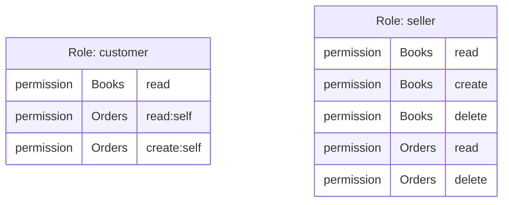
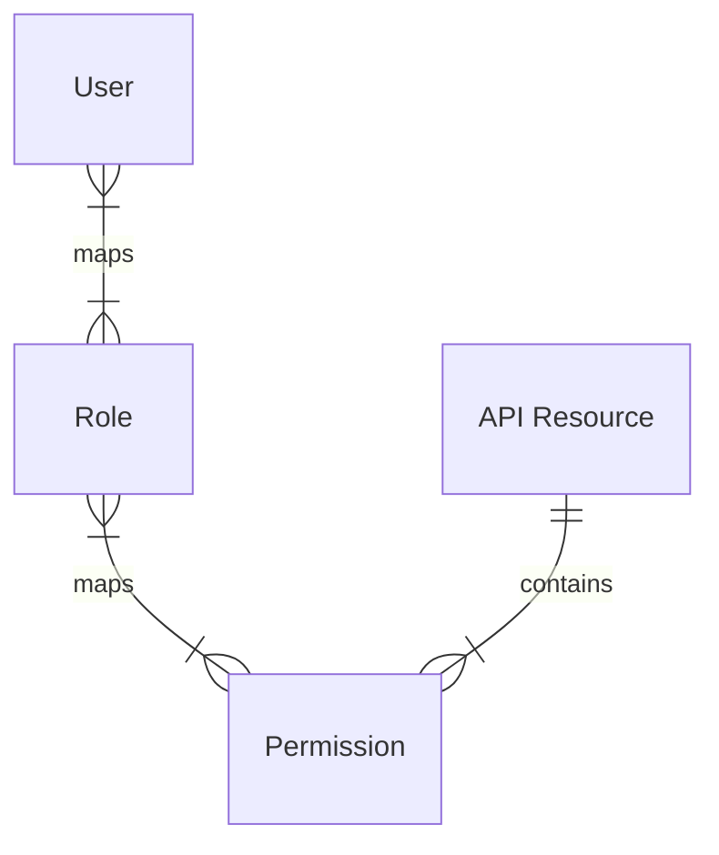

# CIAM 102: Authorization & Role-based Access Control

## Background

In the [previous article](../2022-11-28-ciam-101-authn-identity-sso/index.mdx), we introduced the concept of authentication (AuthN) and authorization (AuthZ), along with some headachy terms: Identity, Organization, Tenant, etc.

Organization and Tenant are great for grouping Identities, but they lead to an absolute democracy: everyone can do anything in this system. While utopia is still a mystery, let’s take a look at the governance of access: Authorization (AuthZ).

<!--truncate-->

### Why do we need authorization?

:::info Recall
Authorization (AuthZ) answers the question “What can you do?”
:::

Notion is a great example. For each page you own, you can choose to keep it private, accessible only to you, or share it with friends, or even the public.

Or, for an online bookstore, you want everyone to be able to view all books, but customers to only view their own orders, and sellers to manage only the books in their stores.

AuthZ and AuthN are essential components of a complex business model. They often go hand-in-hand; AuthZ verifies a user's access, while AuthN authenticates identities. Both are necessary for a secure system.

## The basic authorization model

Here’s one of the most common AuthZ models: If **IDENTITY** performs **ACTION** on **RESOURCE**, then **ACCEPT** or **DENY**.

In the Notion example, the model is **PERSON** performs **VIEW** on **PAGE.**

If the page is private:

- You’ll receive **ACCEPT** when performing **VIEW** on your **PAGE**.
- Everyone else should receive **DENY** when performing **VIEW** on your **PAGE**.

Based on consensus, the industry developed various authorization technologies, such as Role-based Access Control (RBAC), Attribute-based Access Control (ABAC). Today, we will focus on the [NIST RBAC model](https://csrc.nist.gov/CSRC/media/Publications/conference-paper/2000/07/26/the-nist-model-for-role-based-access-control-towards-a-unified-/documents/sandhu-ferraiolo-kuhn-00.pdf) Level 1: Flat RBAC.

## Role-based Access Control

:::info
The NIST RBAC model left many things open to provide flexibility and adaptability for various scenarios. Logto now adopts the Level 1 definition with an additional concept "Resource" (i.e. API Resource).
:::

Let's extend the bookstore example. Say we have many customers, but only one seller:

- Customers can view and order books, as well as view their own orders.
- The seller can view, create, and delete books, and manage customer orders.

### Define resources

In Logto, a resource (i.e. API Resource) usually represents a set of entities or items, since it’s required to use a valid URL as the indicator. Hence we define two resources:

- Books: `https://api.bookstore.io/books`
- Orders: `https://api.bookstore.io/orders`

One of the advantages of enforcing the URL format is it can map to a real address of your API service, which improves the readability and recognizability when integrating with other components in the system.

:::note
🤔 Resources should be divided according to the needs of the business. There is no one-size-fits-all approach; the decision should be made on a case-by-case basis. The example in this article that divides Books and Orders may be suitable for microservices, but not for a monolithic architecture.
:::

### Define permissions

Since we introduced the concept of resource, in Logto, we also enforce that permissions must belong to a resource, in reverse, resources can have permissions.

Let’s add some permissions the the resources:

- Books: `read`, `create`, `delete`
- Orders: `read`, `read:self`, `create:self`, `delete`

Although there’s no requirement of the name of a permission, we have the convention as below:

```
<action>[:<target>]
```

While `<action>` is required to describe a permission, `:<target>` can be ignored to describe a general target, i.e. to all entities or items in the resource. For example:

- Permission `read` in resource Books means the action to read arbitrary books.
- Permission `create:self` in resource Orders means the action to create orders that belong to the current user.

### Define roles

In short, a role is a group of permissions. Let’s create two roles `customer` and `seller` and assign permissions to them as below:



You may notice the permission-role assignment is many-to-many relations.

### Assign roles to users

Just like role-permission assignment, user-role assignment is also a many-to-many relationship. Therefore, you can assign multiple roles to a single user, and a single role can be assigned to multiple users.

### Connect to dots

Here’s a complete relationship diagram for the Level 1 RBAC model in Logto:



In the RBAC model, permissions are always "positive", meaning the authorization judgement is simple: if a user has the permission, then accept; otherwise, reject.

Let's say Alice has the role `seller`, Bob and Carol have the role `customer`. We'll describe actions in natural language first, and transpile them to the standard authorization format: **IDENTITY** performs **ACTION** on **RESOURCE**, finally giving the conclusion.

- Alice wants to add a new book for sale:
  - User Alice performs `create` on resource Books (`https://api.bookstore.io/books`).
  - Since Alice has been assigned the permission `create` of Books according to their role `seller`, the result is ✅ **ACCEPT**.
- Alice wants to view all orders to see if the sale meets their expectation:
  - User Alice performs `read` on resource Orders (`https://api.bookstore.io/orders`).
  - Since Alice has been assigned the permission `read` of Orders according to their role `seller`, the result is ✅ **ACCEPT**.
- Bob wants to browse the book list to see if there’s any books they want to purchase.
  - User Bob performs `read` on resource Books (`https://api.bookstore.io/books`).
  - Since Bob has been assigned the permission `read` of Books according to their role `cusomter`, the result is ✅ **ACCEPT**.
- Bob wants to view Carol’s order.
  - Since it’s someone else’s order, the permission `read:self` of `Orders` does not work here.
  - User Bob performs `read` on resource Orders (`https://api.bookstore.io/order`).
  - Since Bob has no permission `read` of Orders, the result is ❌ **DENY**.

### Other RBAC levels

There are four levels in the NIST RBAC model:

- Flat RBAC
- Hierarchical RBAC
- Constrained RBAC
- Symmetric RBAC

See the [paper](https://csrc.nist.gov/CSRC/media/Publications/conference-paper/2000/07/26/the-nist-model-for-role-based-access-control-towards-a-unified-/documents/sandhu-ferraiolo-kuhn-00.pdf) for details if you are interested.

Logto now has the Level 1 implementation and will progress to higher levels based on community feedback. Don’t hesitate to let us know if a higher level fits your need!

## In practice

Beside the theory, we still have heavy technical works to complete in order to make the model work as expected:

- Client and auth server development
- Database design for RBAC
- Validation across different services
- Security and open-standard compliance
- Role, permission, resource management and assignment

Don’t panic. We've taken this into account and added out-of-the-box support to cover all of the above. Check out the [🔐 RBAC recipe](/docs/recipes/rbac/) to learn how to use RBAC in Logto.

## Closing notes

RBAC is a powerful access management model for most cases, but there’s no silver bullet. We still have some questions:

- Do I need high levels of RBAC?
- How does RBAC compare to other authorization models?
- How to define authorization model between different Organizations?

:::note
🔥 Stay tuned. We’ll see you in CIAM 103!
:::
