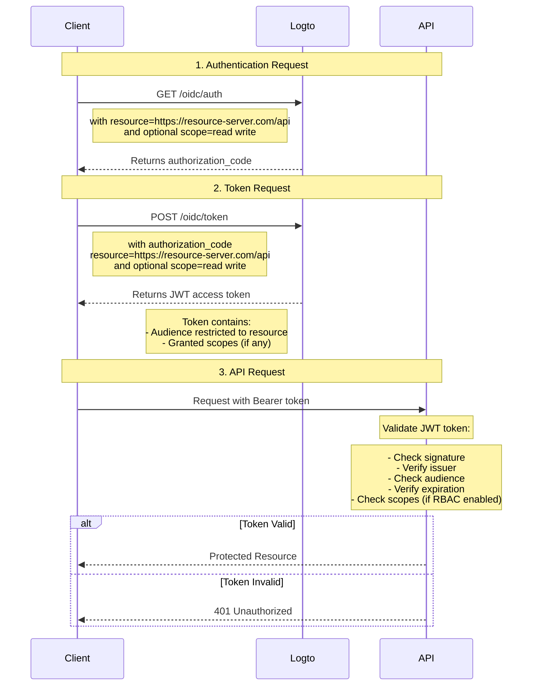

# Protect your API

If you don’t need flexible, granular access control policies, you can simply protect your API directly. We’ll walk you through a sequence diagram and the necessary step show how to integrate access control into your app.



In this tutorial

- Logto endpoint: `https://tenant-id.logto.app`
- Client application: `https://client.example.org`
- API Resource server: `https://resource-server.com/api`

You should replace these with your actual endpoints when implementing.

## Authentication request

Provide a list of resource indicator parameters in an [Authentication Request](https://openid.net/specs/openid-connect-core-1_0.html#AuthRequest). It will indicate all the protected resource(s) that the user may request.

```bash
GET https://tenant-id.logto.app/oidc/auth?response_type=code
    &client_id=s6BhdRkqt3
    &state=tNwzQ87pC6llebpmac_IDeeq-mCR2wLDYljHUZUAWuI
    &redirect_uri=https%3A%2F%2Fclient.example.org%2Fcb
    &resource=https%3A%2F%2Fresource-server.com%2Fapi
    &scope=read%20write
```

Logto will validate and store these resource indicators. An `authorization_code` will be granted and returned with scopes restricted to these specified resources.

Example configuration of Logto SDK:

```tsx
const config: LogtoConfig = {
  // ...other configs
  resources: ['https://resource-server.com/api'],
  scopes: ['read', 'write'],
};
```

## Token request

When the resource parameter is present on a [Token Request](https://openid.net/specs/openid-connect-core-1_0.html#TokenRequest) along with the `authorization_code` granted above, it will specify the target API Resource audience of the access token is requested.

```bash
POST https://tenant-id.logto.app/oidc/token HTTP/1.1
Content-Type: application/x-www-form-urlencoded

grant_type=authorization_code&redirect_uri=https%3A%2F%2Fclient.example.org%2Fcb&code=10esc29BWC2qZB0acc9v8zAv9ltc2pko105tQauZ&resource=https%3A%2F%2Fresource-server.com%2Fapi
```

An encrypted access token with the audience restricted to this requested resource will be granted by Logto. The token carries all the data you will need to represent the authorization status of the request. E.g., the request user's identity and role, the token's audience and expiration time.

Example code of Logto SDK:

```tsx
const accessToken = await logtoClient.getAccessToken('https://resource-server.com/api');
```

The accessToken’s payload will contain:

```tsx
{
  iss: '<your-logto-endpoint>/oidc',
  aud: 'https://resource-server.com/api',
  scope: 'read write'
}
```

## Request to the API resource

The client user sent a request to the API Resource by presenting the given `access_token` in the Authorization header.

```bash
GET https://resource-server.com/api/users
Authorization: Bearer eyJhbGciOiJIUz...
```

Logto follows the standard token-based authorization protocol to protect your API Resources. To learn more about OAuth 2.0, please refer to OAuth 2.0's [official document](https://datatracker.ietf.org/doc/html/rfc6749#section-1.3.1).

## Validate authorization tokens for API requests

Logto issues a standard [JWT](https://datatracker.ietf.org/doc/html/rfc7519) format authorization token for each authorized API request. The token is encrypted and signed as a [JWS](https://datatracker.ietf.org/doc/html/rfc7515) token.

#### Understanding JWS token

An encoded [JWS](https://datatracker.ietf.org/doc/html/rfc7515) token is constructed with three parts:

- JOSE Header: Declares the code type and encoding algorithm
- JWS Payload: Includes all the token's claims
- JWS Signature: Signature signed with [JWK](https://datatracker.ietf.org/doc/html/rfc7517)

A standard schema of Logto issued JWS Payload: (claims may vary, based on your custom OIDC config)

| key       | description                       |
| --------- | --------------------------------- |
| jti       | unique JWT ID                     |
| sub       | subject, usually user-id          |
| iat       | timestamp token issues at         |
| exp       | timestamp token expires at        |
| client_id | application id                    |
| iss       | token issuer identity             |
| aud       | audience of the token             |
| scope     | scopes (permissions) of the token |

:::note

For development, to visually inspect a JWT token, you could visit a [JWT Decoder tool](https://www.jstoolset.com/jwt) to decode and check the tokens you received. Be careful with or never use the tokens from a production environment. As this is a third party provided public online service, your token may be exposed.

:::

#### Validate the authorization token

1. [Validating a JWT](https://datatracker.ietf.org/doc/html/rfc7519#section-7.2)
2. [Validating the JWS signature](https://datatracker.ietf.org/doc/html/rfc7515#section-5.2)
3. The token's issuer is `https://<your-logto-domain>/oidc` (issued by your Logto auth server)
4. The token's audience is equal to the current receiver's resource indicator registered in Logto Admin Console
5. The token is within its expiration time
6. ([RBAC](/authorization/role-based-access-control/protect-api-resources-with-rbac) only) The token has the desired `scope`

There are various open-source libraries and packages that can help you to validate and decode a JWT token easily. You may pick one and integrate with your backend application based on the language and framework you are using. Please check some of the examples we have:

- [Node (Express)](/authorization/api-resources/node-express)
- [Spring Boot](/authorization/api-resources/spring-boot)
- [Python](/authorization/api-resources/python)

## Reference

Logto uses the code-based OAuth 2.0 Authorization Protocol to make your API request safe. If you are interested in the strategy behind it, refer to OAuth 2.0's [specification](https://datatracker.ietf.org/doc/html/rfc6749#section-1.3.1) for more details.
