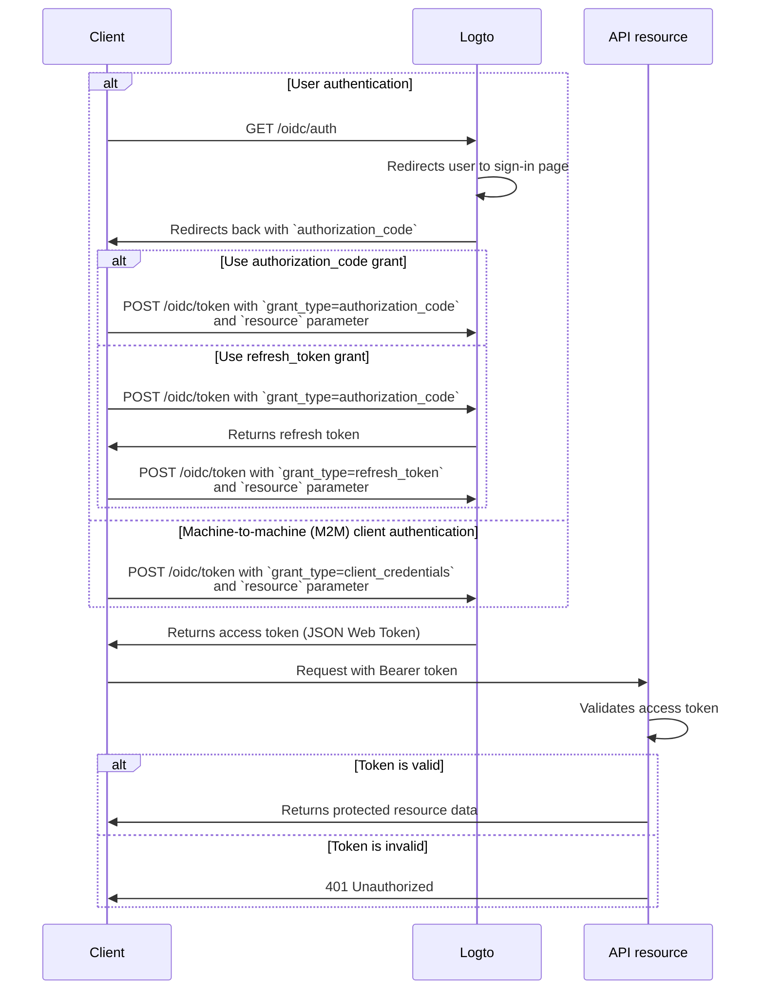

import TabItem from '@theme/TabItem';
import Tabs from '@theme/Tabs';

# Protect global API resources

## What are global API resources?

Global API resources are endpoints or services in your application that are accessible to all users, regardless of organization or tenant. These are typically public-facing APIs, core product services, or any endpoint that is not scoped to a specific organization.

**Use cases include:**

- Public APIs or endpoints shared across your user base.
- Microservices that are not tied to multi-tenancy.
- Core application APIs (e.g., `/api/users`, `/api/products`) used by all customers.

Logto allows you to secure these APIs using OAuth 2.1, combined with flexible, role-based access control.

## How it works in Logto

- **API resources and permissions are registered globally:** Each API you want to protect is defined with a unique resource indicator (URI) with a set of permissions (scopes) that control access.
- **Access is controlled by global roles:** You can assign permissions to roles, which are then assigned to users or clients.
- **Separate from organization-level permissions:** Global API resources have no organization context. However, they may be used in conjunction with organization roles to provide an additional layer of context if needed. To protect organization-level APIs, see [Protect organization-level API resources](/authorization/organization-level-api-resources).

### Implementation overview

1. **Register your API resource** and define its permissions in Logto.
2. **Define roles** with the necessary permissions for accessing the API.
3. **Assign roles** to users or clients.
4. **Use OAuth 2.0 authorization flows** to obtain access tokens for the API (resource parameter must match the registered API identifier).
5. **Validate access tokens** in your API to enforce permissions.

### Understanding resource indicators

Logto models API resources according to [RFC 8707: Resource Indicators for OAuth 2.0](https://www.rfc-editor.org/rfc/rfc8707.html). A **resource indicator** is a URI that uniquely identifies the target API or service being requested.

**Key points:**

- Resource indicators must be absolute URIs (e.g., `https://api.example.com`)
- No fragment component; avoid using query strings when possible.
- Resource indicators enable audience-restricted tokens and support for multi-API architectures.

**Example:**

- Management API: `https://my-tenant.logto.app/api`
- Custom global API: `https://api.yourapp.com`

### Authorization flow: authenticating and securing your API

The flow below applies to both interactive user authentication (browser/app) and backend machine-to-machine (M2M) scenarios.

Please note that the flow does not include exhaustive details about the required parameters or headers, but focuses on the key steps involved. Continue reading to see how the flow works in practice.



_User authentication = browser/app. M2M = backend service or script using client credentials._

:::note
The `resource` parameter must exactly match the API identifier (resource indicator) you registered in Logto.
:::

## Implementation steps

### Registering global API resources in Logto

To secure a global API resource, you must register it in the Logto Console:

1. Go to **Console > API resources**.
2. Click **Create API resource**.
3. Provide the following:

   - **API name:** Human-readable name for your API.
   - **API identifier:** The resource indicator URI.
   - **Token expiration time:** (Optional) Adjust access token lifespan.

4. Define **permissions (scopes)** for the API resource. These are actions that can be performed on the API, such as `read:products`, `write:products`, etc.
5. Save and manage your resource as needed. You can update or delete resources from the Console at any time.

#### Setting a default API resource (optional)

If you have clients or integrations that do not support the `resource` parameter (for example, some third-party tools or plugins), you can designate a default API resource for your tenant. When no resource is specified in the OAuth request, Logto will use the default for audience-restriction and token issuance.

### Setting up role-based access control (RBAC)

Once your API resource is registered, you can define roles and assign permissions to control who can access which endpoints or actions. RBAC is highly recommended for production APIs, allowing you to manage user access at scale.

- **Assign roles and permissions** to users or clients globally for your API resource.
- For details and configuration steps, see [Role-based access control deep dive](/authorization/role-based-access-control).

### Obtaining access tokens for global API resources

Before accessing a global API resource, your client must obtain an access token. Logto issues [JSON Web Tokens (JWTs)](https://auth.wiki/jwt) as access tokens for global API resources. This is typically done using the [OAuth 2.0 authorization code flow](https://auth.wiki/authorization-code-flow), [refresh token flow](https://auth.wiki/refresh-token), or the [client credentials flow](https://auth.wiki/client-credentials-flow).

#### Authorization code or refresh token flow

All Logto official SDKs support obtaining access tokens for global API resources using the refresh token flow out of the box. A standard OAuth 2.0 / OIDC client library can also be used to implement this flow.

<Tabs groupId="user-client">
<TabItem value="logto-sdk" label="Logto SDK">

When initializing the Logto client, add the resource indicator to the `resources` parameter (array), then add desired permissions (scopes) to the `scopes` parameter.

Once the user is authenticated, pass the resource indicator in the `resource` parameter or similarly named parameter when requesting the access token (e.g., calling `getAccessToken()`).

For details on each SDK, see the [Quick starts](/quick-starts).

</TabItem>
<TabItem value="oauth-client" label="OAuth 2.0 / OIDC client library">

When configuring your OAuth 2.0 client or initializing the authorization code flow, ensure you include the `resource` parameter and the desired scopes in the authorization request.

Some libraries may not support the `resource` parameter natively, but usually allow you to pass additional parameters in the authorization request. Check your library's documentation for details.

Here's a non-normative example of the authorization request with the `resource` and `scope` parameters:

```http
GET /oidc/auth?response_type=code
&client_id=your-client-id
&redirect_uri=https://your-app.com/callback
&scope=openid profile offline_access read:products write:products
&resource=https://api.yourapp.com
&code_challenge=abc123
&code_challenge_method=S256
&state=xyz
HTTP/1.1
Host: your.logto.endpoint
```

Once the user is authenticated, you will receive an authorization code. Exchange this code for an access token by making a POST request to Logto's `/oidc/token` endpoint, including the `resource` parameter in the request body.

Here's a non-normative example of the token request using the authorization code grant type:

```http
POST /oidc/token HTTP/1.1
Host: your.logto.endpoint
Content-Type: application/x-www-form-urlencoded
Authorization: Basic base64(client_id:client_secret)

grant_type=authorization_code
&code=authorization_code_received
&redirect_uri=https://your-app.com/callback
&resource=https://api.yourapp.com
```

You can also use the `refresh_token` grant type to obtain a new access token without user interaction, as long as the `resource` parameter is included in the request.

Here's a non-normative example of the token request using the refresh token grant type:

```http
POST /oidc/token HTTP/1.1
Host: your.logto.endpoint
Content-Type: application/x-www-form-urlencoded
Authorization: Basic base64(client_id:client_secret)

grant_type=refresh_token
&refresh_token=your-refresh-token
&resource=https://api.yourapp.com
```

</TabItem>
</Tabs>

#### Client credentials flow

For machine-to-machine (M2M) scenarios, you can use the client credentials flow to obtain an access token for your global API resource. By making a POST request to Logto's `/oidc/token` endpoint, you can request an access token using your client ID and secret.

There are two key parameters to include in the request:

- `resource`: The resource indicator URI of the API you want to access (e.g., `https://api.yourapp.com`).
- `scope`: The permissions you want to request for the API (e.g., `read:products write:products`).

Here's a non-normative example of the token request using the client credentials grant type:

```http
POST /oidc/token HTTP/1.1
Host: your.logto.endpoint
Content-Type: application/x-www-form-urlencoded
Authorization: Basic base64(client_id:client_secret)

grant_type=client_credentials
&resource=https://api.yourapp.com
&scope=read:products write:products
```

### Validating JWT access tokens in your API

Logto-issued JWTs contain claims that your API can use to enforce authorization.

When your API receives a request with a Logto-issued access token, you should:

- Verify the token signature (using Logto’s JWKs).
- Confirm the token is not expired (`exp` claim).
- Check that the `iss` (issuer) matches your Logto endpoint.
- Ensure the `aud` (audience) matches your registered API resource indicator. (This prevents tokens for one API from being used against another, an important security best practice.)
- Splitting the `scope` claim by spaces and verifying the necessary permissions are present.

For step-by-step and language-specific guides, see [How to validate access tokens](/developers/validate-access-tokens).

## Best practices and security tips

- **Keep permissions business-driven:** Use clear names that map to real actions.
- **Keep token expiration short:** Reduces risk if a token is leaked.
- **Limit granted scopes:** Only give tokens the permissions they actually need.
- **Use audience restriction:** Always verify the `aud` claim to prevent misuse.

## Troubleshooting and FAQs

- **Q: My client doesn’t support the resource parameter?**

  - A: Set a default API resource in Logto Console. Tokens will default to this audience.

- **Q: I get 401 Unauthorized from my API?**

  - A: Check token signature, expiration, audience, and required scopes. Verify your backend is fetching the correct JWKs.

- **Q: How do I test without a full client?**

  - A: Use a [personal access token](/user-management/personal-access-token) to simulate authenticated calls.

## Further reading

- [Quick start: Secure your first API](/quick-starts/secure-your-api)
- [Role-based access control deep dive](/authorization/role-based-access-control)
- [RBAC in practice: Implementing secure authorization for your application](/use-cases/authorization/rbac-in-practice)
- [Customizing token claims](/developers/custom-token-claims)
- [Opaque token vs JWT](https://blog.logto.io/opaque-token-vs-jwt)
- [When should I use JWTs?](https://blog.logto.io/when-should-i-use-jwts)
- [API authorization methods](https://blog.logto.io/api-authorization-methods)
- [RFC 8707: Resource Indicators](https://www.rfc-editor.org/rfc/rfc8707.html)
