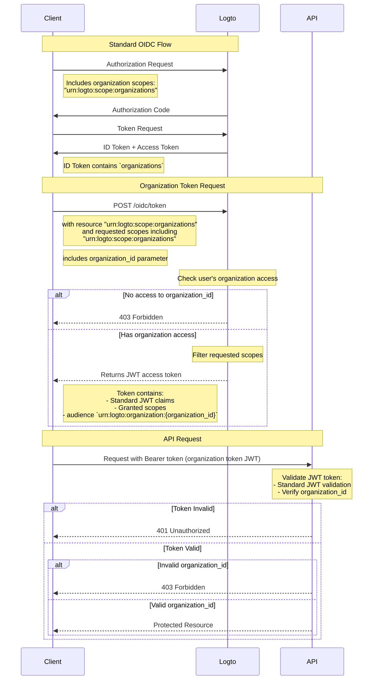

import TabItem from '@theme/TabItem';
import Tabs from '@theme/Tabs';

# Protect organization resources

In addition to [Protect your API](/authorization/api-resources/protect-your-api) which takes API as the resource, organization can also be resource, and protect your organization resource in the same way. In this article, We'll focus on how to change to protect your organization resource in similar way.



## Step 1: Get organization IDs from OIDC flow

Logto extends the standard [OpenID Connect](https://openid.net/specs/openid-connect-core-1_0.html) protocol to allow your app to get the organization info from the user. There are two ways to do that:

- If you are using a Logto SDK with Organizations support, you can add the `urn:logto:scope:organizations` scope to `scopes` parameter of the configuration object. Usually the SDK will have an enum for this scope, e.g. `UserScope.Organizations` in [Logto JS SDKs](https://github.com/logto-io/js).

<Tabs groupId="sdk">

  <TabItem value="js" label="JavaScript">

```ts
import { LogtoClient, UserScope } from '@logto/browser'; // or @logto/node, @logto/client

const logto = new LogtoClient({
  // ...
  scopes: [UserScope.Organizations],
});
```

  </TabItem>
  <TabItem value="react" label="React">

```tsx
import { LogtoProvider, UserScope } from '@logto/react';

const App = () => (
  <LogtoProvider
    config={{
      // ...
      scopes: [UserScope.Organizations],
    }}
  >
    {/* ... */}
  </LogtoProvider>
);
```

  </TabItem>
  <TabItem value="python" label="Python">

```python
from logto import UserInfoScope

client = LogtoClient(
    LogtoConfig(
        # ...
        scopes=[UserInfoScope.organizations],
    )
)
```

  </TabItem>
  <TabItem value="php" label="PHP">

```php
use Logto\Sdk\Constants\UserScope;

$client = new LogtoClient(
  new LogtoConfig(
    // ...
    scopes: [UserScope::organizations],
  )
);
```

  </TabItem>
  <TabItem value="swift" label="Swift">

```swift
import Logto
import LogtoClient

let config = try? LogtoConfig(
    // ...
    scopes: [
        UserScope.organizations.rawValue,
    ],
    // ...
)
let client = LogtoClient(useConfig: config)
```

  </TabItem>
  <TabItem value="others" label="Others">

```ts
const config = {
  // ...
  scope: 'openid offline_access urn:logto:scope:organizations',
};
```

  </TabItem>

</Tabs>
    
- For other cases, you need to add the `urn:logto:scope:organizations` scope to the `scope` parameter of the SDK config (or auth request).

Once the user finishes the authentication flow, you can get the organization info from the `idToken`:

```tsx
// Use JavaScript as an example
const idToken = await logto.getIdTokenClaims();

console.log(idToken.organizations); // A string array of organization IDs
```

The `organizations` field (claim) will also be included in response from the [UserInfo endpoint](https://openid.net/specs/openid-connect-core-1_0.html#UserInfo).

### Optional: Get organization roles

If you haven’t set up organization roles yet, refer to [this section](/authorization/org-template/configure-org-template/#create-organization-role).

To get all organization roles of the current user:

- If you are using a Logto SDK with Organizations support, you can add the `urn:logto:scope:organization_roles` scope to `scopes` parameter of the configuration object. Usually the SDK will have an enum for this scope, e.g. `UserScope.OrganizationRoles` in [Logto JS SDKs](https://github.com/logto-io/js).
- For other cases, you need to add the `urn:logto:scope:organization_roles` scope to the `scope` parameter of the SDK config (or auth request).

Then you can get the organization roles from the `idToken`:

```tsx
// Use JavaScript as an example
const idToken = await logto.getIdTokenClaims();

console.log(idToken.organization_roles); // A string array of organization roles
```

Each string in the array is in the format of `organization_id:role_id`, e.g. `org_123:admin` means the user has the `admin` role in the organization with ID `org_123`.

The `organization_roles` field (claim) will also be included in response from the [UserInfo endpoint](https://openid.net/specs/openid-connect-core-1_0.html#UserInfo).

## Step 2. Fetch organization token

To perform actions in the context of an organization, the user needs to be granted an access token for that organization (organization token). The organization token is a JWT token that contains the organization ID and the user's permissions (scopes) in the organization.

### Add parameters to the authentication request

- If you are using a Logto SDK with Organizations support, you can add the `urn:logto:scope:organizations` scope to `scopes` parameter of the configuration object, the same way as [Get organization IDs of the current user](/authorization/org-template/protect-org-resources/#step-1-get-organization-ids-from-oidc-flow).
  - Logto SDK with Organizations support will automatically handle the rest of the configuration.
- For other cases, you need to add the `offline_access` and `urn:logto:scope:organizations` scopes to the `scope` parameter and the `urn:logto:resource:organizations` resource to the `resource` parameter of the SDK config (or auth request).
  - Note: `offline_access` is required to get the `refresh_token` that can be used to fetch organization tokens.

```tsx
// Only for other cases. For Logto SDKs, see above.
const config = {
  // ...
  scope: 'openid offline_access urn:logto:scope:organizations',
  resource: 'urn:logto:resource:organizations',
};
```

:::note

The `urn:logto:resource:organizations` resource is a special resource that represents the organization template.

:::

### Fetch the organization token

Logto extends the standard `refresh_token` grant type to allow your app to fetch organization tokens.

- If you are using a Logto SDK with Organizations support, you can call the `getOrganizationToken()` method (or `getOrganizationTokenClaims()` method) of the SDK.
- For other cases, you need to call the token endpoint with the following parameters:
  - `grant_type`: `refresh_token`.
  - `client_id`: The app ID the user used to authenticate.
  - `refresh_token`: The `refresh_token` you got from the authentication flow.
  - `organization_id`: The ID of the organization you want to get the token for.
  - `scope` (optional): The scopes you want to grant to the user in the organization. If not specified, the authorization server will try to grant the same scopes as the authentication flow.

<Tabs groupId="sdk">

  <TabItem value="js" label="JavaScript">

```ts
const token = await logto.getOrganizationToken('<organization-id>');
```

  </TabItem>
  <TabItem value="react" label="React">

```tsx
const App = () => {
  const { getOrganizationToken } = useLogto();

  const getToken = async () => {
    const token = await getOrganizationToken('<organization-id>');
  };

  return <button onClick={getToken}>Get organization token</button>;
};
```

  </TabItem>
  <TabItem value="python" label="Python">

```python
token = await client.getOrganizationToken("<organization-id>")
# or
claims = await client.getOrganizationTokenClaims("<organization-id>")
```

  </TabItem>
  <TabItem value="php" label="PHP">

```php
$token = $client->getOrganizationToken('<organization-id>');
// or
$claims = $client->getOrganizationTokenClaims('<organization-id>');
```

  </TabItem>
  <TabItem value="swift" label="Swift">

```swift
let token = try await client.getOrganizationToken(forId: "<organization-id>")
```

  </TabItem>
  <TabItem value="others" label="Others">

```ts
// Use JavaScript as an example

const params = new URLSearchParams();

params.append('grant_type', 'refresh_token');
params.append('client_id', 'YOUR_CLIENT_ID');
params.append('refresh_token', 'REFRESH_TOKEN');
params.append('organization_id', 'org_123');

const response = await fetch('https://YOUR_LOGTO_ENDPOINT/oidc/token', {
  method: 'POST',
  headers: {
    'Content-Type': 'application/x-www-form-urlencoded',
  },
  body: params,
});
```

  </TabItem>

</Tabs>

The response will be in the same format as the [standard token endpoint](https://openid.net/specs/openid-connect-core-1_0.html#TokenEndpoint), and the `access_token` is the organization token in JWT format.

Besides regular claims of an access token, the organization token also contains the following claims:

- `aud`: The audience of the organization token is `urn:logto:organization:{organization_id}`.
- `scope`: The scopes granted to the user in the organization with space as delimiter.

### Example

A good example can beat a thousand words. Assume our organization template has the following setup:

- Permissions: `read:logs`, `write:logs`, `read:users`, `write:users`.
- Roles: `admin`, `member`.
  - The `admin` role has all permissions.
  - The `member` role has `read:logs` and `read:users` permissions.

And the user has the following setup:

- Organization IDs: `org_1`, `org_2`.
- Organization roles: `org_1:admin`, `org_2:member`.

In the Logto SDK config (or auth request), we set up other things properly, and added the following scopes:

- `urn:logto:scope:organizations`
- `openid`
- `offline_access`
- `read:logs`
- `write:logs`

Now, when the user finishes the authentication flow, we can get the organization IDs from the `idToken`:

```tsx
// Use JavaScript as an example
const idToken = await logto.getIdTokenClaims();

console.log(idToken.organizations); // ['org_1', 'org_2']
```

If we want to get the organization tokens:

```tsx
// Use JavaScript as an example
const org1Token = await logto.getOrganizationTokenClaims('org_1');
const org2Token = await logto.getOrganizationTokenClaims('org_2');

console.log(org1Token.aud); // 'urn:logto:organization:org_1'
console.log(org1Token.scope); // 'read:logs write:logs'
console.log(org2Token.aud); // 'urn:logto:organization:org_2'
console.log(org2Token.scope); // 'read:logs'

const org3Token = await logto.getOrganizationTokenClaims('org_3'); // Error: User is not a member of the organization
```

Explanation:

- For `org_1`, the user has the `admin` role, so the organization token should have all available permissions (scopes).
- For `org_2`, the user has the `member` role, so the organization token should have `read:logs` and `read:users` permissions (scopes).

Since we only requested `read:logs` and `write:logs` scopes in the authentication flow, the organization tokens have been "downscoped" accordingly, resulting in the intersection of the requested scopes and the available scopes.

### Fetch organization token for a machine-to-machine application

Similar to fetching organization tokens for users, you can also fetch organization tokens for machine-to-machine applications. The only difference is that you need to use the `client_credentials` grant type instead of the `refresh_token` grant type.

To learn more about machine-to-machine applications, see [Machine-to-machine: Auth with Logto](/quick-starts/m2m/).

## Step 3. Verify organization tokens

Once the app gets an organization token, it can use the token in the same way as a regular access token, e.g. call the APIs with the token in the `Authorization` header in the format of `Bearer {token}`.

In your API, the way you verify the organization token is quite similar to [Protect your API](/authorization/api-resources/protect-your-api/#validate-authorization-tokens-for-api-requests). Main differences:

- Unlike access tokens for API resources, a user CANNOT get an organization token if the user is not a member of the organization.
- The audience of the organization token is `urn:logto:organization:{organization_id}`.
- For certain permissions (scopes), you need to check the `scope` claim of the organization token by splitting the string with space as delimiter.
