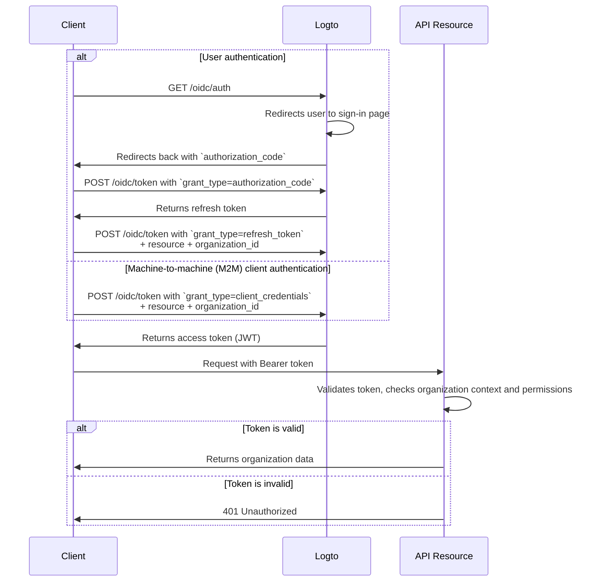

import TabItem from '@theme/TabItem';
import Tabs from '@theme/Tabs';

# Protect organization-level API resources

## What are organization-level API resources?

Organization-level API resources are endpoints or services in your application that are **scoped to a specific organization (tenant)**. These APIs enforce authorization and access based on the organization context-ensuring that users or clients only access data and actions relevant to their organization.

**Use cases include:**

- APIs for managing organization members, roles, or settings (e.g., `/organizations/{organizationId}/members`)
- Organization-scoped dashboards, analytics, or reports
- Billing, subscription, or audit endpoints tied to an organization
- Any API where actions and data are isolated per tenant

Logto allows you to secure these organization APIs using OAuth 2.1 and RBAC, while supporting multi-tenant SaaS architectures.

These permissions are managed through **organization roles** defined in the [organization template](/authorization/organization-template). Every organization (tenant) uses the same template, ensuring a consistent permission model across all organizations.

## How it works in Logto

- **API resources and permissions are registered globally:** Each API resource is defined with a unique resource indicator (URI) and a set of permissions (scopes) in Logto.
- **Roles at the organization level:** Organization roles are defined in the organization template. API resource permissions (scopes) are assigned to organization roles, which are then assigned to users or clients **within each organization**.
- **Context-aware authorization:** When a client requests an access token with both an API resource and an `organization_id`, Logto issues a token that includes both the organization context and the API audience. The token’s permissions (scopes) are determined by the user’s organization roles for the specified organization.
- **Separation from global resources:** API resources can be accessed with or without an organization context. Organization RBAC is only applied if an `organization_id` is included in the request. For APIs that are shared across all users, see [Protect global API resources](/authorization/global-api-resources).

### Implementation overview

1. **Register your API resource** and define its permissions (scopes) in Logto.
2. **Define organization roles** in the organization template and assign relevant API permissions.
3. **Assign roles** to users or clients within each organization.
4. **Request an access token** for the API with an `organization_id` to include organization context.
5. **Validate access tokens** in your API, enforcing both organization context and permissions.

### How Logto applies organization RBAC

- If you request an access token **without** an `organization_id`, only global roles/permissions are considered.
- If you request an access token **with** an `organization_id`, Logto evaluates the user’s organization roles and their associated permissions for that organization.
- The resulting JWT will contain both the API audience (`aud` claim) and the organization context (`organization_id` claim), with scopes filtered to those granted by the user’s organization roles.

### Authorization flow: authenticating and securing APIs with organization context

The following flow shows how a client (web, mobile, or backend) obtains and uses organization tokens to access organization-level API resources.

Please note that the flow does not include exhaustive details about the required parameters or headers, but focuses on the key steps involved. Continue reading to see how the flow works in practice.



_User authentication = browser/app. M2M = backend service or script using client credentials + organization context._

## Implementation steps

### Register your API resource

1. Go to **Console > API resources**.
2. Click **Create API resource**.
3. Provide:

   - **API name:** Human-readable name for your API.
   - **API identifier:** Resource indicator URI (e.g., `https://api.yourapp.com/org`).
   - **Token expiration time:** (Optional)

4. Define **permissions (scopes)** (e.g., `manage:members`, `view:analytics`).
5. Save your resource.

### Set up organization roles and permissions

1. Go to **Console > Organization template > Organization roles**.
2. Create organization roles (e.g., `admin`, `member`) and assign API permissions to each role
3. Assign roles to users or clients within each organization. If they’re not members yet, invite or add them first.

For full configuration steps, see [Organization template](/authorization/organization-template).

### Obtain organization tokens for API resources

Your client/app should request a token with both `resource` and `organization_id` to access organization-level APIs. Logto issues organization tokens as [JSON Web Tokens (JWTs)](https://auth.wiki/jwt). You can obtain these using either the [refresh token flow](https://auth.wiki/refresh-token) or [client credentials flow](https://auth.wiki/client-credentials-flow).

#### Refresh token flow

Almost all Logto official SDKs support obtaining organization tokens using the refresh token flow out of the box. A standard OAuth 2.0 / OIDC client library can also be used to implement this flow.

<Tabs groupId="user-client">
<TabItem value="logto-sdk" label="Logto SDK">

When initializing the Logto SDK, add the `urn:logto:scope:organizations` and desired organization permissions (scopes) to the `scopes` parameter.

Some Logto SDKs have a predefined scope for organizations, such as `UserScope.Organizations` in JavaScript SDKs.

:::note
Inspect the `organizations` claim in the ID token to get a list of organization IDs the user belongs to. This claim lists all organizations the user is a member of, making it easy to enumerate or switch organizations in your app.
:::

When calling `getAccessToken()`, specify both the API resource (`resource`) and the organization ID (`organizationId`) to obtain an organization token.

For details on each SDK, see [Quick starts](/quick-starts).

</TabItem>
<TabItem value="oauth-client" label="OAuth 2.0 / OIDC client library">

When configuring your OAuth 2.0 client or initializing the authorization code flow, ensure you include the following parameters:

- `resource`: Set to the API resource identifier registered in Logto (e.g., `https://api.yourapp.com/org`).
- `scope`: Include the predefined organization scope (`urn:logto:scope:organizations`), `offline_access` (to obtain refresh tokens), and any specific API permissions you need (e.g., `manage:members view:analytics`).

Some libraries may not support the `resource` parameter natively, but usually allow you to pass additional parameters in the authorization request. Check your library's documentation for details.

Here's a non-normative example of how the authorization request might look:

```http
GET /oidc/auth?response_type=code
&client_id=your-client-id
&redirect_uri=https://yourapp.com/callback
&scope=openid profile email urn:logto:scope:organizations manage:members view:analytics
&resource=https://api.yourapp.com/org
&code_challenge=abc123
&code_challenge_method=S256
&state=xyz
HTTP/1.1
Host: your.logto.endpoint
```

Once the user is authenticated, you will receive an authorization code. Use this code by making a POST request to Logto's `/oidc/token` endpoint. You'll receive a refresh token that can be used to obtain organization tokens.

:::note
Inspect the `organizations` claim in the ID token to get a list of organization IDs the user belongs to. This claim lists all organizations the user is a member of, making it easy to enumerate or switch organizations in your app.
:::

Finally, use the refresh token to obtain an organization token by making a POST request to Logto's `/oidc/token` endpoint. Remember to include:

- The `resource` parameter set to the API resource identifier (e.g., `https://api.yourapp.com/org`).
- The `organization_id` parameter set to the desired organization ID.
- (Optional) The `scope` parameter to further downscope the permissions you need (e.g., `manage:members view:reports`).

Here's a non-normative example of how the token request might look:

```http
POST /oidc/token HTTP/1.1
Host: your.logto.endpoint
Content-Type: application/x-www-form-urlencoded
Authorization: Basic base64(client_id:client_secret)

grant_type=refresh_token
&refresh_token=your-refresh-token
&resource=https://api.yourapp.com/org
&organization_id=your-organization-id
```

</TabItem>
</Tabs>

#### Client credentials flow

For machine-to-machine (M2M) scenarios, you can use the client credentials flow to obtain an access token for organization permissions. By making a POST request to Logto's `/oidc/token` endpoint with organization parameters, you can request an organization token using your client ID and secret.

Here are the key parameters to include in the request:

- `resource`: The API resource identifier (e.g., `https://api.yourapp.com/org`).
- `organization_id`: The ID of the organization you want the token for.
- `scope`: The organization permissions you want to request (e.g., `invite:member`, `manage:billing`).

Here's a non-normative example of the token request using the client credentials grant type:

```http
POST /oidc/token HTTP/1.1
Host: your.logto.endpoint
Content-Type: application/x-www-form-urlencoded
Authorization: Basic base64(client_id:client_secret)

grant_type=client_credentials
&resource=https://api.yourapp.com/org
&organization_id=your-organization-id
&scope=invite:member manage:billing
```

### Validate organization tokens

Logto-issued organization tokens (JWTs) contain claims that your API can use to enforce organization-level access control.

When your app receives an organization token, you should:

- Verify the token signature (using Logto’s JWKs).
- Confirm the token is not expired (`exp` claim).
- Check that the `iss` (issuer) matches your Logto endpoint.
- Ensure the `aud` (audience) matches the API resource identifier you registered (e.g., `https://api.yourapp.com/org`).
- Validate the `organization_id` claim to ensure the token is scoped to the correct organization.
- Split the `scope` claim (space-separated) and check for required permissions.
- If your API path includes the organization ID (e.g., `/organizations/{organizationId}/members`), ensure the `organization_id` claim matches the path parameter.

For step-by-step and language-specific guides, see [How to validate access tokens](/developers/validate-access-tokens).

## Best practices and security tips

- **Always validate the organization context:** Don’t trust just the token; check the `organization_id` claim for every organization-scoped API call.
- **Use audience restrictions**: Always check the `aud` claim to ensure the token is for the intended organization.
- **Keep permissions business-driven:** Use clear names that map to real actions; only grant what is needed for each organization role.
- **Separate API and non-API permissions** where possible (but both can be in a single role).
- **Keep token lifetimes short:** Reduces risk if a token is leaked.
- **Regularly review your organization template:** Update roles and permissions as your product evolves.

## Troubleshooting and FAQs

- **Q: What if I don’t include `organization_id` in my token request?**

  - A: Only global roles/permissions will be evaluated. Organization RBAC will not be enforced.

- **Q: Can I mix organization and non-organization permissions in a single role?**

  - A: No, organization permissions (including organization-level API permissions) are defined by the organization template and cannot be mixed with global API permissions. However, you can create roles that include both organization permissions and organization-level API permissions.

## Further reading

- [Organization template](/authorization/organization-template)
- [Role-based access control deep dive](/authorization/role-based-access-control)
- [Customizing token claims](/developers/custom-token-claims)
- [How to validate access tokens](/developers/validate-access-tokens)
