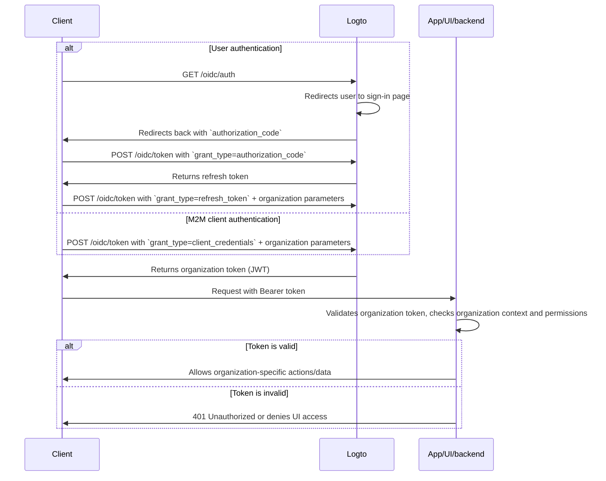

import illustration from '@site/docs/authorization/assets/rbac-organization-permissions.png';
import AuthorizationRequestExample from '@site/docs/authorization/fragments/AuthorizationRequestExample';
import ClientCredentialsRequestExample from '@site/docs/authorization/fragments/ClientCredentialsRequestExample';
import TokenRequestExample from '@site/docs/authorization/fragments/TokenRequestExample';
import HandleUserPermissionChange from '@site/docs/authorization/fragments/_handle-user-permission-change.mdx';
import TabItem from '@theme/TabItem';
import Tabs from '@theme/Tabs';

import InspectOrganizationClaim from './fragments/_inspect-organization-claim.md';
import OrganizationTokenWarning from './fragments/_organization-token-warning.md';

# Protect organization (non-API) permissions

Use the organization template to manage and enforce organization-level roles and permissions in Logto, controlling access to in-app features and workflows within an organization context.

## What are organization (non-API) permissions? \{#what-are-organization-non-api-permissions}

Organization permissions (non-API) control what users can do **within an organization context**, but are not **enforced at the API level**. Instead, they govern access to app features, UI elements, workflows, or business actions, rather than backend APIs.

**Use cases include**

- Inviting or managing members within an organization
- Assigning or changing organization roles
- Managing billing, settings, or administrative functions for an organization
- Access to dashboards, analytics, or internal tools that don’t have API endpoints

Logto allows you to secure these organization permissions using OAuth 2.1 and RBAC, while supporting multi-tenant SaaS architectures.

These permissions are managed through **organization roles** defined in the [organization template](/authorization/organization-template). Every organization uses the same template, ensuring a consistent permission model across all organizations.

## How it works in Logto \{#how-it-works-in-logto}

- **Organization-level RBAC:** Roles and permissions are defined in the organization template. When a user joins an organization, they’re assigned one or more roles, granting specific permissions.
- **Non-API enforcement:** Permissions are checked and enforced in your app’s UI, workflow, or backend logic, not necessarily by an API gateway.
- **Separation from API protection:** Organization (non-API) permissions are distinct from API resource permissions. You can combine both for advanced scenarios.

  

### Implementation overview \{#implementation-overview}

1. **Define organization permissions** in Logto under the organization template.
2. **Create organization roles** that bundle the necessary permissions for your organization-specific actions.
3. **Assign roles** to users or clients within each organization.
4. **Obtain an organization token (JWT)** for the current organization using either the refresh token or client credentials flow.
5. **Validate access tokens** in your app’s UI or backend to enforce organization permissions.

### Authorization flow: authenticating and securing organization permissions \{#authorization-flow-authenticating-and-securing-organization-permissions}

The following flow shows how a client (web, mobile, or backend) obtains and uses organization tokens for non-API permission enforcement.

Please note that the flow does not include exhaustive details about the required parameters or headers, but focuses on the key steps involved. Continue reading to see how the flow works in practice.

_User authentication = browser/app. M2M = backend service or script using client credentials + organization context._

## Implementation steps \{#implementation-steps}

### Register organization permissions \{#register-organization-permissions}

1. Go to <CloudLink to="/organization-template/organization-permissions">Console → Organization template → Organization permissions</CloudLink>.
2. Define the organization permissions you need (e.g., `invite:member`, `manage:billing`, `view:analytics`).

For full configuration steps, see [Define organization permissions](/authorization/role-based-access-control#define-organization-permissions).

### Set up organization roles \{#set-up-organization-roles}

1. Go to <CloudLink to="/organization-template/organization-roles">Console → Organization template → Organization roles</CloudLink>.
2. Create roles that bundle the organization permissions you defined earlier (e.g., `admin`, `member`, `billing`).
3. Assign these roles to users or clients within each organization.

For full configuration steps, see [Use organization roles](/authorization/role-based-access-control#configure-organization-roles).

### Obtain organization tokens (non-API) \{#obtain-organization-tokens-non-api}

Your client/app should obtain an organization token (non-API) to access organization permissions. Logto issues organization tokens as [JSON Web Tokens (JWTs)](https://auth.wiki/jwt). You can obtain these using either the [refresh token flow](https://auth.wiki/refresh-token) or [client credentials flow](https://auth.wiki/client-credentials-flow).

#### Refresh token flow \{#refresh-token-flow}

Almost all Logto official SDKs support obtaining organization tokens using the refresh token flow out of the box. A standard OAuth 2.0 / OIDC client library can also be used to implement this flow.

<Tabs groupId="user-client">
<TabItem value="logto-sdk" label="Logto SDK">

When initializing the Logto SDK, add the `urn:logto:scope:organizations` and desired organization permissions (scopes) to the `scopes` parameter.

Some Logto SDKs have a predefined scope for organizations, such as `UserScope.Organizations` in JavaScript SDKs.

<InspectOrganizationClaim />

Use `getOrganizationToken` or a similar method (like `getAccessToken` with an organization ID) to request an organization token for a specific organization.

For details on each SDK, see [Quick starts](/quick-starts).

</TabItem>
<TabItem value="oauth-client" label="OAuth 2.0 / OIDC client library">

When configuring your OAuth 2.0 client or initializing the authorization code flow, ensure you include the following parameters:

- `resource`: Set to `urn:logto:resource:organizations` to indicate you want an organization token.
- `scope`: Include the predefined organization scope (`urn:logto:scope:organizations`), `offline_access` (to obtain refresh tokens), and any specific organization permissions you need (e.g., `invite:member`, `manage:billing`).

Some libraries may not support the `resource` parameter natively, but usually allow you to pass additional parameters in the authorization request. Check your library's documentation for details.

Here's a non-normative example of how the authorization request might look:

<AuthorizationRequestExample
  scope="urn:logto:scope:organizations invite:member manage:billing"
  resource="urn:logto:resource:organizations"
/>

Once the user is authenticated, you will receive an authorization code. Use this code by making a POST request to Logto's `/oidc/token` endpoint.

Here's a non-normative example of the token request:

<TokenRequestExample grantType="authorization_code" />

<OrganizationTokenWarning />

You'll receive a refresh token that can be used to obtain organization tokens.

<InspectOrganizationClaim />

Finally, use the refresh token to obtain an organization token by making a POST request to Logto's `/oidc/token` endpoint. Remember to include:

- The `organization_id` parameter set to the desired organization ID.
- (Optional) The `scope` parameter to further downscope the permissions you need (e.g., `manage:members view:reports`).

Here's a non-normative example of how the token request might look:

<TokenRequestExample grantType="refresh_token" organizationId="your-organization-id" />

</TabItem>
</Tabs>

#### Client credentials flow \{#client-credentials-flow}

For machine-to-machine (M2M) scenarios, you can use the client credentials flow to obtain an access token for organization permissions. By making a POST request to Logto's `/oidc/token` endpoint with organization parameters, you can request an organization token using your client ID and secret.

Here are the key parameters to include in the request:

- `organization_id`: The ID of the organization you want the token for.
- `scope`: The organization permissions you want to request (e.g., `invite:member`, `manage:billing`).

Here's a non-normative example of the token request using the client credentials grant type:

<ClientCredentialsRequestExample
  organizationId="your-organization-id"
  scope="invite:member manage:billing"
/>

### Validate organization tokens \{#validate-organization-tokens}

Logto-issued organization tokens (JWTs) contain claims that your app/UI/backend can use to enforce organization-level access control.

When your app receives an organization token, you should:

- Verify the token signature (using Logto's JWKs).
- Confirm the token is not expired (`exp` claim).
- Check that the `iss` (issuer) matches your Logto endpoint.
- Ensure the `aud` (audience) matches the formatted organization identifier (e.g., `urn:logto:organization:{organization_id}`).
- Split the `scope` claim (space-separated) and check for required permissions.

For step-by-step and language-specific guides, see [How to validate access tokens](/authorization/validate-access-tokens).

<HandleUserPermissionChange type="organization" />

## Best practices and security tips \{#best-practices-and-security-tips}

- **Never rely solely on UI enforcement:** Always validate permissions on the backend for critical actions.
- **Use audience restrictions**: Always check the `aud` claim to ensure the token is for the intended organization.
- **Keep permissions business-driven:** Use clear names that map to real actions; only grant what is needed for each organization role.
- **Separate API and non-API permissions** where possible (but both can be in a single role).
- **Review organization template regularly** as your product evolves.

## FAQs \{#faqs}

### Can I mix organization and non-organization permissions in a single role? \{#can-i-mix-organization-and-non-organization-permissions-in-a-single-role}

No, organization permissions (including organization-level API permissions) are defined by the organization template and cannot be mixed with global API permissions. However, you can create roles that include both organization permissions and organization-level API permissions.

### Where should I enforce non-API permissions? \{#where-should-i-enforce-non-api-permissions}

Check non-API permissions both in the UI (for feature gating) and in your server-side logic for sensitive actions.

## Further reading \{#further-reading}

<Url href="/authorization/validate-access-tokens">How to validate access tokens</Url>
<Url href="/developers/custom-token-claims">Customizing token claims</Url>
<Url href="/use-cases/multi-tenancy/build-multi-tenant-saas-application">
  Use case: Build a multi-tenant SaaS application
</Url>
