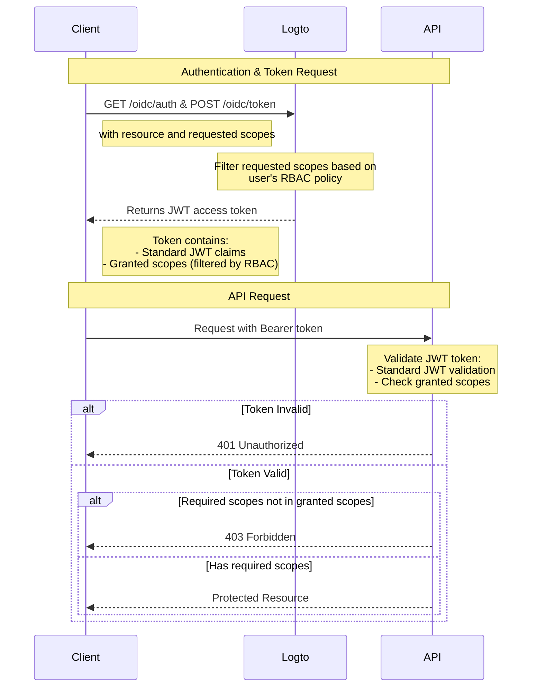

# Protect API resources with RBAC

In addition to [Protect your API](/authorization/api-resources/protect-your-api) which secures resources by ensuring a valid JWT is present, Role-Based Access Control (RBAC) can also be applied.

In this article, We'll focus on how RBAC affects scope delegation and validation in your authentication flow.

## Authorization flow diagram



As you can see from the diagram, the main difference from basic API protection is the handling of scopes. Instead of directly granting all requested scopes, Logto now filters them based on the user's RBAC policy. The JWT token will only contain scopes that the user has been granted through their roles. On the API side, after validating the token's authenticity, there's an additional check to ensure the token contains the required scopes for the requested resource.

## Optional: Handle user permission change

User permissions may be altered during a session -- for instance, they may be assigned new roles or have existing role permissions modified. In these scenarios, detecting these changes and updating the application UI may be necessary.

What happens when a user's permissions change? There are two cases.

### No new permissions introduced into the system

Current access tokens will remain valid until they expire, even after a user’s permissions are changed. However, new permissions will be reflected in subsequent access tokens, and any revoked permissions will be omitted.

Here are some **recommended actions**:

**Option 1: Use short access token expiration times**

Short-lived access tokens ensure more frequent updates to user permissions. Configure token expiration settings in the [API Resource](/authorization/api-resources/#logto-api-resource-schema) settings of the Console. The downside is that it will increase your token usage.

**Option 2: Dynamically check permissions**

Call [Logto Management API](/integrate-logto/interact-with-management-api) endpoints periodically (e.g., SWR) or use techniques such as WebSocket to implement long-lived connections to dynamically fetch user permissions. Upon detecting changes, clear the existing access token and newly issued tokens will automatically have permission scope changes reflected. - API: User-role - API: Role-permission

    When permission changes detected, clear the access token from storage first, and then call the SDK method `getAccessToken()` to acquire a new one. Newly issued access token should have permission changes reflected.

### New permission is introduced into the system and assigned to a user

This happens when new permissions are introduced into your system. In this case, you’ll have to first include the newly introduced permission scopes when initializing Logto client. E.g.

```tsx
new LogtoClient({
  appId: 'your-app-id',
  redirectUrl: 'your-redirect-url',
  resources: ['your-api-resource'],
  scopes: [
    // ... your existing permission scopes,
    'new-scope',
  ],
});
```

Secondly, each of your client application need to re-consent or re-login the users in order to receive the new permission change. Then the new permission scope will be reflected in new access tokens.

Code example for re-consent:

```tsx
signIn({ redirectUrl: 'your-redirect-url', prompt: 'consent' });
```
