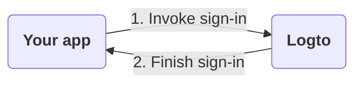

# Sign-in experience explained

This page explains the sign-in experience in Logto and why it is designed this way.

## Introduction

Sign-in experience is the user authentication process in Logto. The process can be simplified as follows:

1. Your app invokes the sign-in method.
2. The user is redirected to the Logto sign-in page. For native apps, the system browser is opened.
3. The user signs in and is redirected back to your app (configured as the "Redirect URI" in Logto).

While the process is simple, the redirecting part may look overkill some times. However, it can be beneficial and secure in many ways. We'll explain the reasons in the following sections.
