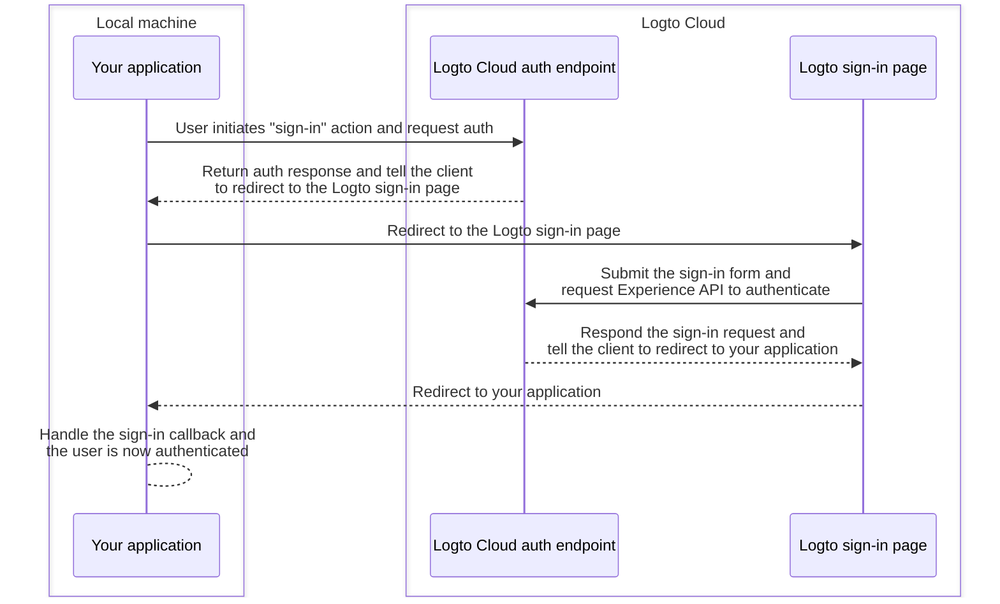
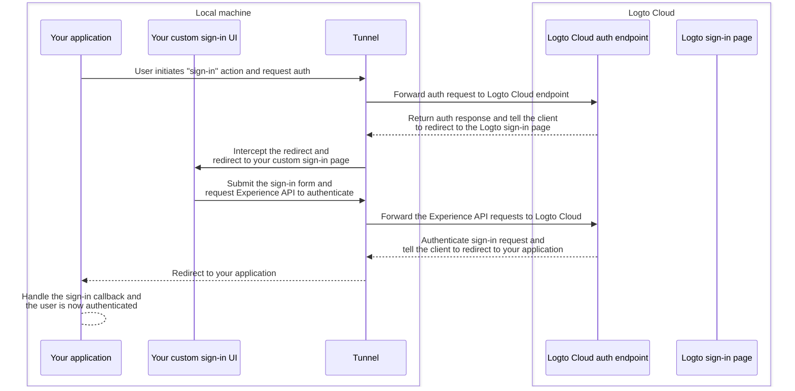

import TabItem from '@theme/TabItem';
import Tabs from '@theme/Tabs';

# Debug and test your custom UI locally

For Logto Cloud users, We've made it easy to let you "Bring your own UI" to Logto. Cloud users can now upload a zip file containing the custom UI assets in <CloudLink to="/sign-in-experience/branding">Console > Sign-in experience > Branding > Bring your UI</CloudLink> (Check out the [Bring your UI](/customization/bring-your-ui) page for more details.)

However, when developing such custom UI pages, users want to test and debug the code locally, before uploading to Logto Cloud. This CLI command helps you set up a local tunnel and connect the following 3 entities together:
your Logto cloud auth endpoint, your application, and your custom sign-in UI.

## Why do I need this?

By default, when you click the "sign-in" button in your application, you will be navigated to the sign-in page configured at Logto endpoint. A successful sign-in flow can be illustrated as follows:



But now since you are developing your own custom sign-in UI, you need a way to navigate to the custom sign-in UI pages running on your local machine instead.
This requires a local tunnel service to intercept the outgoing requests from your application and redirect them to your custom sign-in UI pages.

Additionally, you need to interact with [Logto's Experience API](https://openapi.logto.io/group/endpoint-experience) to authenticate users and manage sessions.
This service will also help forward these Experience API requests to Logto Cloud in order to avoid CORS issues.

The sequence diagram below illustrates how a successful "sign-in" flow works with your custom UI and the tunnel service in place:



With the tunnel service in place, you can now develop and test your custom sign-in UI locally, without needing to upload the assets to Logto Cloud every time you make a change.

## Instructions

### Step 1: Execute the command

Assuming your Cloud tenant ID is `foobar`, and you have a custom sign-in page running on your local dev server at `http://localhost:4000`, then you can execute the command this way:

<Tabs groupId="cmd">

  <TabItem value="cli" label="CLI">

```bash
logto-tunnel -p 9000 --experience-uri http://localhost:4000/ --endpoint https://foobar.logto.app/
```

  </TabItem>
  <TabItem value="npx" label="npx">

```bash
npx @logto/tunnel -p 9000 --experience-uri http://localhost:4000/ --endpoint https://foobar.logto.app/
```

  </TabItem>

</Tabs>

It also works if you have custom domain configured in Logto:

<Tabs groupId="cmd">

  <TabItem value="cli" label="CLI">

```bash
logto-tunnel -p 9000 --experience-uri http://localhost:4000/ --endpoint https://your.custom.domain/
```

  </TabItem>
  <TabItem value="npx" label="npx">

```bash
npx @logto/tunnel -p 9000 --experience-uri http://localhost:4000/ --endpoint https://your.custom.domain/
```

  </TabItem>

</Tabs>

Alternatively, the command also supports static html assets without needing to run it first on a dev server. Just make sure there's a `index.html` in the path you specified.

<Tabs groupId="cmd">

  <TabItem value="cli" label="CLI">

```bash
logto-tunnel -p 9000 --experience-path /path/to/your/static/files --endpoint https://foobar.logto.app/
```

  </TabItem>
  <TabItem value="npx" label="npx">

```bash
npx @logto/tunnel -p 9000 --experience-path /path/to/your/static/files --endpoint https://foobar.logto.app/
```

  </TabItem>

</Tabs>

### Step 2: Update endpoint URI in your application

Finally, run your application and set its Logto endpoint to the tunnel service address `http://localhost:9000/` instead.

Let's take a React application as an example:

```tsx title=App.tsx
import { LogtoProvider, LogtoConfig } from '@logto/react';

const config: LogtoConfig = {
  // endpoint: 'https://foobar.logto.app/', // original Logto Cloud endpoint
  endpoint: 'http://localhost:9000/', // tunnel service address
  appId: '<your-application-id>',
};

const App = () => (
  <LogtoProvider config={config}>
    <YourAppContent />
  </LogtoProvider>
);
```

If you are using social sign-in, you also need to update the redirect URI in your social provider settings to the tunnel service address.

```
http://localhost:9000/callback/<connector-id>
```

If all set up correctly, when you click the "sign-in" button in your application, you should be navigated to your custom sign-in page instead of Logto's built-in UI, along with valid session (cookies) that allows you to further interact with Logto Experience API.

Happy coding!
