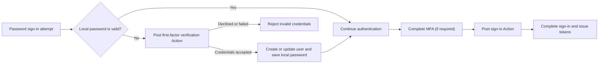

# Actions

Logto Actions let you run trusted JavaScript at specific points in the authentication flow. An action runs synchronously: the authentication request waits for the script, and the script result can update the user or determine whether the flow continues.

Actions are useful when the decision must happen inside the authentication flow. Common use cases include:

- Migrating users and passwords from a legacy identity system when they first sign in.
- Refreshing user profile or application-specific data before Logto completes a sign-in.
- Calling an external service and applying its result to the Logto user.

:::note
Actions are available in Logto OSS and Logto Cloud Enterprise plans.
:::

:::warning
Action scripts can affect authentication and modify user data. Only trusted administrators should be allowed to view, create, edit, test, enable, or delete them.

In self-hosted deployments, action scripts run in a virtual machine inside the Logto process. Treat them as trusted server-side code, not as a security boundary for untrusted code.
:::

## How Actions fit into sign-in \{#how-actions-fit-into-sign-in}

Logto currently provides two action types:



| Action type                                                                          | When it runs                                                                                                                                    | What it can do                                                                                                                                        |
| ------------------------------------------------------------------------------------ | ----------------------------------------------------------------------------------------------------------------------------------------------- | ----------------------------------------------------------------------------------------------------------------------------------------------------- |
| [Post first-factor verification](/developers/actions/post-first-factor-verification) | During a password sign-in, only after Logto's local password verification fails. It does not run when the local password is valid.              | Verify the submitted credentials against a legacy system, then create a new Logto user or update an existing user and migrate the submitted password. |
| [Post sign-in](/developers/actions/post-sign-in)                                     | After the user has completed all authentication factors, including MFA when required, and before Logto completes the sign-in and issues tokens. | Update and enrich the existing Logto user using the final sign-in context.                                                                            |

Both action types run only for `SignIn` interactions in the Experience API. Post first-factor verification applies only to password sign-in; Post sign-in is independent of the authentication method.

## Script model \{#script-model}

Each action type has one configuration and one JavaScript entry function named `runAction`:

```js
const runAction = async ({ event, environmentVariables = {} }) => {
  // Inspect the event, optionally fetch external data, and return
  // a result supported by this action type.
};
```

The payload contains:

- `event`: The production authentication event. Its shape depends on the action type.
- `environmentVariables`: The string values configured for this action. These values are passed through the function payload; they are not available through `process.env`.

The editor provides type information, but the saved script is executed as JavaScript. The script may be asynchronous and can use the injected `fetch` function to call external HTTPS APIs. It cannot import packages or access Node.js globals such as `require` or `process`.

The supported result is different for each action type; see the corresponding reference page before enabling an Action.

## Actions and Webhooks \{#actions-and-webhooks}

Actions and [Webhooks](/developers/webhooks) serve different purposes:

|                                            | Actions                                            | Webhooks                                                          |
| ------------------------------------------ | -------------------------------------------------- | ----------------------------------------------------------------- |
| Execution                                  | Synchronous and inline with authentication         | Asynchronous and outside the authentication request               |
| Can affect the current authentication flow | Yes                                                | No                                                                |
| Can modify a user from its result          | Yes, using the supported user patch                | Not directly; the receiver can call the Management API separately |
| Event coverage                             | Selected authentication points                     | A broad set of interaction and data-change events                 |
| Typical use                                | Credential migration, pre-token profile enrichment | Notifications, downstream synchronization, analytics              |

Keep asynchronous work in Webhooks. Use an Action only when Logto needs the result before authentication can continue.

## Next steps \{#next-steps}

- [Configure and test Actions](/developers/actions/configure-and-test-actions)
- [Migrate users on password sign-in](/developers/actions/post-first-factor-verification)
- [Enrich a user after sign-in](/developers/actions/post-sign-in)
