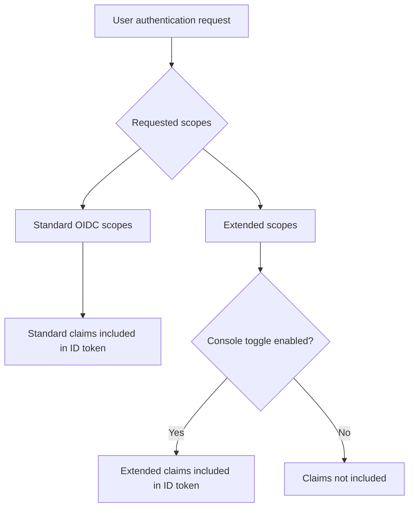

# Custom ID token

## Introduction \{#introduction}

[ID token](https://auth.wiki/id-token) is a special type of token defined by the [OpenID Connect (OIDC)](https://auth.wiki/openid-connect) protocol. It serves as an identity assertion issued by the authorization server (Logto) after a user successfully authenticates, carrying claims about the authenticated user's identity.

Unlike [access tokens](/developers/custom-token-claims) which are used to access protected resources, ID tokens are specifically designed to convey authenticated user identity to client applications. They are [JSON Web Tokens (JWTs)](https://auth.wiki/jwt) that contain claims about the authentication event and the authenticated user.

## How ID token claims work \{#how-id-token-claims-work}

In Logto, ID token claims are divided into two categories:

1. **Standard OIDC claims**: Defined by the OIDC specification, these claims are entirely determined by the scopes requested during authentication.
2. **Extended claims**: Claims extended by Logto to carry additional identity information, controlled by a **dual-condition model** (Scope + Toggle).

## Standard OIDC claims \{#standard-oidc-claims}

Standard claims are completely governed by the OIDC specification. Their inclusion in the ID token depends solely on the scopes your application requests during authentication. Logto does not provide any option to disable or selectively exclude individual standard claims.

The following table shows the mapping between standard scopes and their corresponding claims:

| Scope     | Claims                                                                                                                                                                           |
| --------- | -------------------------------------------------------------------------------------------------------------------------------------------------------------------------------- |
| `openid`  | `sub`                                                                                                                                                                            |
| `profile` | `name`, `family_name`, `given_name`, `middle_name`, `nickname`, `preferred_username`, `profile`, `picture`, `website`, `gender`, `birthdate`, `zoneinfo`, `locale`, `updated_at` |
| `email`   | `email`, `email_verified`                                                                                                                                                        |
| `phone`   | `phone_number`, `phone_number_verified`                                                                                                                                          |
| `address` | `address`                                                                                                                                                                        |

For example, if your application requests the `openid profile email` scopes, the ID token will include all claims from the `openid`, `profile`, and `email` scopes.

## Extended claims \{#extended-claims}

Beyond the standard OIDC claims, Logto extends additional claims that carry identity information specific to the Logto ecosystem. These extended claims follow a **dual-condition model** to be included in the ID token:

1. **Scope condition**: The application must request the corresponding scope during authentication.
2. **Console toggle**: The administrator must enable the claim's inclusion in the ID token through Logto Console.

Both conditions must be satisfied simultaneously. The scope serves as the protocol-layer access declaration, while the toggle serves as the product-layer exposure control — their responsibilities are clear and non-substitutable.

### Available extended scopes and claims \{#available-extended-scopes-and-claims}

| Scope                                | Claims                         | Description                             | Included by default |
| ------------------------------------ | ------------------------------ | --------------------------------------- | ------------------- |
| `custom_data`                        | `custom_data`                  | Custom data stored on the user object   |                     |
| `identities`                         | `identities`, `sso_identities` | User's linked social and SSO identities |                     |
| `roles`                              | `roles`                        | User's assigned roles                   | ✅                  |
| `urn:logto:scope:organizations`      | `organizations`                | User's organization IDs                 | ✅                  |
| `urn:logto:scope:organizations`      | `organization_data`            | User's organization data                |                     |
| `urn:logto:scope:organization_roles` | `organization_roles`           | User's organization role assignments    | ✅                  |

### Configure in Logto Console \{#configure-in-logto-console}

To enable extended claims in the ID token:

1. Navigate to <CloudLink to="/customize-jwt">Console > Custom JWT</CloudLink>.
2. Toggle on the claims you want to include in the ID token.
3. Ensure your application requests the corresponding scopes during authentication.

## Related resources \{#related-resources}

<Url href="/developers/custom-token-claims">Custom access token</Url>

<Url href="https://openid.net/specs/openid-connect-core-1_0.html#IDToken">
  OpenID Connect Core - ID Token
</Url>
