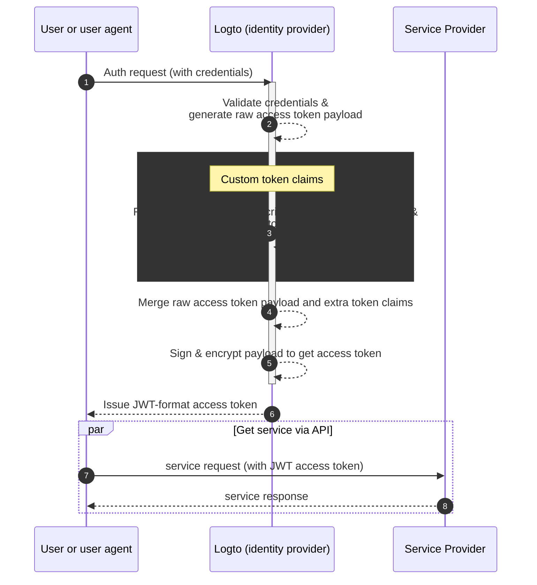

# Custom token claims

## Introduction

[Access tokens](https://auth.wiki/access-token) play a critical role in the authentication and authorization process, carrying the subject's identity information and permissions, and are passed between the [Logto server](/concepts/core-service) (serve as auth server or identity provider, IdP), your web service server (resource provider), and client applications (clients).

[Token claims](https://auth.wiki/claim) are the key-value pairs that provide information about an entity or the token itself. The claims may include user information, token expiration time, permissions, and other metadata that are relevant to the authentication (link to auth.wiki) and authorization (link to auth.wiki) process.

There are two types of access tokens in Logto:

- **JSON Web Token:** [JSON Web Token (JWT)](https://auth.wiki/jwt) is a popular format that encodes claims in a way that is both secure and readable by clients. Common claims like `sub`, `iss`, `aud` etc are used in line with the OAuth 2.0 protocol (See [this link](https://datatracker.ietf.org/doc/html/rfc7519#section-4) for more details). JWT tokens allow consumers to directly access claims without additional validation steps. In Logto, access tokens are issued in JWT format by default when a client inits authorization requests of specific resources or organizations.
- **Opaque token:** An [opaque token](http://localhost:3000/concepts/opaque-token) is not self-contained and always requires an additional validation step via the [token introspection](https://auth.wiki/token-introspection) endpoint. Despite their non-transparent format, opaque tokens can help to get claims and be transmitted securely between parties. Token claims are securely stored in the Logto server and accessed by the client applications via the token introspection endpoint. Access tokens are issued in opaque format when no specific resource or organization is included in the authorization request. These tokens are primarily used for accessing the OIDC `userinfo` endpoint and other general purposes.

In many cases, standard claims aren't sufficient to meet the specific needs of your applications, whether you're using JWT or opaque tokens. To address this, Logto provides the flexibility to add customize claims within access tokens. With this feature, you can include additional information for your business logic, all securely transmitted in the tokens and retrievable via introspection in the case of opaque tokens.

## How do custom token claims work?

Logto allows you to insert custom claims into the `access token` through a callback function `getCustomJwtClaims`. You may provide your implementation of the `getCustomJwtClaims` function to return an object of custom claims. The return value will be merged with the original token payload and signed to generate the final access token.

:::warning
Logto build-in token claims can NOT be overridden or modified. Custom claims will be added to the token as additional claims. If any custom claims conflict with the built-in claims, those custom claims will be ignored.
:::
