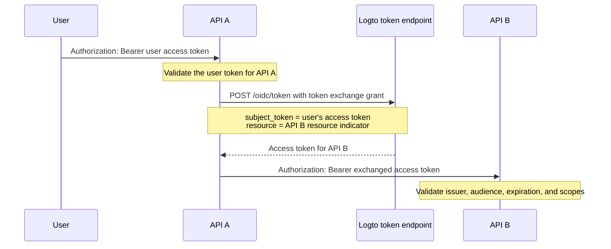

import TokenExchangePrerequisites from './fragments/_token-exchange-prerequisites.mdx';

# Service-to-service delegation

In some API architectures, a backend service receives a request from a signed-in user and needs to call another backend service while preserving the user's identity.

For example:

```text
User -> API A -> API B
```

API B needs to know two things:

1. The caller is a trusted service, such as API A.
2. The operation is being performed for the original user.

Use Logto's token exchange grant to exchange the user's access token for a new access token whose audience is the downstream API resource. This follows the OAuth 2.0 token exchange pattern and avoids forwarding the original user token to downstream services.

## When to use this flow \{#when-to-use-this-flow}

Use service-to-service delegation when:

- API A is a backend service that can securely authenticate to Logto's token endpoint.
- API A receives a Logto-issued user access token.
- API A needs to call API B on behalf of the same user.
- API B should validate one access token with its own API resource as the audience.

Do not use this flow for pure machine-to-machine access without a user. In that case, use the [client credentials flow](/quick-starts/m2m). For support, admin, or agent scenarios where one user temporarily acts as another user, use [user impersonation](/developers/user-impersonation).

## How it works \{#how-it-works}



The exchanged access token represents the original user (`sub`) and is bound to the downstream API resource (`aud`). The downstream API can also inspect the `client_id` claim to identify the application that initiated the exchange.

## Prerequisites \{#prerequisites}

1. Create API resources for the services involved. See [Protect global API resources](/authorization/global-api-resources).
2. Configure API B's permissions and assign them to users through roles or organization roles.
3. Use a server-side application for API A, such as a machine-to-machine app or a traditional web app, so it can authenticate securely with an app secret.
4. Enable token exchange for API A's application.

<TokenExchangePrerequisites />

## Request an access token for the downstream API \{#request-an-access-token-for-the-downstream-api}

When API A needs to call API B, make a token exchange request to Logto's [token endpoint](/integrate-logto/application-data-structure#token-endpoint).

For traditional web applications or machine-to-machine applications with an app secret, include the credentials in the `Authorization` header:

```bash
POST /oidc/token HTTP/1.1
Host: tenant.logto.app
Content-Type: application/x-www-form-urlencoded
# highlight-next-line
Authorization: Basic <base64(api-a-app-id:api-a-app-secret)>

grant_type=urn:ietf:params:oauth:grant-type:token-exchange
&subject_token=<user_access_token_received_by_api_a>
&subject_token_type=urn:ietf:params:oauth:token-type:access_token
&resource=https://api-b.example.com
&scope=read:orders
```

Parameters:

1. `grant_type`: Use `urn:ietf:params:oauth:grant-type:token-exchange`.
2. `subject_token`: The original Logto-issued user access token received by API A.
3. `subject_token_type`: Use `urn:ietf:params:oauth:token-type:access_token`.
4. `resource`: The API resource indicator of API B.
5. `scope`: The downstream permissions API A is requesting for this delegated call. Logto issues only the requested scopes that are available to the original user for this resource according to RBAC settings.

Logto returns an access token for API B:

```json
{
  "access_token": "eyJhbGci...<truncated>",
  "token_type": "Bearer",
  "expires_in": 3600,
  "scope": "read:orders"
}
```

When decoded, the access token includes claims similar to:

```json
{
  "sub": "user_id",
  "client_id": "api_a_app_id",
  "iss": "https://tenant.logto.app/oidc",
  "aud": "https://api-b.example.com",
  "scope": "read:orders",
  "exp": 1760000000
}
```

Then API A calls API B with the exchanged token:

```bash
GET /orders HTTP/1.1
Host: api-b.example.com
Authorization: Bearer <exchanged_access_token>
```

## Validate the token in API B \{#validate-the-token-in-api-b}

API B should validate the exchanged token just like any Logto-issued API resource access token:

1. Verify the signature using Logto's JWKs.
2. Check the issuer (`iss`).
3. Check that the audience (`aud`) matches API B's resource indicator.
4. Check expiration (`exp`).
5. Check the required scopes.
6. Use `sub` as the original user ID.
7. Optionally check `client_id` if only specific upstream services are allowed to perform delegated calls.

See [Validate access tokens in API](/authorization/validate-access-tokens) for implementation guidance.

## Related resources \{#related-resources}

<Url href="/authorization/global-api-resources">Protect global API resources</Url>

<Url href="/authorization/validate-access-tokens">Validate access tokens in API</Url>

<Url href="/developers/user-impersonation">User impersonation</Url>
