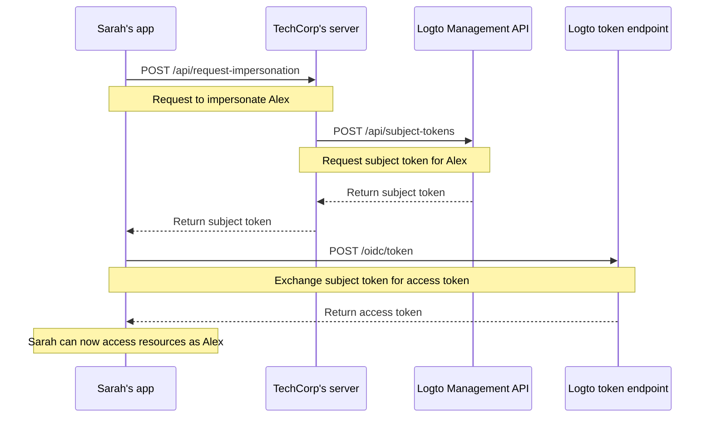

# User impersonation

Imagine Sarah, a support engineer at TechCorp, receives an urgent ticket from Alex, a customer who can't access a critical resource. To efficiently diagnose and resolve the issue, Sarah needs to see exactly what Alex sees in the system. This is where Logto's user impersonation feature comes in handy.

User impersonation allows authorized users like Sarah to temporarily act on behalf of other users like Alex within the system. This powerful feature is invaluable for troubleshooting, providing customer support, and performing administrative tasks.

## How it works?



The impersonation process involves three main steps:

1. Sarah requests impersonation through TechCorp's backend server
2. TechCorp's server obtains a subject token from Logto's Management API
3. Sarah's application exchanges this subject token for an access token

Let's walk through how Sarah can use this feature to help Alex.

### Step 1: Requesting impersonation

First, Sarah's support application needs to request impersonation from TechCorp's backend server.

**Request (Sarah's application to TechCorp's server)**

```bash
POST /api/request-impersonation HTTP/1.1
Host: api.techcorp.com
Authorization: Bearer <Sarah's_access_token>
Content-Type: application/json

{
  "userId": "alex123",
  "reason": "Investigating resource access issue",
  "ticketId": "TECH-1234"
}
```

In this API, the backend should perform proper authorization checks to ensure Sarah has the necessary permissions to impersonate Alex.

### Step 2: Obtaining a subject token

TechCorp's server, upon validating Sarah's request, will then call Logto's [Management API](/integrate-logto/interact-with-management-api) to obtain a subject token.

**Request (TechCorp's server to Logto's Management API)**

```bash
POST /api/subject-tokens HTTP/1.1
Host: techcorp.logto.app
Authorization: Bearer <TechCorp_m2m_access_token>
Content-Type: application/json

{
  "userId": "alex123",
  "context": {
    "ticketId": "TECH-1234",
    "reason": "Resource access issue",
    "supportEngineerId": "sarah789"
  }
}
```

**Response (Logto to TechCorp's server)**

```json
{
  "subjectToken": "sub_7h32jf8sK3j2",
  "expiresIn": 600
}
```

TechCorp's server should then return this subject token to Sarah's application.

**Response (TechCorp's server to Sarah's application)**

```json
{
  "subjectToken": "sub_7h32jf8sK3j2",
  "expiresIn": 600
}
```

### Step 3: Exchanging the subject token for an access token

Now, Sarah's application exchanges this subject token for an access token representing Alex, specifying the resource where the token will be used.

**Request (Sarah's application to Logto's token endpoint)**

```bash
POST /oidc/token HTTP/1.1
Host: techcorp.logto.app
Content-Type: application/x-www-form-urlencoded

grant_type=urn:ietf:params:oauth:grant-type:token-exchange
&client_id=techcorp_support_app
&scope=resource:read
&subject_token=alx_7h32jf8sK3j2
&subject_token_type=urn:ietf:params:oauth:token-type:access_token
&resource=https://api.techcorp.com/customer-data
```

**Response (Logto to Sarah's application)**

```json
{
  "access_token": "eyJhbG...<truncated>",
  "issued_token_type": "urn:ietf:params:oauth:token-type:access_token",
  "token_type": "Bearer",
  "expires_in": 3600,
  "scope": "resource:read"
}
```

The `access_token` returned will be bound to the specified resource, ensuring it can only be used with TechCorp's customer data API.

## Example usage

Here's how Sarah might use this in a Node.js support application:

```jsx
interface ImpersonationResponse {
  subjectToken: string;
  expiresIn: number;
}

interface TokenExchangeResponse {
  access_token: string;
  issued_token_type: string;
  token_type: string;
  expires_in: number;
  scope: string;
}

async function impersonateUser(
  userId: string,
  clientId: string,
  ticketId: string,
  resource: string
): Promise<string> {
  try {
    // Step 1 & 2: Request impersonation and get subject token
    const impersonationResponse = await fetch(
      'https://api.techcorp.com/api/request-impersonation',
      {
        method: 'POST',
        headers: {
          Authorization: "Bearer <Sarah's_access_token>",
          'Content-Type': 'application/json',
        },
        body: JSON.stringify({
          userId,
          reason: 'Investigating resource access issue',
          ticketId,
        }),
      }
    );

    if (!impersonationResponse.ok) {
      throw new Error(`HTTP error occurred. Status: ${impersonationResponse.status}`);
    }

    const { subjectToken } = (await impersonationResponse.json()) as ImpersonationResponse;

    // Step 3: Exchange subject token for access token
    const tokenExchangeBody = new URLSearchParams({
      grant_type: 'urn:ietf:params:oauth:grant-type:token-exchange',
      client_id: clientId,
      scope: 'openid profile resource.read',
      subject_token: subjectToken,
      subject_token_type: 'urn:ietf:params:oauth:token-type:access_token',
      resource: resource,
    });

    const tokenExchangeResponse = await fetch('https://techcorp.logto.app/oidc/token', {
      method: 'POST',
      headers: { 'Content-Type': 'application/x-www-form-urlencoded' },
      body: tokenExchangeBody,
    });

    if (!tokenExchangeResponse.ok) {
      throw new Error(`HTTP error! status: ${tokenExchangeResponse.status}`);
    }

    const tokenData = (await tokenExchangeResponse.json()) as TokenExchangeResponse;
    return tokenData.access_token;
  } catch (error) {
    console.error('Impersonation failed:', error);
    throw error;
  }
}

// Sarah uses this function to impersonate Alex
async function performImpersonation(): Promise<void> {
  try {
    const accessToken = await impersonateUser(
      'alex123',
      'techcorp_support_app',
      'TECH-1234',
      'https://api.techcorp.com/customer-data'
    );
    console.log('Impersonation access token for Alex:', accessToken);
  } catch (error) {
    console.error('Failed to perform impersonation:', error);
  }
}

// Execute the impersonation
void performImpersonation()
```

:::note

1. The subject token is short-lived and for one-time-use.
2. The impersonation access token doesn't come with a [refresh token](https://auth.wiki/refresh-token). Sarah will need to repeat this process if the token expires before she resolves Alex's issue.
3. TechCorp's backend server must implement proper authorization checks to ensure only authorized support staff like Sarah can request impersonation.
   :::

## `act` claim

When using the token exchange flow for impersonation, the issued access token can include an additional `act` (actor) claim. This claim represents the identity of the "acting party" - in our example, Sarah, who is performing the impersonation.

To include the `act` claim, Sarah's application needs to provide an `actor_token` in the token exchange request. This token should be a valid access token for Sarah with the `openid` scope. Here's how to include it in the token exchange request:

```bash
POST /oidc/token HTTP/1.1
Host: techcorp.logto.app
Content-Type: application/x-www-form-urlencoded

grant_type=urn:ietf:params:oauth:grant-type:token-exchange
&client_id=techcorp_support_app
&scope=resource:read
&subject_token=alx_7h32jf8sK3j2
&subject_token_type=urn:ietf:params:oauth:token-type:access_token
&actor_token=sarah_access_token
&actor_token_type=urn:ietf:params:oauth:token-type:access_token
&resource=https://api.techcorp.com/customer-data
```

If an `actor_token` is provided, the resulting access token will contain an `act` claim like this:

```json
{
  "aud": "https://api.techcorp.com",
  "iss": "https://techcorp.logto.app",
  "exp": 1443904177,
  "sub": "alex123",
  "act": {
    "sub": "sarah789"
  }
}
```

This `act` claim clearly indicates that Sarah (sarah789) is acting on behalf of Alex (alex123). The `act` claim can be useful for auditing and tracking impersonation actions.

## Customizing token claims

Logto allows you to [customize the token claims](/developers/custom-token-claims) for impersonation tokens. This can be useful for adding additional context or metadata to the impersonation process, such as the reason for impersonation or the associated support ticket.

When TechCorp's server requests a subject token from Logto's Management API, it can include a `context` object:

```json
{
  "userId": "alex123",
  "context": {
    "ticketId": "TECH-1234",
    "reason": "Resource access issue",
    "supportEngineerId": "sarah789"
  }
}
```

This [context](/developers/custom-token-claims/create-script#context-only-available-for-user-access-token) can then be used in a `getCustomJwtClaims()` function to add specific claims to the final access token. Here's an example of how this might be implemented:

```tsx
const getCustomJwtClaims = async ({ token, context, environmentVariables }) => {
  if (context.grant?.type === 'urn:ietf:params:oauth:grant-type:token-exchange') {
    const { ticketId, reason, supportEngineerId } = context.grant.subjectTokenContext;
    return {
      impersonation_context: {
        ticket_id: ticketId,
        reason: reason,
        support_engineer: supportEngineerId,
      },
    };
  }
  return {};
};
```

The resulting access token that Sarah receives might look like this:

```json
{
  "sub": "alex123",
  "aud": "https://api.techcorp.com/customer-data",
  "impersonation_context": {
    "ticket_id": "TECH-1234",
    "reason": "Resource access issue",
    "support_engineer": "sarah789"
  }
  // ... other standard claims
}
```

By customizing access token claims in this way, TechCorp can include valuable information about the impersonation context, making it easier to audit and understand impersonation activities in their system.

:::note
Be cautious when adding custom claims to your tokens. Avoid including sensitive information that could pose security risks if the token is intercepted or leaked. The JWTs are signed but not encrypted, so the claims are visible to anyone with access to the token.
:::
