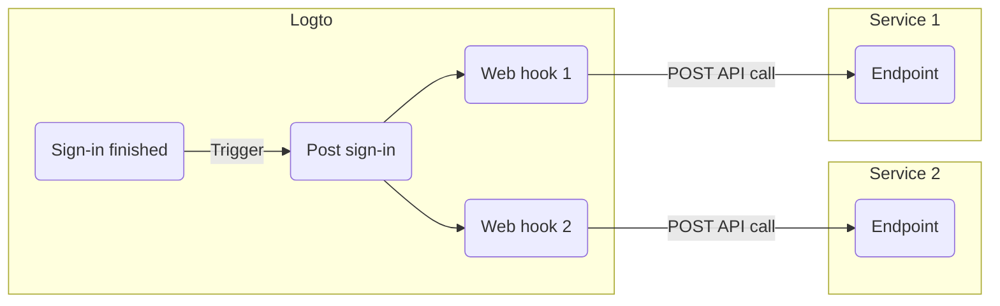

# Webhooks

Logto [Webhook](https://auth.wiki/webhook) provide real-time notifications for various events, including changes to [user account](/user-management/user-data), [role](/authorization/role-based-access-control#roles), [permission](/authorization/role-based-access-control#permissionsscopes), [organization](/organizations/organization-data), [organization role](/authorization/organization-template#organization-role), [organization permission](/authorization/organization-template#organization-permission), and [user interaction](/end-user-flows).

When an event is triggered, Logto sends an HTTP request to the Endpoint URL you provide, containing detailed information about the event, such as user ID, username, email, and other relevant details (for more about the data included in the payload and header, refer to [Webhook request](/developers/webhooks/webhooks-request)). Your application can process this request and take customized actions, like sending an email or updating data in database.

We continuously add more events based on user needs. If you have specific requirements for your business, please let us know.

## Why use Webhook?

Webhooks offer real-time communication between applications, eliminating the need for polling and enabling immediate data updates. They simplify application integration and workflow automation without complex code or proprietary APIs.

Here are some examples of common Webhook use cases for CIAM:

- **Send emails:** Configure a Webhook to send a welcome email to new users upon registration or notify administrators when a user signs in from a new device or location.
- **Send notifications:** Configure a Webhook to trigger a virtual assistant with your CRM system to provide real-time customer support when users sign up.
- **Perform additional API calls**: Configure a Webhook to verify user access by checking their email domain or IP address and then use the Logto Management API to assign appropriate roles with resource permissions.
- **Data synchronization:** Configure Webhook to keep the application updated about changes such as user account suspensions or deletions.
- **Generate reports**: Set up a Webhook to receive user login activity data and leverage it to create reports on user engagement or usage patterns.

## Terms

| Item                                                                                                                                                                           | Description                                                                                                                                                                                              |
| ------------------------------------------------------------------------------------------------------------------------------------------------------------------------------ | -------------------------------------------------------------------------------------------------------------------------------------------------------------------------------------------------------- |
| Event                                                                                                                                                                          | When a specific action is done, it will trigger a hook event with a specific type. E.g., Logto will emit a PostRegister hook event when the user finished the sign-up process and created a new account. |
| Hook                                                                                                                                                                           | A single or series of actions that hook to a specific event. Action can be calling API, executing code snippets, etc.                                                                                    |
| Webhook                                                                                                                                                                        | A subtype of hook that indicates calling an API with the event payload.                                                                                                                                  |
| Say a developer wants to send a notification when user signs in via a new device, the developer can add a webhook that calls his security service API to the PostSignIn event. |

Here's an example of enabling two web hooks for `PostSignIn` event in Logto:

## FAQs

Does Logto support synced webhooks?

Although synced webhooks would make the user sign-in flow smoother, we don't support them yet (we will in the future). Therefore, scenarios that rely on synced webhooks currently all require different workarounds. If you have any questions, don't hesitate to contact us.

How to deal with user permission change?

See [Manage user permission change](/authorization/role-based-access-control/protect-api-resources-with-rbac/#optional-handle-user-permission-change) guide.

How to debug webhook timeout?

For the endpoint receiving Webhooks, it should return a 2xx response as quickly as possible to tell Logto that the Webhook has been successfully received. Since different users have vastly different processing logic for Webhooks, excessively complex tasks might take several seconds, causing the Logto Webhook to time out. Best practice is to maintain your own event queue; upon receiving the Logto Webhook, insert the event into the queue and return a 2xx response to Logto. Then let your own worker process the tasks in the queue step by step. If the worker encounters an error, handle it on your own server.

Can I get the client IP address from `PostSignIn` webhooks?

Yes, you can get IP address, user agents, etc in Webhook payload. If you need information that is not currently supported, you can create feature requests on GitHub issues, or contact us.

