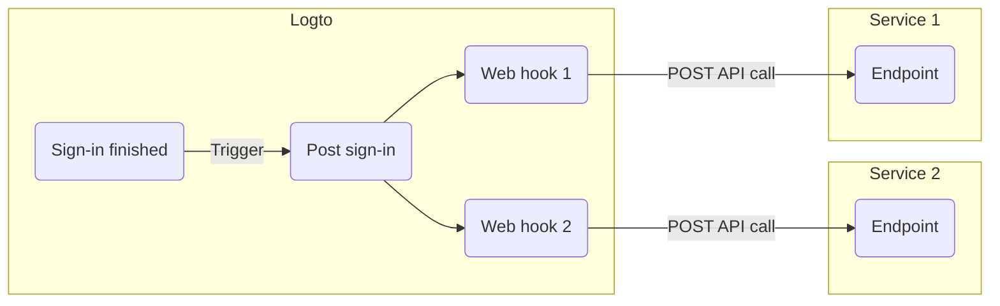

# Webhooks

Logto [Webhooks](https://auth.wiki/webhook) provide real-time notifications for various events, including changes to user accounts, roles, permissions, organizations, organization roles, organization permissions, and [user interactions](/end-user-flows).

When an event is triggered, Logto asynchronously sends an HTTP request to the endpoint URL you provide. The request contains details about the event, such as the user, application, and request context. See [Webhook request](/developers/webhooks/webhooks-request) for the payload and header reference.

Webhook delivery happens outside the authentication request and cannot change the outcome of the current flow. For synchronous code that must finish before sign-in continues, use [Actions](/developers/actions).

We continuously add more events based on user needs. If you have specific requirements for your business, please let us know.

## Why use Webhook? \{#why-use-webhook}

Webhooks offer real-time communication between applications, eliminating the need for polling and enabling immediate data updates. They simplify application integration and workflow automation without complex code or proprietary APIs.

Here are some examples of common Webhook use cases for CIAM:

- **Send emails:** Configure a Webhook to send a welcome email to new users upon registration or notify administrators when a user signs in from a new device or location.
- **Send notifications:** Configure a Webhook to trigger a virtual assistant with your CRM system to provide real-time customer support when users sign up.
- **Perform additional API calls**: Configure a Webhook to verify user access by checking their email domain or IP address and then use the Logto Management API to assign appropriate roles with resource permissions.
- **Data synchronization:** Configure Webhook to keep the application updated about changes such as user account suspensions or deletions.
- **Generate reports**: Set up a Webhook to receive user login activity data and leverage it to create reports on user engagement or usage patterns.

## Terms \{#terms}

| Item          | Description                                                                                         |
| ------------- | --------------------------------------------------------------------------------------------------- |
| Webhook event | A supported event type that Logto can deliver, such as `PostSignIn` or `User.Created`.              |
| Webhook       | A configuration that subscribes to one or more events and sends their payloads to an HTTP endpoint. |

For example, to notify a security service after a user signs in, create a Webhook that subscribes to `PostSignIn`.

Here's an example of enabling two Webhooks for the `PostSignIn` event in Logto:

```mermaid
graph LR
  subgraph Logto
    SF(Sign-in finished)
    PS(Post sign-in)
    WH2(Web hook 2)
    WH1(Web hook 1)
  end

  subgraph Service 2
    E2(Endpoint)
  end

  subgraph Service 1
    E1(Endpoint)
  end

  SF -->|Trigger| PS
  PS --> WH1
  PS --> WH2
  WH1 --->|POST API call| E1
  WH2 --->|POST API call| E2

```

## FAQs \{#faqs}

### Can Webhooks make a synchronous authentication decision? \{#does-logto-support-synced-webhooks}

No. Webhooks are asynchronous notifications, so their response cannot allow, block, or modify the current authentication flow.

Use [Actions](/developers/actions) when Logto must run custom code, call an external API, or update a user before sign-in continues. Because Actions are synchronous, keep their external dependencies fast and reliable.

### How to deal with user permission change? \{#how-to-deal-with-user-permission-change}

See [Manage user permission change](/authorization/global-api-resources/#optional-handle-user-permission-change) guide.

### How to debug webhook timeout? \{#how-to-debug-webhook-timeout}

For the endpoint receiving Webhooks, it should return a 2xx response as quickly as possible to tell Logto that the Webhook has been successfully received. Since different users have vastly different processing logic for Webhooks, excessively complex tasks might take several seconds, causing the Logto Webhook to time out. Best practice is to maintain your own event queue; upon receiving the Logto Webhook, insert the event into the queue and return a 2xx response to Logto. Then let your own worker process the tasks in the queue step by step. If the worker encounters an error, handle it on your own server.

### Can I get the client IP address from `PostSignIn` webhooks? \{#can-i-get-the-client-ip-address-from-postsignin-webhooks}

Yes, you can get IP address, user agents, etc in Webhook payload. If you need information that is not currently supported, you can create feature requests on GitHub issues, or contact us.

## Related resources \{#related-resources}

<Url href="https://blog.logto.io/webhooks-vs-polling">Webhooks vs. polling</Url>
