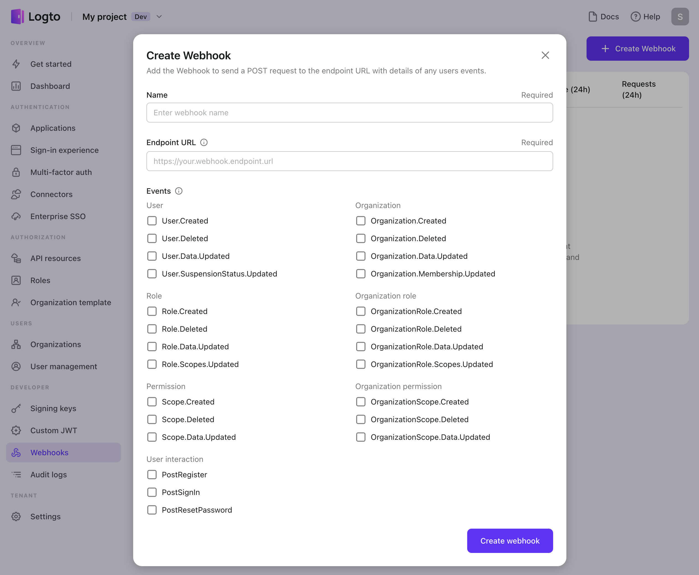

# Configure webhooks

Configure webhooks in Logto Console to achieve seamless integration and receive real-time event notifications for your application. Enjoy easy configuration, enhanced security, and convenient health monitoring options.

## Create a webhook

Firstly, create a webhook endpoint that will be called by the Logto Agent. This endpoint should be implemented on your server and capable of receiving HTTP requests.

To create a new webhook in the Logto Console, follow these steps:

1. **Create webhook**: Navigate to <CloudLink to="/webhooks">Console > Webhooks</CloudLink> and click the "Create webhook" button.
2. **Name**: Provide a name for the webhook. It is for your own reference to define the usage scenario.
3. **Endpoint URL**: Enter the `Endpoint URL`, which is the URL of your server that will receive the webhook POST requests when the event occurs. For security reasons, the URL must be publicly accessible via HTTPS and should not be a local host URL.

   :::note
   Your server should respond to the Logto webhook requests with an HTTP 200 ("OK") response right after receiving the request to notify that the request has been received.

   Waiting for the corresponding Webhook event's logic processing to complete before responding might cause the Webhook to timeout.

   Do not return any response other than 200 to the Logto webhook. If an error occurs while processing the event, handle it on your own server.
   :::

4. **Event**: In the modal that appears, select the desired [events](/developers/webhooks/webhooks-events) that will trigger this webhook. It is recommended to choose a smaller number of events that meet your requirements to avoid overwhelming the server reception. You can change the selected events at any time after creating the webhook.

   

5. **Disable / Reactive**: By default, the webhook is activated immediately after creation. If you want to suspend the webhook temporarily, you can disable or reactivate it using the "Three-Dots" menu located in the top-right corner of the header after creating it.

## Secure webhook

Once your server is ready to receive webhook requests, you may want to make sure that it can handle the requests securely. Logto generates a signature for each webhook request payload, which allows you to verify that the request comes from Logto.

After creating a new webhook, you have options to enhance its security:

- **Signing key**: Logto generates a unique hash signature, known as the Signing Key, for each webhook. You can include this key as a request header in your endpoint implementation. Verifying the signing key ensures that the webhook payload originates from Logto and has not been tampered with by unauthorized sources. Read [securing your webhooks](/developers/webhooks/secure-webhooks/) to learn more about the code.
- **Custom header**: You have the option to include custom headers in the webhook payload to provide additional context or metadata. This feature allows you to add relevant information that can assist in processing the webhook data effectively.

By utilizing the Signing Key and considering the inclusion of Custom Headers, you can enhance the security of your webhooks and ensure the integrity and authenticity of the received payloads.

## Test webhook

To test the connection between Logto and your services, simply click the "Send test payload" button. Logto will then send a sample payload for each selected event to your endpoint URL. These test requests contain anonymous data and are not logged in the recent request history.

This test ensures that your webhook is properly set up to receive and process payloads from Logto. It allows you to validate the integration before deploying the webhook in a live environment.

## Monitor Webhook health status

Logto provides convenient tools to monitor the health status of your webhooks and investigate any potential issues in detail:

- **Health status**
  The webhook list in Logto displays the health status of each webhook, including the success rate and total number of requests made in the past 24 hours. This information gives you an overview of the webhook's performance.
- **Independent request logs**
  In the "Recent Requests" section of each webhook, you can access the request logs for the past 24 hours. Each request is logged individually, allowing you to view the details of each request and investigate any potential errors or anomalies.
- **Auto-retry**
  In the event of a failed delivery (when the webhook response status is greater than or equal to 500), Logto automatically retries the delivery up to three times. Rest assured that multiple retries of the same request will only generate a single log entry, avoiding unnecessary duplication.

By leveraging these monitoring features, you can effectively track the health of your webhooks, examine request logs, and ensure the reliability and performance of your webhook integrations.
