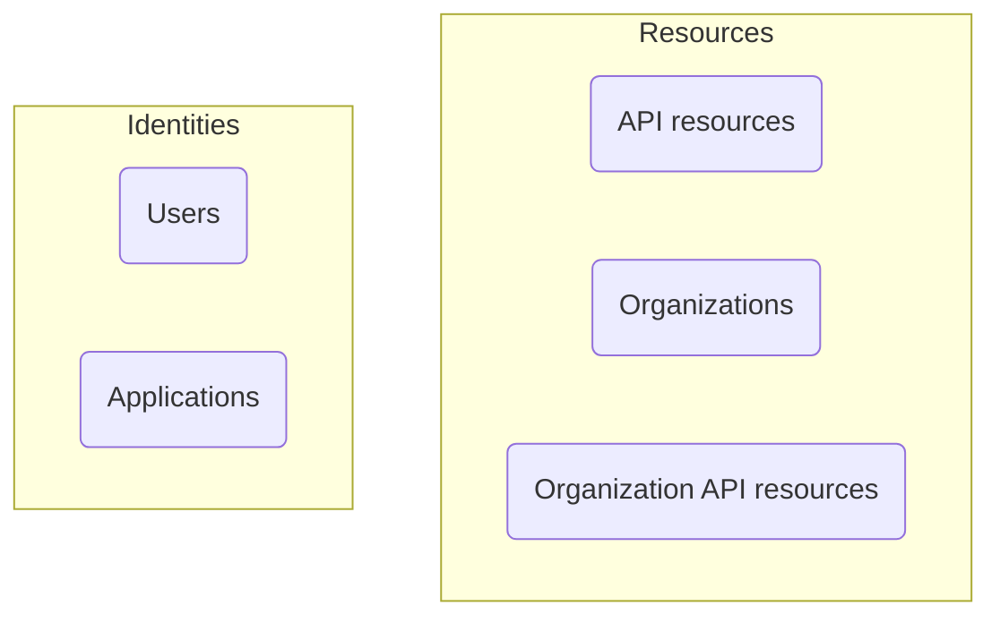

# 🆚 Authentication vs. authorization

## TL;DR

The difference between **authentication** and **authorization** can be summarized as follows:

- **Authentication** answers the question “Which identity do you own?”
- **Authorization** answers the question “What can you do?”

For a complete customer identity and access management (CIAM) introduction, you can refer to our CIAM series:

- [CIAM 101: Authentication, Identity, SSO](https://blog.logto.io/ciam-101-intro-authn-sso/)
- [CIAM 102: Authorization & Role-based Access Control](https://blog.logto.io/ciam-102-authz-and-rbac/)

## Authentication

Logto supports various interactive and non-interactive authentication methods, for example:

- **Sign-in experience**: The authentication process for end-users.
- **Machine-to-machine (M2M) authentication**: The authentication process for services or applications.

The ultimate goal of authentication is dramatically simple: to verify and get the unique identifier of the entity (in Logto, a user or an application).

## Authorization

In Logto, authorization is done through role-based access control (RBAC). It gives you the complete control to manage the access of your users or applications to the following:

- **API resources**: A global entity that represents by an absolute URI.
- **Organizations**: A group of users or applications.
- **Organization API resources**: An API resource that belongs to an organization.

To learn more about these concepts, you can refer to the following resources:

- [🔐 Role-based access control (RBAC)](../recipes/rbac/README.mdx)
- [🏢 Organizations (Multi-tenancy)](../recipes/organizations/README.mdx)

Here's a visual representation of the relationship between these concepts:

In a nutshell, authorization is about defining the rules that determine what entities in the "Identities" group can access the entities in the "Resources" group.

## Common pitfalls

### I need to specify which users can sign in to an application

Due to the nature of single sign-on (SSO), Logto currently does not support using applications as resources. Instead, you can define API resources and permissions to control access to your resources.

### I need my users to sign in to an organization

As mentioned earlier, authentication involves verifying the identity of an entity, while access control is handled through authorization. Therefore:

- Determining which organization(s) a user belongs to is an authorization concern.
- The sign-in process is an authentication concern.

This means that there is no concept of "signing in to an organization" in Logto. Once a user is authenticated, they can be authorized to access all resources (including organization resources) based on the defined permissions.

This model is efficient and clear, as it separates the concerns of authentication and authorization. All modern SaaS applications, such as GitHub and Notion, follow this model.

However, there are some cases where you need to establish 1-1 mappings between user sources and organizations. In this case, [enterprise SSO](../recipes/single-sign-on/README.md) and [organization Just-in-Time (JIT) provisioning](../recipes/organizations/just-in-time-provisioning.mdx) can be helpful.

### Our customers need custom branding for their sign-in pages

We hear you! The "Organization-level and app-level sign-in experience settings" feature is on [our roadmap](https://logto.productlane.com/roadmap) and will be available soon.
