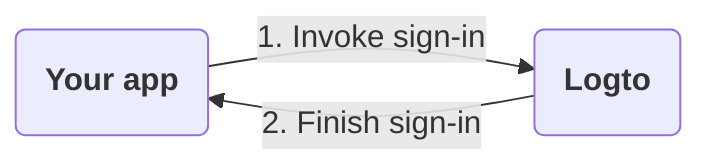
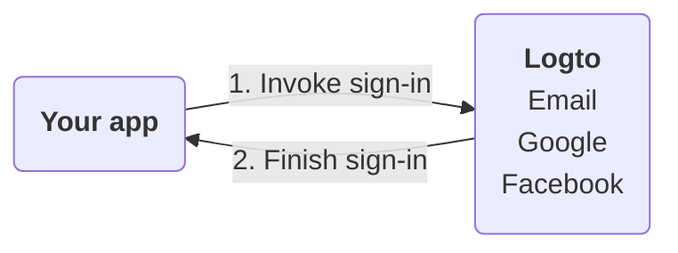
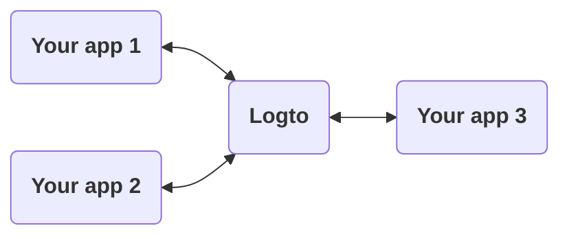
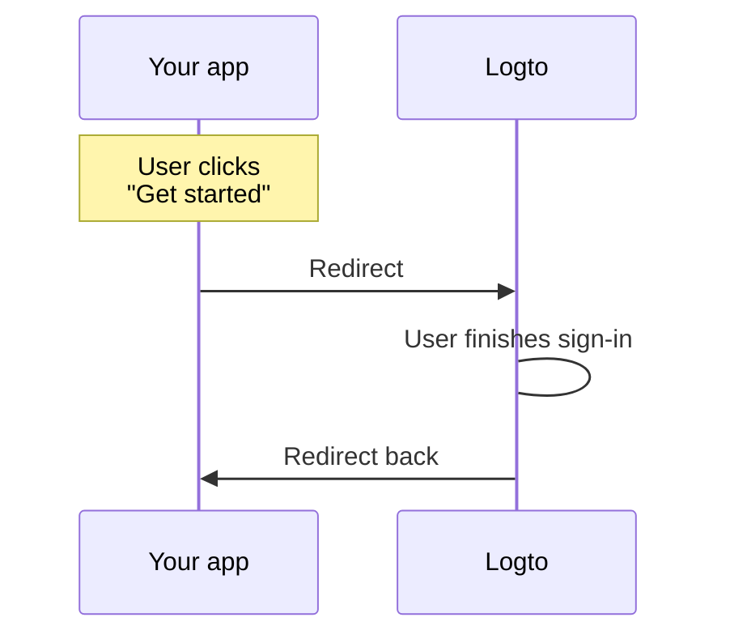
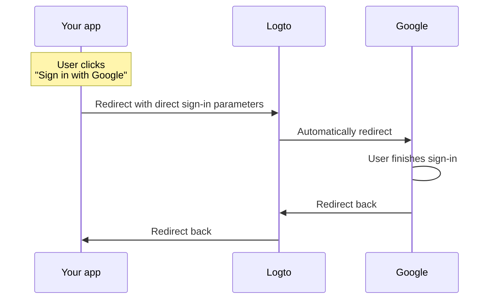

# 🎾 Sign-in experience explained

This page explains the sign-in experience in Logto and why it is designed this way.

## Introduction

Sign-in experience is the user authentication process in Logto. The process can be simplified as follows:



1. Your app invokes the sign-in method.
2. The user is redirected to the Logto sign-in page. For native apps, the system browser is opened.
3. The user signs in and is redirected back to your app (configured as the "Redirect URI" in Logto).

While the process is simple, the redirecting part may look overkill some times. However, it can be beneficial and secure in many ways. We'll explain the reasons in the following sections.

## Why redirect?

### Flexibility

Redirecting allows you to decouple the authentication process from your app. As your business grows, you can still keep the same authentication process without changing your app. For example, you can add multi-factor authentication (MFA) or change the sign-in methods without touching your app.



### Multi-app support

If you have multiple apps, your users can sign in once and access all apps without signing in again. This is especially useful for SaaS businesses or companies with multiple services.



### Native apps

For native apps, redirecting to the system browser is a secure way to authenticate users and has built-in support for both iOS and Android.

- **iOS**: Apple offers [ASWebAuthenticationSession](https://developer.apple.com/documentation/authenticationservices/aswebauthenticationsession) for secure authentication.
- **Android**: Google provides [Custom Tabs](https://developer.chrome.com/docs/android/custom-tabs) for a seamless experience.

### Security

Under the hood, Logto is an [OpenID Connect (OIDC)](https://openid.net/specs/openid-connect-core-1_0.html) provider. OIDC is a widely adopted standard for user authentication.

Logto enforces strict security measures, such as [PKCE](https://tools.ietf.org/html/rfc7636), and disables insecure flows like the implicit flow. Redirecting is a secure way to authenticate users and can prevent many common attacks.

## What if I need to show some sign-in components in my app?

Sometimes your team may want to show some sign-in components in the app, such as a "Sign in with Google" button. This can be achieved by using the "Direct sign-in" feature in Logto.

### How does it work?

Let's say you have two call-to-action buttons in your app: "Get started" and "Sign in with Google". These buttons are designed to:

- "Get started": Redirect to the normal sign-in page.
- "Sign in with Google": Redirect to the Google sign-in page.

Both actions need to complete the sign-in process and redirect back to your app.

---

#### Process of clicking "Get started"

In this case, the sign-in experience is the same as the default. The user is redirected to the Logto sign-in page and then back to your app.



:::note
If you have configured social sign-in methods (e.g., Google, Facebook) in Logto, the user may be redirected to the corresponding sign-in page. In the illustration, we only show the general flow for simplicity.
:::

---

#### Process of clicking "Sign in with Google"

In this case, the user is redirected to the Google sign-in page automatically without interacting with the Logto sign-in page. The speed of this auto-redirect is almost instant that users may not notice the redirection.



---

In summary, the direct sign-in feature is a way to automate some interactions in the sign-in experience without changing the security level.

### Use direct sign-in in your app

To use direct sign-in, you need to pass the `direct_sign_in` parameter when invoking the sign-in method. The value should be composed of a certain format that Logto recognizes. For example, to sign in with Google, the value should be `social:google`.

In some of Logto official SDKs, there's a dedicated option for direct sign-in. Here's an example of using direct sign-in in the `@logto/client` JavaScript SDK:

```ts
client.signIn({
  redirectUri: 'https://some-redirect-uri',
  directSignIn: { method: 'social', target: 'google' },
});
```

For more details, please refer to [Direct sign-in](../references/openid-connect/authentication-parameters/README.md#direct-sign-in).

:::info
We are gradually rolling out this feature in all Logto offical SDKs. If you don't see it in your SDK, please feel free to contact us.
:::

## I need my users to fill in their credentials in my app

If you need your users to fill in their credentials (such as email and password) directly in your app, rather than redirecting to Logto, we can't help you with that at the moment. Historically, there was a "Resource Owner Password Credentials" grant, but it is now considered insecure and has been [formally deprecated in OAuth 2.1](https://blog.logto.io/oauth-2-1/).

To learn more about the security risks of the ROPC grant type, check out our blog post [Why you should deprecate the ROPC grant type](https://blog.logto.io/deprecated-ropc-grant-type/).
