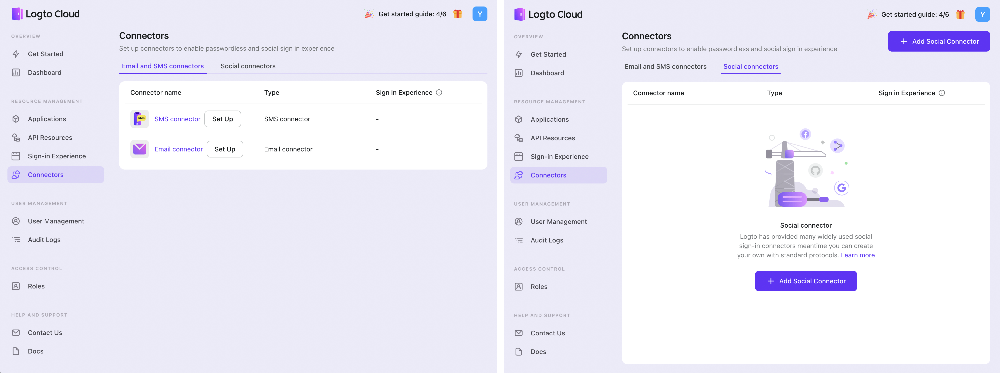

# 🪛 Configure connectors

_Connectors_ are the bridge between Logto and other third-party vendors who provide short message service (SMS), email service, or user information on wildly accepted social media.

Logto provides you with many connectors to give end-users access to third-party providers. Such as Google, GitHub, Facebook, SendGrid mail, etc.

You may feel lost when using connectors as this is a brand new concept. :sob:

Don't worry. This doc will show you an easy way to have things done!

## :watch: Kick-off :zap:

Let's start from Admin Console, signing in with your Logto account ("admin" role needed). You may [create an admin account](../../tutorials/get-started/README.mdx#create-an-admin-account) if you don't have one.

Click the "Connectors" button on the sidebar :neutral_face:

:ghost: **Welcome to the world of _connectors_** :ghost:

This is where you can add, delete or update connectors' configurations as you wish!

_Connectors_ can be classified into three types: _SMS Connector_, _Email Connector_ and _Social Connector_. See [connector reference](../../references/connectors/README.mdx) for more details about connector type.

You can continue setting up _Email connector_ or _SMS connector_, and you need to go to "Social connectors" tab before adding _Social connector_.

:::note
Move on to detailed [connector setup tips](./connector-setup-tips.md) for different connector types' configuration.
:::
