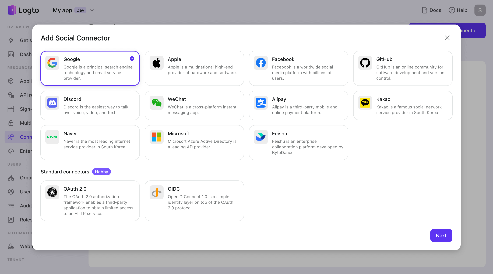

# Configure Social Connector

Configuring social connectors allows users to easily sign in using their existing social media accounts, without entering a password or basic profile information. This can help increase the registration conversion rate for your website or app. At Logto, we're constantly improving our social connector's capabilities to support new platforms and enhance the user experience.

Logto offers two types of social connectors:

- **Common Social Connectors**: Google, Apple, Facebook, GitHub, Discord, Wechat, Alipay, Kakao, Naver, Azure Active Directory.
- **Standard Connectors**: OIDC, OAuth 2.0, SAML.

:::tip
If the social connector you need isn't among our Common Social Connectors, you can create your own using the Standard Connector protocol. Check out our “[Custom Social Connector with Standard Protocol](./custom-social-connector-with-standard-protocols.md)” guide to learn more.
If the Standard Connector still doesn't meet your needs, don't hesitate to contact us. For those using the Logto Open-Source Version, you can even [Write your connector (OSS)](../create-your-connector/README.md).
:::

## Types of common Social Connectors

We have provided lots of universal third-party social platforms preinstalled by Logto Console.

Follow the README to compose the connector config with little effort.

- **Google** [Universal connector](https://github.com/logto-io/logto/tree/master/packages/connectors/connector-google)
- **Apple** [Universal connector](https://github.com/logto-io/logto/tree/master/packages/connectors/connector-apple)
- **Facebook** [Universal connector](https://github.com/logto-io/logto/tree/master/packages/connectors/connector-facebook)
- **GitHub** [Universal connector](https://github.com/logto-io/logto/tree/master/packages/connectors/connector-github)
- **Discord** [Universal connector](https://github.com/logto-io/logto/tree/master/packages/connectors/connector-discord)
- **WeChat** [Web connector](https://github.com/logto-io/logto/tree/master/packages/connectors/connector-wechat-web) | [Native connector](https://github.com/logto-io/logto/tree/master/packages/connectors/connector-wechat-native)
- **Alipay** [Web connector](https://github.com/logto-io/logto/tree/master/packages/connectors/connector-alipay-web) | [Native connector](https://github.com/logto-io/logto/tree/master/packages/connectors/connector-alipay-native)
- **Kakao** [Universal connector](https://github.com/logto-io/logto/tree/master/packages/connectors/connector-kakao)
- **Naver** [Universal connector](https://github.com/logto-io/logto/tree/master/packages/connectors/connector-naver)
- **Microsoft Azure AD** [Universal connector](https://github.com/logto-io/logto/tree/master/packages/connectors/connector-azuread)

:::info About the platform of Social connector
You may find that some connectors do not have a secondary choice of platform, such as Google, Facebook, and GitHub. These connectors' _platform_ are _Universal_. Explore [_platform_](https://docs.logto.io/docs/references/connectors/README.mdx#platform) to know more.

Choose a proper _platform_ from either _Web_ or _Native_ for connectors to fit your use case. You can set up a single _Native_ connector w/o adding a _Web_ connector if you only provide native mobile apps and vice versa.
:::

## Configure steps

To add a new Social connector in Logto Console, navigate to “**Connector > Social connectors**” and click the “**Add Social Connector**” button. Then Select the desired social connector type in the Modal that appears and click the “**Next**” button.

Note that **each type of common social connector can only create one instance** in a Logto tenant.

1. All types of social connectors can choose how to “**sync user profiles**” (such as avatars and usernames). The default setting is to only sync at registration. Still, you can also choose to always sync at each sign-in, but be careful that this may overwrite customized information in your application at user each social sign-in.
2. Each social connector has a unique **“Identity provider name (IdP name)”** to distinguish social identities. Common social connectors use a default IdP name value that cannot be modified, ensuring that you always own the same user identity pool, even if this social connector is re-added. ( For Standard Connectors, you should customize the IdP name value. You can learn more about IdP names before setting up a standard connector. )
3. Finally, note that different social connectors require different configuration parameters. You can refer to the left **README** for guidance on filling out the forms.

## **Related Readings**

- See [Configure sign-in method](../customize-sie/configure-sign-in-methods.mdx) by adding connectors to bring your social connector into use.
