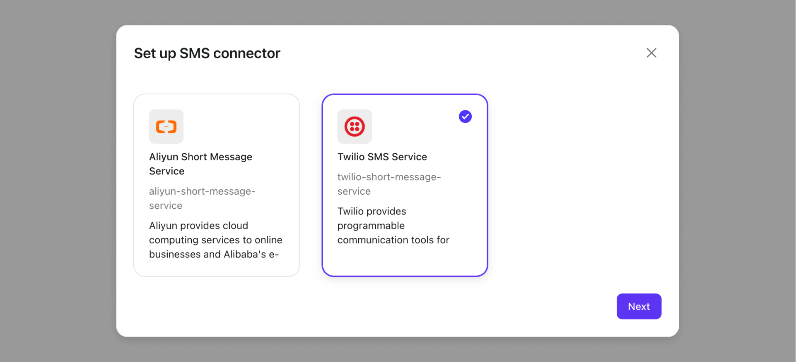
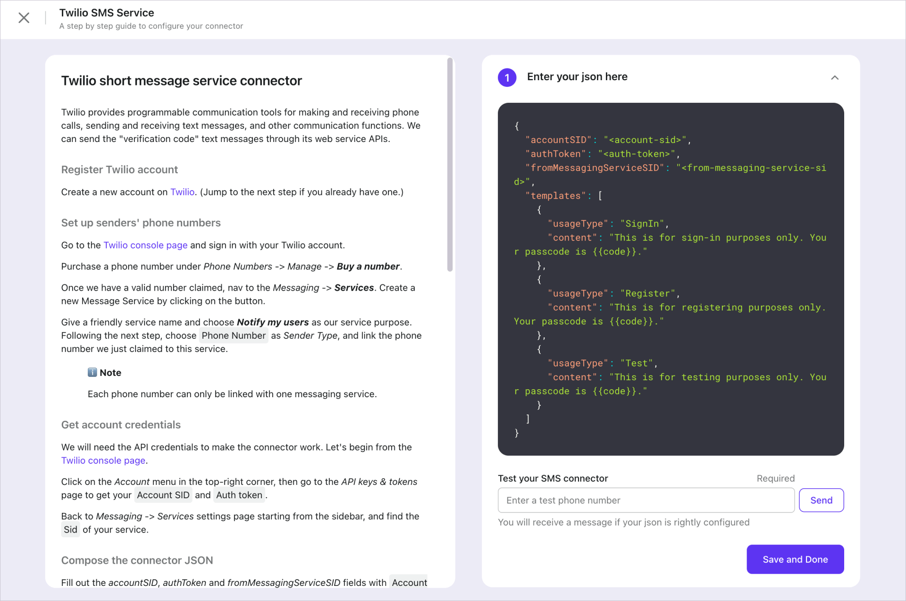
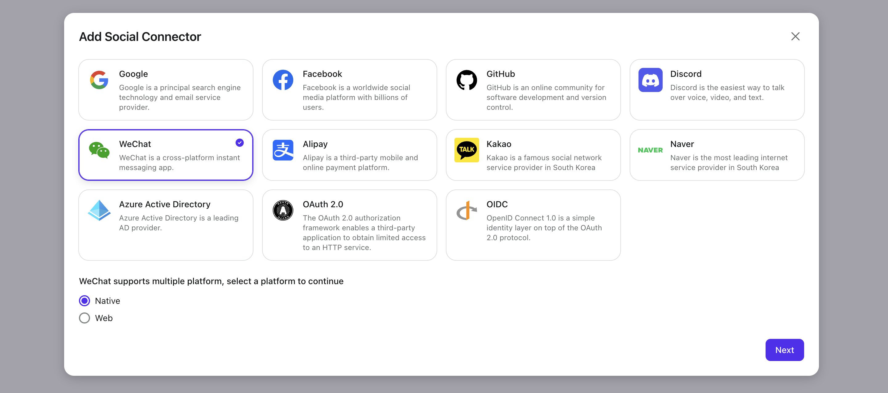
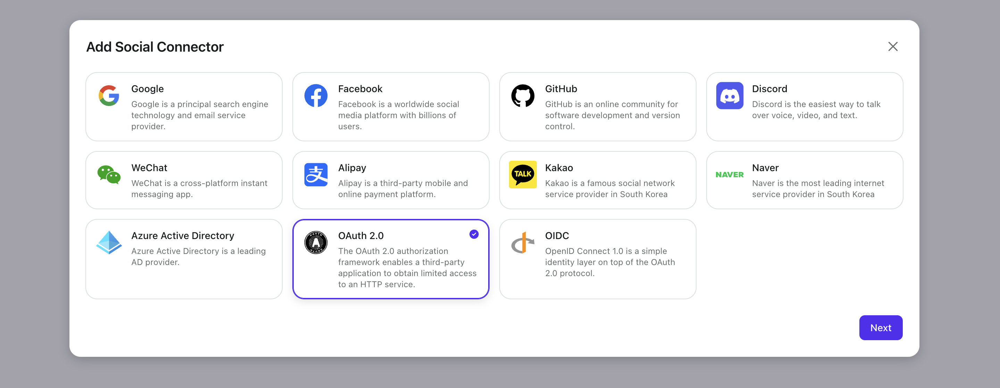
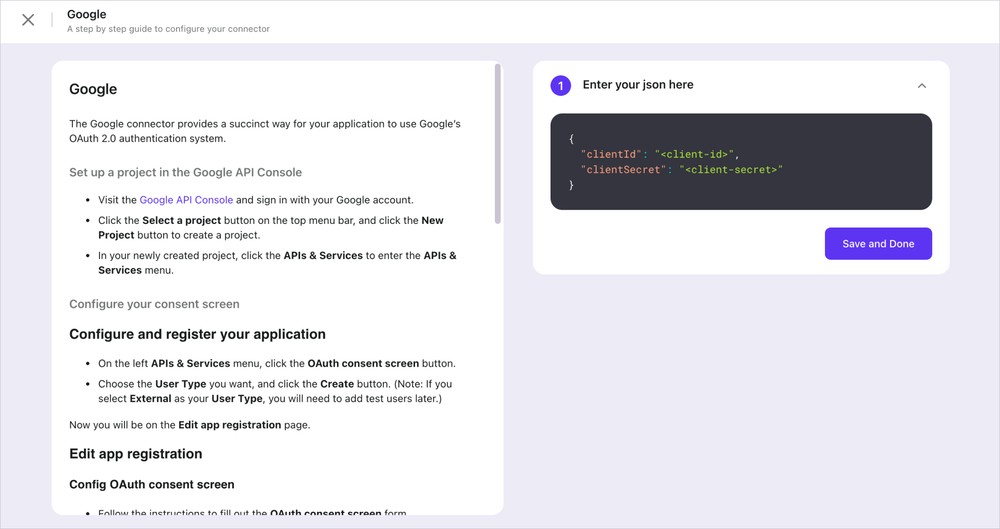

# Connector setup tips

A connector can be classified into two categories by its use cases: [_SMS or Email connector_](./connector-setup-tips.md#sms-or-email-connector) and [_Social connector_](./connector-setup-tips.md#social-connector).

Let's go over some worthy of notice tips for previously mentioned cases.

## SMS or Email Connector

Suppose you are now on the "Connectors" page in Admin Console. Click the "Set up" button and select an SMS or Email connector to enter the configuration process.

Follow the README on the left and compose the connector config JSON in the text input box on your right. You can check whether the config can work before saving changes.

:::tip
We suggest you use different templates for various use cases, or it could trigger flow control, leading to a temporary outage of your service.
:::

You can change the current SMS or Email connector in the top-right corner on the connector details page, where a review of the connector README is also available.

:::note
You can bring ONLY ONE _SMS Connector_ (or _Email Connector_) alive.

If you change the living SMS or Email connector and save changes, the previous SMS or Email connector will be disabled automatically. Also, the _config_ of past connectors will lose track. 
You may keep the old connectors' _config_ properly if you want to switch back to those connectors in the future.
:::

You can check out [how to enable SMS or email passcode sign-in](../../tutorials/get-started/enable-passcode-sign-in.mdx) as soon as you finish the setup.

## Social Connector

Suppose you are now on the "Connectors" page in Admin Console. Go to the "Social connectors" tab and add a new connector to enter the configuration process.

:::tip
You may find that some connectors do not have a secondary choice of platform, such as Google, Facebook, and GitHub. These connectors' _platform_ are _Universal_. Explore [_platform_ description](../../references/connectors/README.mdx#platform) to know more.

Choose a proper _platform_ from either _Web_ or _Native_ for connectors to fit your use case. 
You can set up a single _Native_ connector w/o adding a _Web_ connector if you only provide native mobile apps and vice versa.
:::

Follow the README to compose the connector config JSON with little effort.

See [how to enable social sign-in](../../tutorials/get-started/enable-social-sign-in.mdx) to bring your social connector into use.
