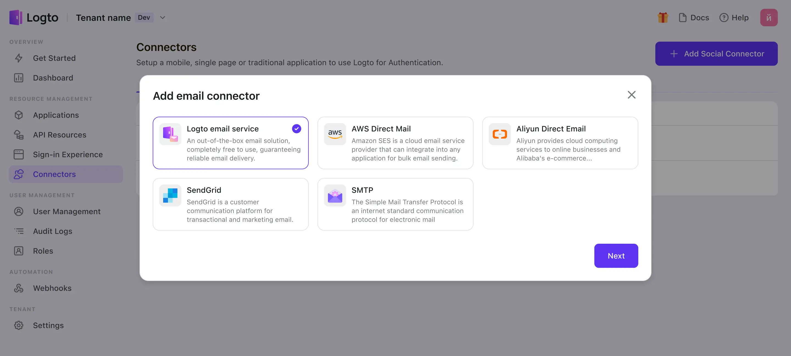

# Configure email connector

Configuring an Email connector allows you to send a one-time password (OTP) to the user's email address ( Magic link will be supported in the future ). Email connector usage is similar to SMS connector, which can be utilized in various scenarios, including sign-up, sign-in, forgot password, and link-account processes, to validate the user's identity.

We provide Logto built-in email service for your online usage or onboarding. It is completely free to use and doesn’t require any additional configuration. You just need to customize your basic brand information for email templates:

- [Logto email service](https://github.com/logto-io/logto/tree/master/packages/connectors/connector-logto-email)

Alternatively, you have the option to connect with other email service providers that Logto offers out-of-box usage. With these providers, you can customize your email templates freely:

- [AWS direct mail connector](https://github.com/logto-io/logto/tree/master/packages/connectors/connector-aws-ses)
- [SendGrid mail connector](https://github.com/logto-io/logto/tree/master/packages/connectors/connector-sendgrid-email)
- [SMTP connector](https://github.com/logto-io/logto/tree/master/packages/connectors/connector-smtp)
- [Aliyun direct mail connector](https://github.com/logto-io/logto/tree/master/packages/connectors/connector-aliyun-dm)

:::tip
We're still working on more connectors! But If you don't see the connector you want, just let us know your needs in Discord or file a Feature Request on GitHub.
For those using the Logto Open-Source Version, we offer the flexibility to [create your own connector](../../configure-connectors/create-your-connector/README.md) to extend.
:::
