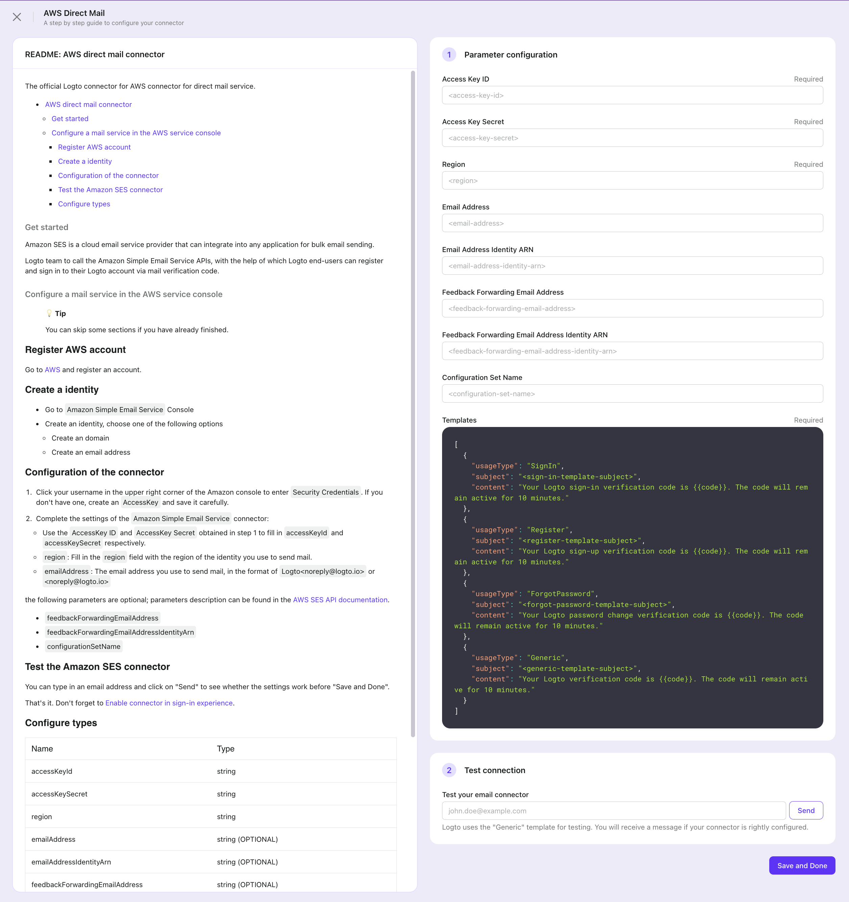
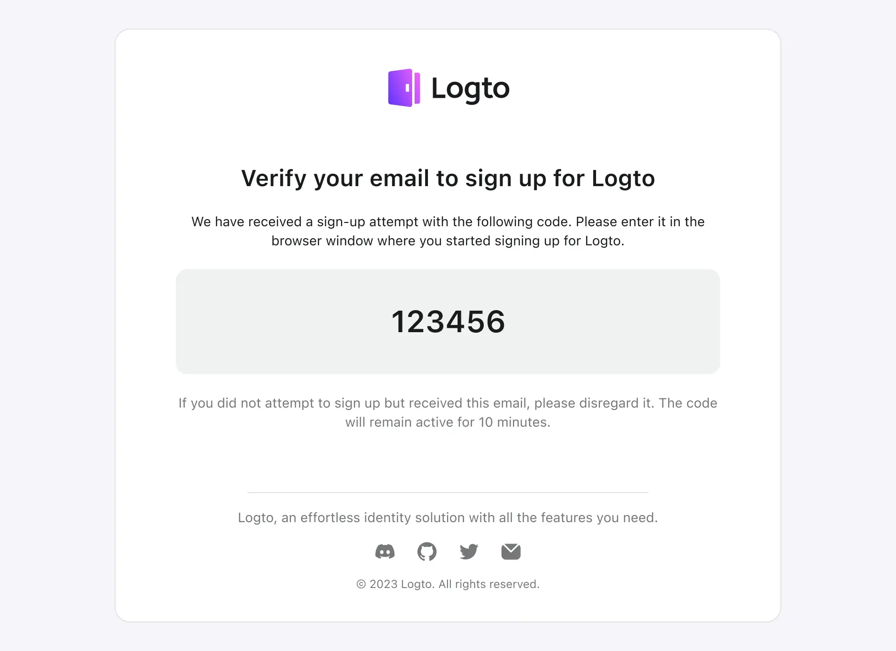

<head>
  <link rel="canonical" href="https://docs.logto.io/connectors/email-connectors/#popular-email-providers" />
</head>

# Configure popular email service

Logto provides a low-code configuration for the most popular email delivery service providers. They are using similar configuration steps so you can get started quickly.

You can refer to the specific doc for detailed instructions on registering each email service provider. Supported email service providers:

- [AWS direct mail connector](https://github.com/logto-io/logto/tree/master/packages/connectors/connector-aws-ses)
- [Mailgun mail connector](https://github.com/logto-io/logto/tree/master/packages/connectors/connector-mailgun)
- [SendGrid mail connector](https://github.com/logto-io/logto/tree/master/packages/connectors/connector-sendgrid-email)
- [SMTP connector](https://github.com/logto-io/logto/tree/master/packages/connectors/connector-smtp)
- [Aliyun direct mail connector](https://github.com/logto-io/logto/tree/master/packages/connectors/connector-aliyun-dm)

## Configuration steps

Follow these steps to configure your email connector:

1. Go to “Connector > Email and SMS connectors” in Logto Console.
2. To add a new one, click the "Set up" button and select the desired Email connector.
3. In the configuration process, follow the steps below:

- Go through the README doc for each type connector on the left, then follow the instructions.
- Fill out any required forms in the Parameter Configuration section on the right.
- Customize the Email template to fit your needs by editing the JSON code.
- Test the configuration by sending an Email verification code to your email address using the “Generic” template.
- Click "Save and Done" to finish.

4. After making the necessary changes, remember to send a test email to your email address.



If you wish to change the current Email connector, simply access the connector details page and click the “Change connector” button of the “More” menu in the top-right corner. Or you can delete the old connector first, then add a new Email connector.

:::note
You can bring ONLY ONE _email connector_ alive.

If you change the active email connector and save changes, the previous Email connector will be disabled automatically. Also, the _config_ of past connectors will lose track. You may keep the old connectors' _config_ properly if you want to switch back to those connectors in the future.
:::

## Email template

Notice that:

- Logto provides four different templates for customizing Email content, which are categorized based on their usage type: Register, SignIn, ForgotPassword, and Generic. It is highly recommended that you use different templates for various use cases, or it could trigger flow control, leading to a temporary outage of your service.
- The verification code is valid for 10 minutes by default.
- The verification code number sent to users uses the variate of `{{code}}`.

| Usage                    | Scenario                                                                                                                                                          |
| ------------------------ | ----------------------------------------------------------------------------------------------------------------------------------------------------------------- |
| Register                 | Users create an account using their email and verify by entering the verification code.                                                                           |
| SignIn                   | Users sign in using their email and verify by entering verification code instead of entering a password.                                                          |
| ForgotPassword           | If users forget their password during sign-in, they can choose to verify their identity using their email.                                                        |
| Generic                  | This template can be used as a generic backup option for various scenarios, including linking an email to an existing account or testing connector configuration… |
| OrganizationInvitation   | This template is used to invite users to join an organization.                                                                                                    |
| UserPermissionValidation | Users request permission validation in [Account API](../../interact-with-account-api/README.mdx) by verify the email verification code.                           |
| BindNewIdentifier        | Users request to bind a new email in [Account API](../../interact-with-account-api/README.mdx) by verify the email verification code.                             |

There is a template example just for reference:



```jsx
<table cellpadding="0" cellspacing="0" border="0" width="100%"
  style="font-family: -apple-system, system-ui, 'BlinkMacSystemFont', 'Segoe UI', 'Roboto', 'Arial', sans-serif;">
  <tr>
    <td align="center" valign="center">
      <table cellpadding="0" cellspacing="0" border="0" width="100%"
        style="max-width: 680px; border-radius: 16px; border: 1px solid #E0E3E3; padding: 32px; background-color: #FFFFFF;">
        <tr>
          <td align="center" valign="center">
            
          </td>
        </tr>
        <tr>
          <td align="center" valign="center" style="padding-bottom: 16px;">
            <table cellpadding="0" cellspacing="0" border="0" width="100%" style="padding: 16px 32px;">
              <tr>
                <td align="center" valign="center" style="padding-bottom: 20px;">
                  <h1 style=" font-size: 24px; font-weight: 600; color: #191C1D; line-height: 32px;">
                    <a href="https://www.{{domain}}/account/verify?token={{token}}"
                      style="color: #191C1D; text-decoration: none;">Verify your email to sign up for Logto</a>
                  </h1>
                </td>
              </tr>
              <tr>
                <td align="center" valign="center" style="padding-bottom: 20px;">
                  <div style="font-size: 14px; font-weight: 400; color: #191C1D;  line-height: 20px;">
                    We have received a sign-up attempt with the following code. Please enter it in the browser window
                    where
                    you started signing up for Logto.
                  </div>
                </td>
              </tr>
              <tr>
                <td align="center" valign="center" style="background: #EFF1F1; padding: 35px; border-radius: 12px;">
                  <div style="font-size: 32px; font-weight: 600; color: #191C1D;  line-height: 40px;">
                    {{code}}
                  </div>
                </td>
              </tr>
              <tr>
                <td align="center" valign="center" style="padding-top: 20px;">
                  <div style="font-size: 14px; font-weight: 400; color: #747778; line-height: 20px;">
                    If you did not attempt to sign up but received this email, please disregard it. The code will remain
                    active for 10 minutes.
                  </div>
                </td>
            </table>
          </td>
        </tr>
        <tr>
          <td align="center" valign="center" style="padding-top: 32px;">
            <table cellpadding="0" cellspacing="0" border="0" width="100%">
              <tr>
                <td align="center" valign="center" width="100%" style="padding-bottom: 16px;">
                  <div style="border-top: 1px solid #E0E3E3; width: 65%;"></div>
                </td>
              </tr>
              <tr>
                <td align="center" valign="center" style="padding-bottom: 16px;">
                  <div style="font-size: 14px; font-weight: 400; color: #747778;  line-height: 20px;">
                    Logto, an effortless identity solution with all the features you need.
                  </div>
                </td>
              </tr>
              <tr>
                <td align="center" valign="center" style="padding-bottom: 16px;">
                  <table cellpadding="0" cellspacing="0" border="0" width="200px">
                    <tr>
                      <td align="center" valign="center">
                        <a href="https://discord.gg/UEPaF3j5e6" target="_blank" rel="noopener">
                          
                        </a>
                      </td>
                      <td align="center" valign="center">
                        <a href="https://github.com/logto-io/logto" target="_blank" rel="noopener">
                          
                        </a>
                      </td>
                      <td align="center" valign="center">
                        <a href="https://twitter.com/silverhand_io" target="_blank" rel="noopener">
                          
                        </a>
                      </td>
                      <td align="center" valign="center">
                        <a href="https://logto.io/subscribe" target="_blank" rel="noopener">
                          
                        </a>
                      </td>
                    </tr>
                  </table>
                </td>
              </tr>
              <tr>
                <td align="center" valign="center">
                  <div style="font-size: 12px; font-weight: 400; color: #747778; line-height: 16px;">
                    © 2023 Logto. All rights reserved.
                  </div>
                </td>
              </tr>
            </table>
          </td>
        </tr>
      </table>
    </td>
  </tr>
</table>
```

You can then escape the HTML code above and add it to the connector "Template" field in configs as follows (assuming using SendGrid connector):

```json
{
  "subject": "<sign-in-template-subject>",
  "content": "<table cellpadding=\"0\" cellspacing=\"0\" ...",
  "usageType": "SignIn",
  "type": "text/html"
}
```
