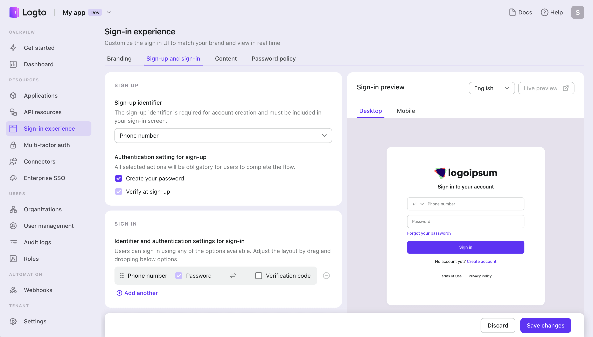

<head>
  <link rel="canonical" href="https://docs.logto.io/connectors/sms-connectors/#enable-phone-number-sign-up-or-sign-in" />
</head>

# Enable SMS connector in sign-in experience

Once you've successfully configured your Email connector, you can make it available as a sign-up or sign-in option according to your business needs.

Navigate to the "Sign-in experience" tab in the left navigation bar, and click "Sign-up and sign-in".

1. **Set sign-up methods:** To enable passwordless sign-up via SMS, select "Phone number" or "Email address or phone number" as the sign-up identifier. Please note that email verification must be required during sign-up in the current version.
2. **Set sign-in methods:** The sign-up identifier will be automatically added as a sign-in method. To provide additional sign-in combinations, click "Add another".
3. Click "Save changes" to make the changes live.

Remember to open the “Live preview” to test the new sign-in experience.

