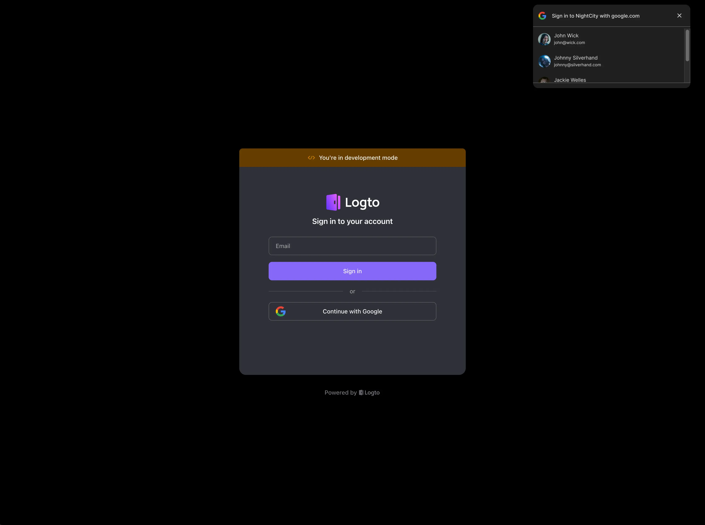

<head>
  <link rel="canonical" href="https://docs.logto.io/end-user-flows/sign-up-and-sign-in/social-sign-in/#google-one-tap" />
</head>

import Availability from '@components/Availability';

# Enable Google One Tap

<Availability cloud oss={{ major: 1, minor: 18 }} />

[Google One Tap](https://developers.google.com/identity/gsi/web/guides/features) is a secure and easy way to let users sign in to your website or app with their Google account. Logto's official Google connector supports Google One Tap, and you can enable it directly in the Logto Console.

## Enable Google One Tap in your sign-in experience

To enable Google One Tap in your sign-in experience, you need to have an official Google connector configured. Please refer to the [official Google connector documentation](/integrations/google/) for more information.

Once you have the Google connector set up, you'll see a card for Google One Tap in the connector settings. You can enable Google One Tap by toggling the switch.

### Configuration options

When you enable Google One Tap, you can configure the following options:

- **Auto-select credential if possible**: Automatically sign in the user with the Google account if [certain conditions are met](https://developers.google.com/identity/gsi/web/guides/automatic-sign-in-sign-out).
- **Cancel the prompt if user click/tap outside**: Close the Google One Tap prompt if the user clicks or taps outside the prompt. If disabled, the user must click the close button to dismiss the prompt.
- **Enable Upgraded One Tap UX on ITP browsers**: Enable the upgraded Google One Tap user experience on Intelligent Tracking Prevention (ITP) browsers. Please refer to [this page](https://developers.google.com/identity/gsi/web/guides/features#upgraded_ux_on_itp_browsers) for more information.

## Enable Google One Tap in your website

This feature is under development. Please stay tuned for updates.
