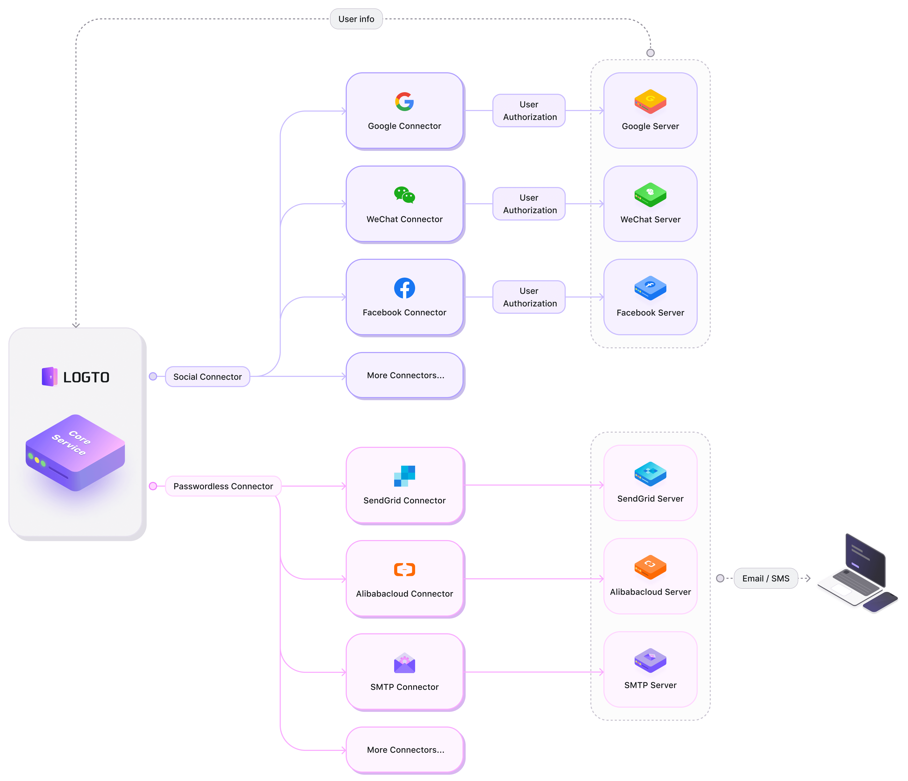

# 🧑‍🔬 Create your connector

Currently, Logto has provided many widely used social sign-in connectors such as WeChat, Alipay, Google, Facebook, etc., and SMS/Email connectors such as AliCloud, SendGrid, and Twilio.

Here is an architecture diagram illustrating how connectors work with Logto core service.

They should be able to satisfy most users' needs at this stage, but _we will keep making progress_. :fire:

While we're working on more connectors, you can also develop your connectors. You are encouraged to share your connectors with the whole community.

Let's see how to contribute to the Logto project by starting with building a connector. :coffee:
