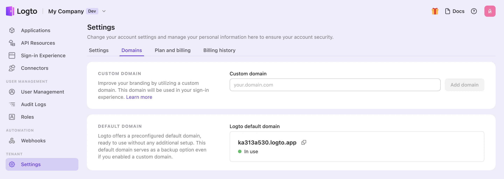
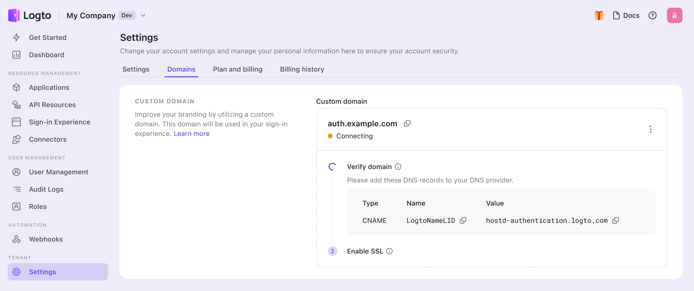

# Configure custom domain in Console

To add a new custom domain in the Logto Console, follow these steps:

1. Navigate to the "Settings" and go to the “Domains” tab.
2. In “Custom Domain” section, enter your domain name and click “add domain”. 
3. Copy the CNAME value in the table, and go to your domain’s DNS provider to add record. 
4. Wait for the verification and SSL process.
   1. We will auto-verify your records every 10 seconds until the custom domain is added. Just ensure that the entered domain name or DNS Records are accurate.
   2. Verification typically takes a few minutes but can take up to 24 hours, depending on the DNS provider. Feel free to navigate away during the process.
