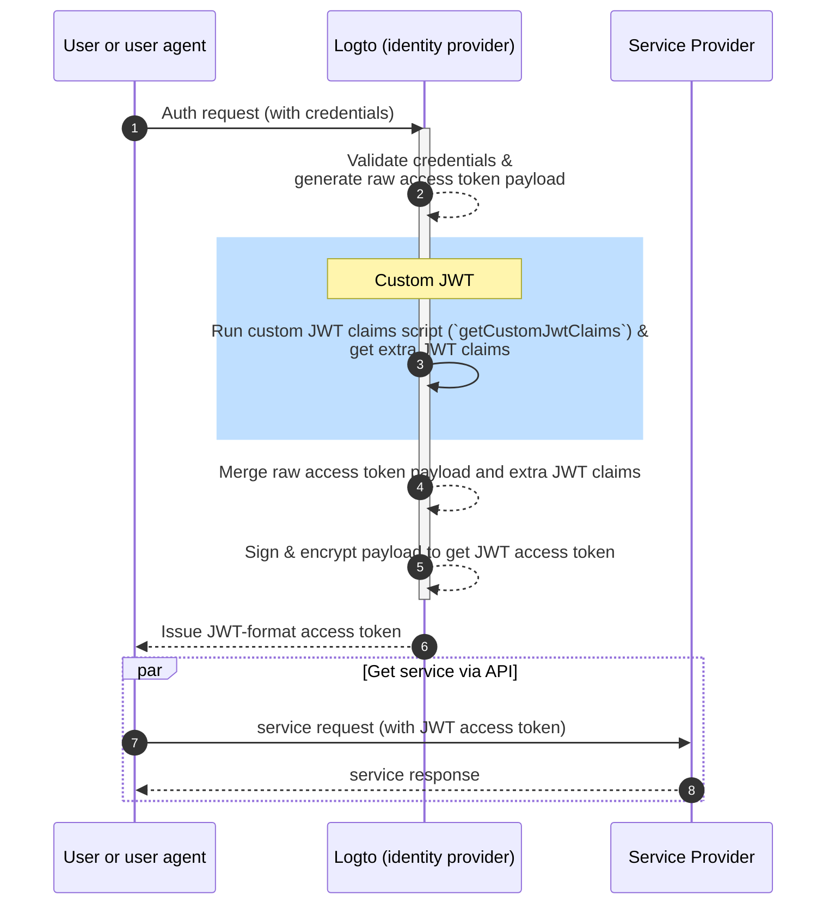
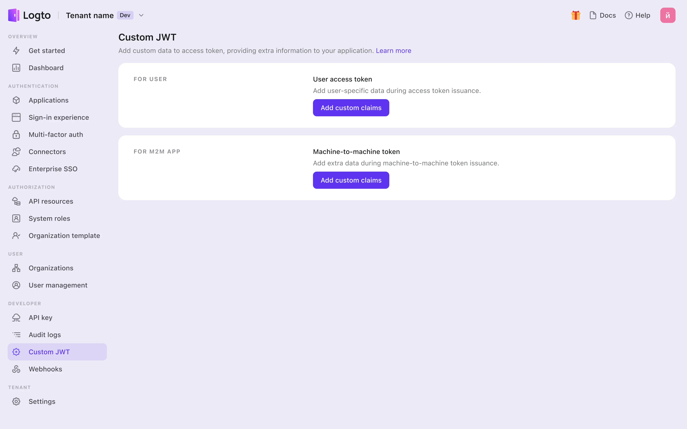
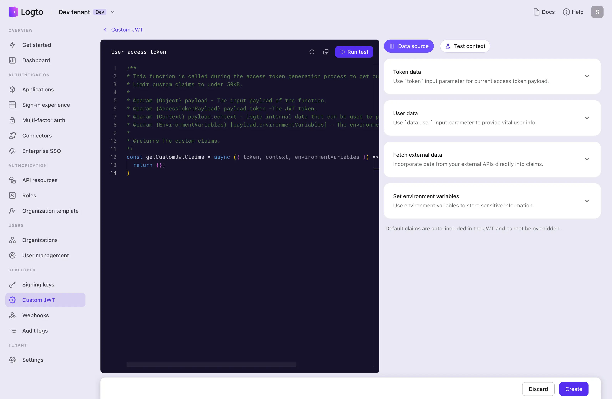
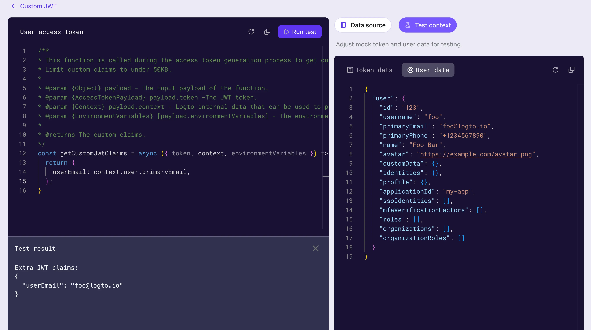

import Availability from '@components/Availability';

import CustomJwtLanding from './assets/custom-jwt-landing.webp';
import CustomJwtDetails from './assets/custom-jwt-details.webp';
import TestResult from './assets/test-result.webp';

# 🎫 Custom JWT claims

<Availability cloud oss={{ major: 1, minor: 16 }} />

## Introduction

JSON web token (JWT) is a popular way to represent claims securely between two parties. Logto issues JWT format access tokens and ID tokens for your applications for authentication and access control. These JWT tokens carry important user information and permissions and pass them between Logto server and your client applications securely.

Usually, the information contained in JWT is determined by the authentication server. According to the OAuth 2.0 protocol, several standard claims are commonly used in JWT tokens, such as `sub`, `iss`, `aud`, `exp`, `iat`, and `jti`. (See [RFC7519](https://datatracker.ietf.org/doc/html/rfc7519) for more details).

However, there are countless scenarios where JWT is used for further verification or data transmission needs, and common JWT claims may often not meet the needs. We understand that you may have specific requirements for the JWT claims in your applications. Therefore, Logto allows you to customize the JWT claims in the access tokens issued by Logto. You can add custom claims to the JWT tokens to meet your specific needs.

## How does it work?

Logto allows you to insert custom claims into the `access token` through a callback function `getCustomJwtClaims`. You may provide your implementation of the `getCustomJwtClaims` function to return an object of custom claims. The return value will be merged with Logto built-in claims and included in the JWT `access token`.



:::note
Logto build-in JWT claims can NOT be overridden or modified. Custom claims will be added to the JWT token as additional claims. If any custom claims conflict with the built-in claims, those custom claims will be ignored.
:::

## Create a custom JWT claims script

To add custom claims to the JWT access token, you need to provide a script that returns an object of custom claims. The script should be a `JavaScript` function that returns an object of custom claims.

Visit the **Logto Console** and click on the **Custom JWT** navigation item in the left sidebar.



There are two different types of access tokens that you can customize the JWT claims for:

- **User Access Token**: The access token issued for the end users. E.g. for Web applications or mobile applications.
- **Machine-to-Machine Access Token**: The access token issued for the services or applications. E.g. for machine-to-machine applications.

Different types of access tokens may have different token payload contexts. You may customize the JWT claims for each type of access token separately.

Pick any type of access token you want to customize the JWT claims for, and click on the **Add custom claims** button to create a new script.

## Implement the `getCustomJwtClaims` function

In the `Custom JWT` details page, you may find the script editor to write your custom JWT claims script. The script should be a `JavaScript` function that returns an object of custom claims.



### Edit the script

Use the code editor on the left side to modify the script. A default `getCustomJwtClaims` with an empty object return value is provided for you to start with. You may modify the function to return an object of your own custom claims.

This editor uses the javascript language server to provide basic syntax highlighting, code completion, and error checking. A comprehensive JsDoc is also provided to help you understand the function signature and the return value.

:::info
This function will be exported as a module. Make sure remain the function name as `getCustomJwtClaims` so the module can export the function correctly.
:::

```javascript
const getCustomJwtClaims = async ({ token, context, environmentVariables }) => {
  return {};
};
```

### Input parameters

The `getCustomJwtClaims` function takes an object as the input parameter. The object contains the standard token payload, additional user information (only available for user access token), and the environment variables you set for the script.

You may find the detailed type definition of the token payload object and user data object on the right side of the page. The IntelliSense of the editor will also help you access these properties of the input object correctly.

**User access token data object:**

| Property             | Description                                      | Type          |
| -------------------- | ------------------------------------------------ | ------------- |
| `jti`                | The unique JWT id                                | `string`      |
| `aud`                | The audience of the token                        | `string`      |
| `scope`              | The scopes of the token                          | `string`      |
| `clientId`           | The client id of the token                       | `string`      |
| `accountId`          | The user id of the token                         | `string`      |
| `expiresWithSession` | Whether the token will expire with the session   | `boolean`     |
| `grantId`            | The current authentication grant id of the token | `string`      |
| `gty`                | The grant type of the token                      | `string`      |
| `kind`               | The token kind                                   | `AccessToken` |

**Machine-to-machine access token data object:**

| Property   | Description                | Type                |
| ---------- | -------------------------- | ------------------- |
| `jti`      | The unique JWT id          | `string`            |
| `aud`      | The audience of the token  | `string`            |
| `scope`    | The scopes of the token    | `string`            |
| `clientId` | The client id of the token | `string`            |
| `kind`     | The token kind             | `ClientCredentials` |

**User data object:**

For user access token, Logto provides additional user data context for you to access. The user data object contains all the user profile data and organization membership data you may need to set up the custom claims. Please check [Users](../../references/users/README.md) and [Organizations](../../recipes/organizations/README.mdx) for more details.

**Grant data object:**

For user access token granted by impersonation token exchange, Logto provides additional grant data context for you to access. The grant data object contains the custom context from the subject token. Please check [Impersonation](../impersonation/#customizing-jwt-claims) for more details.

**Environment variables:**

Use the **Set environment variables** section on the right to set up the environment variables for your script. You may use these variables to store sensitive information or configuration data that you don't want to hardcode in the script. e.g. API keys, secrets, or URLs.

All the environment variables you set here will be available in the script. Use the `environmentVariables` object in the input parameter to access these variables.

### Fetch external data

You may use the node built-in `fetch` function to fetch external data in your script. The `fetch` function is a promise-based function that allows you to make HTTP requests to external APIs.

```javascript
const getCustomJwtClaims = async ({ environmentVariables }) => {
  const response = await fetch('https://api.example.com/data', {
    headers: {
      Authorization: `Bearer ${environmentVariables.API_KEY}`,
    },
  });

  const data = await response.json();

  return {
    data,
  };
};
```

:::note
Be aware, any external data fetching may introduce latency to the token issuing process. Make sure the external API is reliable and fast enough to meet your requirements. Additionally:

- Handle the error and timeout properly in your script to avoid the token issuing process being blocked.
- Use proper authorization headers to protect your external API from unauthorized access.

  :::

### Test the script

Make sure to test your script before saving it. Click on the `Test context` tab on the right side of the page to modify the mock token payload and user data context for testing.

Click on the `Run test` on the right-top corner of the editor to run the script with the mock data. The output of the script will be displayed in the `Test Result` drawer.



:::note
The test result is the output of the `getCustomJwtClaims` function with the mock data you set ("extra JWT claims" got after completing the step 3 in [the sequence diagram](#how-does-it-work)). The real token payload and user data context will be different when the script is executed in the token issuing process.
:::

Click on the **Create** button to save the script. The custom JWT claims script will be saved and applied to the access token issuing process.
