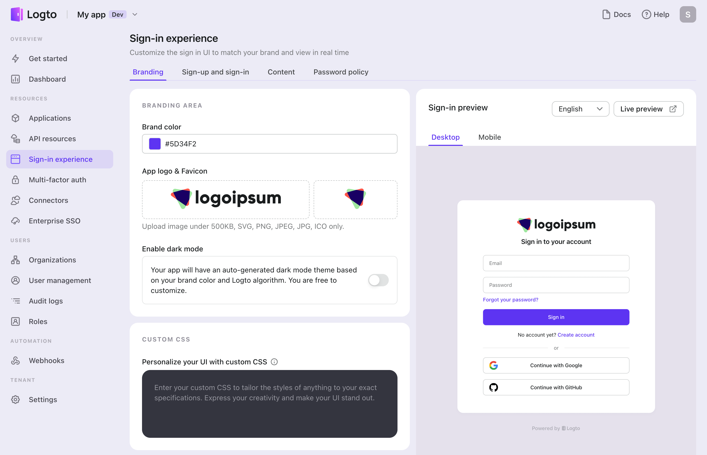

# 🎨 Customize sign-in experience

Sign-in experience is the core flow for end-users, including sign-in and sign-up. It provides a unified experience across apps, devices, and platforms.

:::note
In most cases, a single sign-in experience is good enough. But you may need some special customizations based on region or app, and we're working on this feature. Stay tuned.
:::

Logto covers the tedious part, so you can have fun with customization to define the unique experience for your users.

In Admin Console, click the "Sign-in Experience" tab on the left, and you'll see a two-column page.

The left column is the customization section with three tabs: **Branding**, **Sign-in and sign-up**, and **Others**.

1. Configure sign-in methods: Whether you prefer **password-based or passwordless sign-in/sign-up** options, you can easily configure them straight out of the box or customize them to align with your company's unique requirements.
2. Match your brand: Quickly customize the sign-in page to match your product brand with options to set your **brand color**, **logo**, **favicon**, and **dark mode** usage.
3. Custom CSS: Tailor the UI of all pages with **Custom CSS**. The orderly and concise design system of styles and components makes customization a breeze.
4. Terms & Policy: Link your website's **Terms of Use** and **Privacy Policy** to the sign-in page. Users will be prompted to agree to these policies when they register.
5. Language (i18n): Create a localized experience by selecting your language mode to **enable auto-detect** or **choose a default language**. Edit **i18n translations** for tailored content.

The right column is a live preview that will immediately update to synchronize the change when you update things on the left.

:::tip Use preview to save your time

- Click the tab "Mobile" or "Web" to see what the homepage looks like on different platforms.
- Change the language or theme dropdown to see the appearance under different system preferences.

:::
