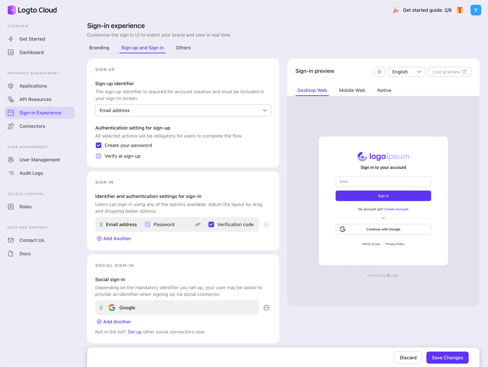
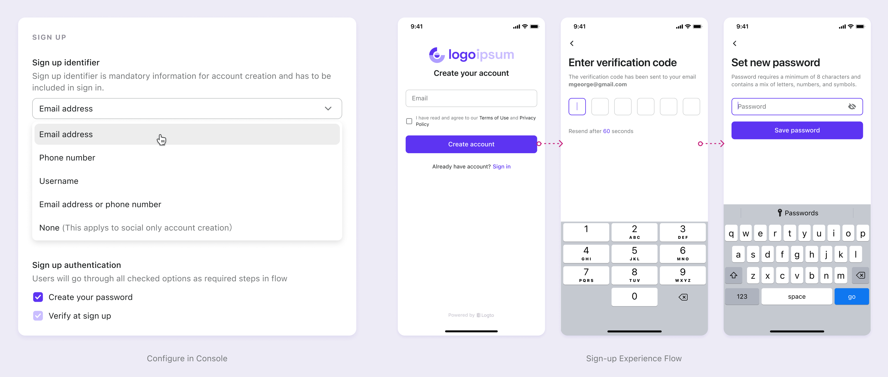
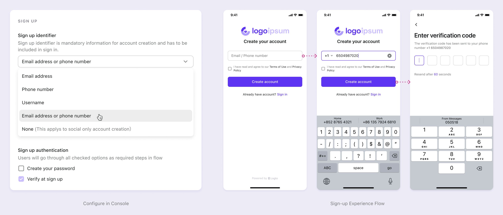
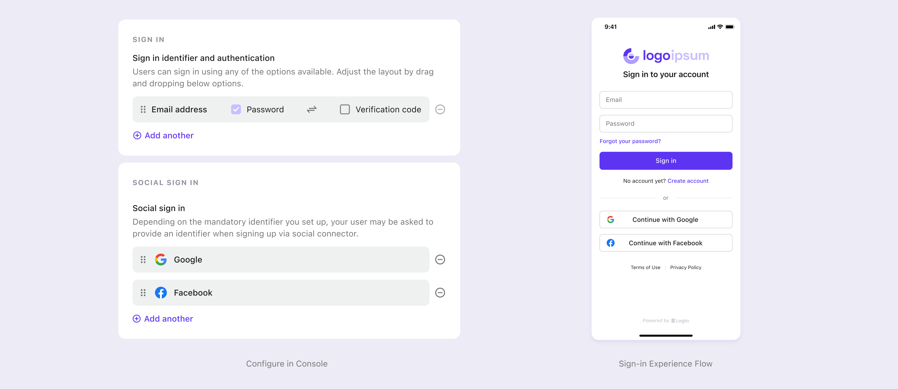
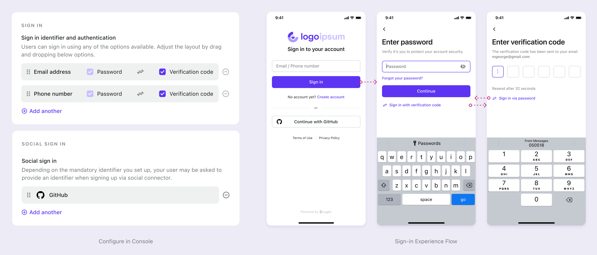
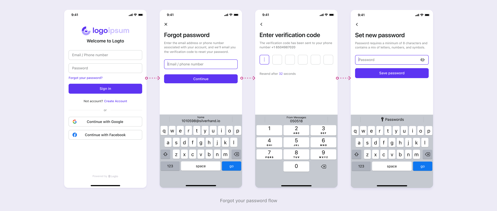
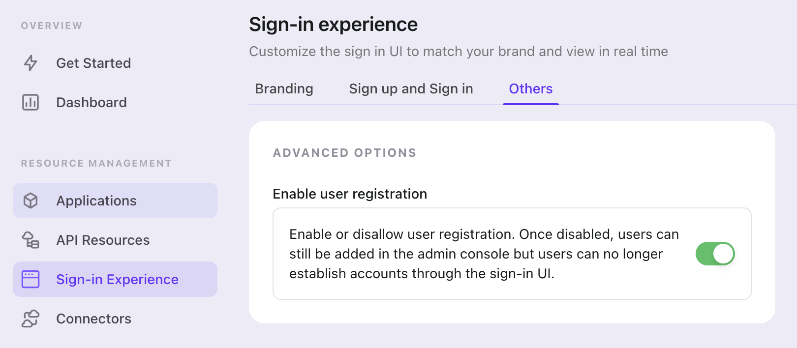

import SaveChanges from './fragments/_save-changes.md';

# Configure sign-in methods

<SaveChanges />

Join forces with the Console to set up an end-to-end sign-in experience for your customers.

## Sign-up method

### Sign-up identifier

The sign-up identification is the handle used to identify who you are and what information is required to register for the product. It is required information for account creation and must be included in the sign-in process. We offer four types of identifiers in the Sign-in Experience configuration,

- Email address
- Phone number
- Username
- Email or Phone

End users can create an account and access the product using any of these four methods. Furthermore, we support "none," which is appropriate for social-only account creation. In this instance, the only way to establish an account and sign in to the product is through social sign-in.

### Sign-up authentication

We require not just identifiers, but also authentication factors to specify the sign-up. By associating authentication factors with identifiers, you will lay a solid foundation for a successful and frictionless sign-up flow.
We presently support end-user authentication as follows,

- Verification code (password-less)
- Password

However, the verification criteria cannot be combined in any isolated way with the identifiers given above. There are several restrictions to allow for real-world conditions.

| If you identifier is… | Password | Verification code (password-less) |
| --------------------- | -------- | --------------------------------- |
| Username              | Required | `N/A`                             |
| Email address         | Optional | Required                          |
| Phone                 | Optional | Required                          |
| Email or Phone        | Optional | Required                          |
| None                  | `N/A`    | `N/A`                             |

For example, if you sign up with your email address, you must authenticate your account. We do not currently support unverified email at sign-up, but it will be added soon.

Another example: if you choose username as your sign-up identifier, you must also choose password as one of your authentication factors.

The checkboxes here form a "and" logic, which indicates that your sign-up procedure will include all of the ticked options as needed steps.

Here are two examples:

Sign-up method: Email address. Sign-up authentication: Password & Verification code.

Sign-up method: Email address or phone number. Sign-up authentication: Verification code.

## Sign-in method

### Sign-in identifier and authentication

As previously stated, users may enter and complete additional information as they explore and utilize the product. Some of them should be accepted as **_sign-in methods_**. That is why sign-in procedures differ from **_sign-up methods_**. Sign-in identifiers are the same as sign-up identifiers, except they form a "or" logic, which means users can use any of them to sign in.

- Username
- Phone number
- Email address

You can add as many as you like and then drag and drop to determine who is at the top of the layout.

In terms of authentication factors, you can activate either a password or a verification code for each identifier in your sign-in flow. Your sign-up identities and authentication factors also limited the capability. Here are some broad guidelines for creating a successful user flow for your consideration:

- If password is used as an authentication factor in sign-up→ sign-in should also support it, and all other identifiers should as well. We don't want end users to waste time registering or neglecting their security intents. The requirement of a password for username sign-up but not for email/phone password sign-in makes no sense and confuses the user.

- If you simply use your username as your identifier during sign-up, you will need to create a password. This is because of the constraints and limitations of a username as a form of identification.

- In order to sign in, at least two of the sign-in choices that users choose when they registered must be active. If a user signs up with their email address but can only sign in with their phone number, they will be unable to utilize the product.

- If the username is the only identification used during registration, a password is required. Because of the restrictions and peculiarities of utilizing a username as an identification, this is the case.

- If you choose "email", "phone number", or "phone number or email address" as sign-up identifiers, you must verify those identifiers at sign-up, and if you do not choose password as the sign-up authentication factor, you must activate verification code at sign-in. After selecting a password, the sign-in password must be enabled, and the verification code at sign-in can be unchecked.

Although these guidelines may initially appear daunting, they quickly begin to feel like second nature as you experiment with them on your own. The hidden reasoning will save you from making mistakes that will have a detrimental effect on your user acquisition funnel.

Here are two examples:

Sign-in identifier: Email address. Sign-in authentication: Password.

Sign-in identifier: Email address / Phone number. Sign-in authentication: Password / Verification code.

## Social sign-in

**Social sign-in** is a method of logging into third-party services using credentials from your existing social networking profiles. Signing up and logging in is simplified and hastened by using social sign-in due to the use of already established, trusted identifiers.

Your user may be requested to supply additional information when joining up with social accounts, depending on the sign-up identifiers you selected.

For example, if you choose "email address" as the sign-up identifier, the social sign-up flow will also request users to fill out a new one, or link an existing account, depending on whether the account exists. But for faster sign-in, if the social account carries an unregistered “trusted email” which is verified by trusted third-party social identity providers, like Gmail, GitHub, etc., the email address will be automatically filled in the user’s profile.

You can also use drag and drop to change the order of how it appears on the UI, and if you add a lot of social sign-in, which we don't encourage, it will be hidden in the collapsed view.

## Forget password

When you configure the Email or SMS connector, the forget password feature is automatically enabled. Passwords can be reset using a verified email address or phone number.

You cannot currently use the old password when creating a new one. The restriction occurs only once.

## Disable User Registration

In some circumstances, account creation must be restricted. Navigate to Sign-in Experience > Other > Advanced Settings. Turn the toggle off, and you're done. The account creation button will disappear from the sample page, and you will be unable to establish an account through social media.

