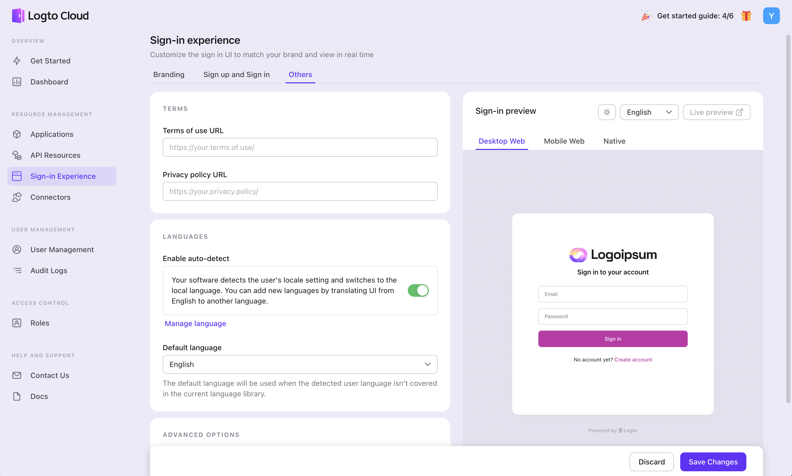
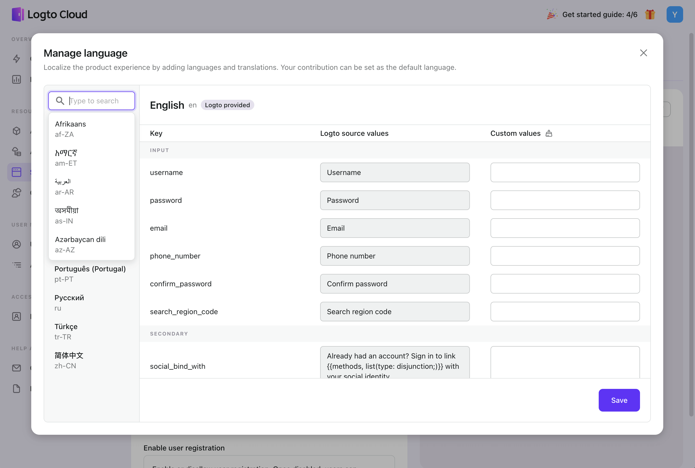

# Localized language

The Sign-in Experience i18n is a powerful tool that allows you to create and manage your own unique set of language options.

Logto supports [various languages](https://github.com/logto-io/logto/tree/master/packages/phrases-ui/src/locales) pre-defined. Now, 113 language tags are also included. You can make your own translation of the product's user interface and apply it in a different language.

:::note
Currently, this language setting only affects the Sign-in UI and has no bearing on the language used in the Admin Console.
:::

Let's back up for a second and look at the framework and terminology used to describe the Sign-in Experience.  
A JSON file stores the text for the Logto sign-in user interface. A "key", or unique identifier, and its associated "value" define each phrase.

For example,

```js
const translation = {
  input: {
    username: 'Username',
    password: 'Password',
    email: 'Email',
    phone_number: 'Phone number',
    confirm_password: 'Confirm password',
  },
  secondary: {
    sign_in_with: 'Sign in with {{methods, list(type: disjunction;)}}',
    social_bind_with:
      'Already have an account? Sign in to link {{methods, list(type: disjunction;)}} with your social identity.',
  },
  // ....
};

export default translation;
```

As a result, localization's emphasis is on making it simple and intuitive for you to edit those values (code in red) with no code needed.  
Your developers will then have a great deal of leeway and will be happy to embrace a customized experience based on the business's specific requirements.

Let's see how we did in the following sections.

## Set your language mode



Go to **Sign-in Experience > Others > Language** to configure your languages.  
You may have already configured your language mode during the initial launch; for a refresher, see [Get started - Language](/docs/tutorials/get-started/customize-sign-in-experience.mdx#language).

## Customize the existing language

There is also a **Manage language** button beneath the toggle. This is the location where you can manage your language library.

We make every effort to make language customization as simple as possible, but we may refer to a few terms throughout the documentation. Here are a few definitions you should be aware of:

| Definition              | Description                                                                                                                                                                                                                                      |
| ----------------------- | ------------------------------------------------------------------------------------------------------------------------------------------------------------------------------------------------------------------------------------------------ |
| Language tag            | The language tag identifies the language of the content. A language tag is made up of a language code (for example, en, fr, zh) and a country/region code (for example, US, UK, KR) separated by hyphens. A language tag looks like this: en-US. |
| Logto provided language | Logto provided language is Logto official language and is stored in Logto original code base.                                                                                                                                                    |
| Added language          | Added language is the language added by users.                                                                                                                                                                                                   |
| Logto source values     | Logto source values are Logto-supplied values that have not been customized by users.                                                                                                                                                            |
| Custom values           | Custom values are values that have already been customized by users. Logto source values will be overwritten.                                                                                                                                    |

When you click the **Manage language** button, a modal screen will appear.  
Logto provides the languages on the left side, and you can see Logto provided next to the language tag. Although pre-defined languages cannot be deleted, they can be customized. When it loads in front of end users, your custom values will overwrite Logto source values.


## Add a new language



You can also add your own language in addition to the ones Logto offers. Click the **Add language** button, select a language tag, add your own translation, and then save your changes. You can then find the added language in the dropdown menu on the left side of the screen. The new language version is now available!

## How added language appear to end customers

Let's say you have a website where English is the default language and auto-detect is turned on. A user from Japan happens upon your site and decides to create an account. If he/she uses Japanese as their app language but Logto doesn't yet support the language, the sign-in screen will appear in English.

Now SIE i18n makes customized language possible.  
Click the `ja` language tag to add your own Japanese translation.  
In this way, the user accessing your site from Japan will be able to read content in Japanese, which you have just translated from English.

## FAQ

> What if the language I added becomes Logto provided language?

Next to the language tag on the left, a Logto-provided tag will appear, and the language you added will no longer be removable. The modified values continue to function and replace the original Logto values. Erase the user-supplied values to use the values provided by Logto's default configuration.

> What if I only added a few custom values?

What the final users see is the result of the two columns merging.  
Suppose, that you only want to make adjustments to a subset of the original content copies that Logto supplied. The only difference between your signup screen and the one provided by Logto will be the keys you edited. The rest of the content will remain unchanged.
