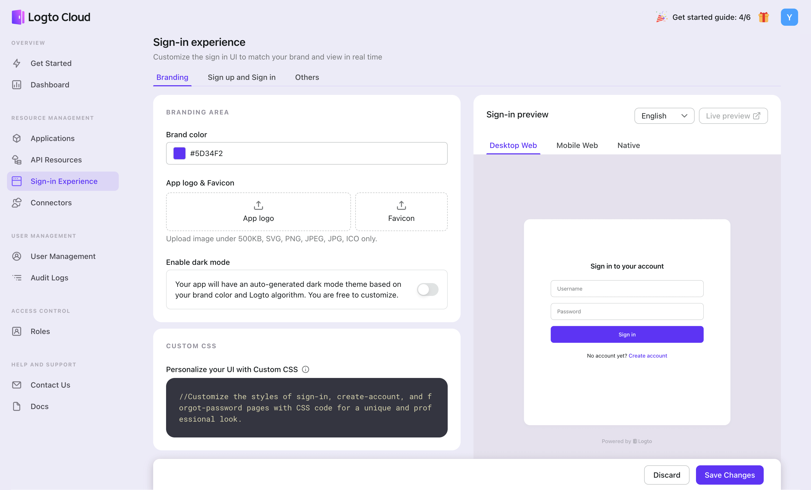

# Match your brand

To customize the sign-in page for the core brand element, go to "Sign-in Experience > Brand > Brand Area" in the Logto Console. This section is straightforward. Change something to see what happens.

# Brand color

- _Brand color_ will affect the primary color of components, including but not limited to CTA buttons, links, etc. Feel free to replace the Logto purple-blue with your brand color.
- If dark mode is enabled, you'll see an additional brand color input named _Brand color (Dark)_.

:::tip
You may notice the auto-generated Brand color (Dark) is slightly different compared to the original Brand color. Because Logto just took care of the visual difference between light and dark and computes a brand color exclusively for dark mode. If you are unsatisfied with the color, you’re also free to customize it.
:::

## App logo

The logo will be displayed on the sign-in homepage, sign-up home, loading page, and other interfaces with our expansion.

- In the Logto Cloud, upload the images to our service. In the Open-Source Console, paste the URL of the uploaded image in the input box.
- There are some limitations for images: they must be under 500KB and in SVG, PNG, JPG, JPEG, or ICO format.
- If you leave the logo field blank, the logo will not display in the interface.
- You can also edit the App logo for dark mode if dark mode is enabled.

## Favicon

A favicon is a small icon representing a website and is displayed in the browser tab, bookmarks, and other areas of the browser interface.

- As the App logo, Favicon should be uploaded to Logto Cloud, and the URL pasted in the Open-Source Console.
- The image must be under 500KB and in SVG, PNG, JPG, JPEG, or ICO format. Uploading a square image is recommended to ensure a good presentation effect.
- Currently, only one universal favicon can be uploaded for different browser themes.
- Besides, the browser title for different flows (Sign in/Sign up/Forgot password, etc.) is now used instead of a custom title.

## Dark mode

The _Enable dark mode_ switch controls if the UI has a "dark feeling" when Logto detects related system preference.

