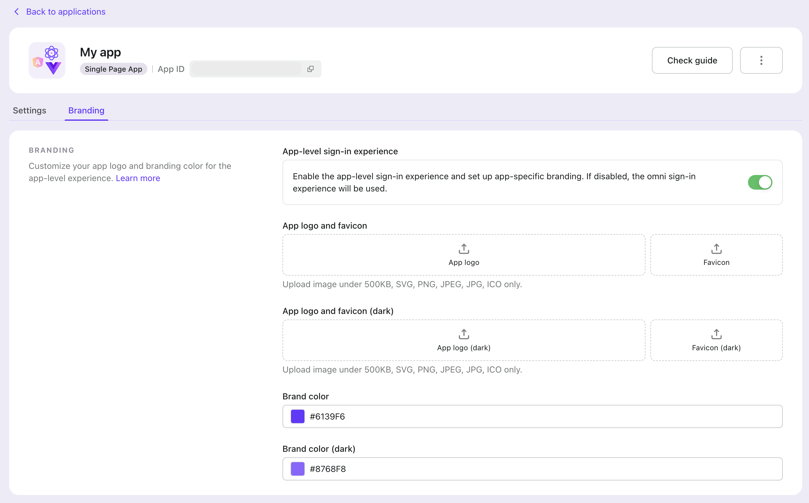
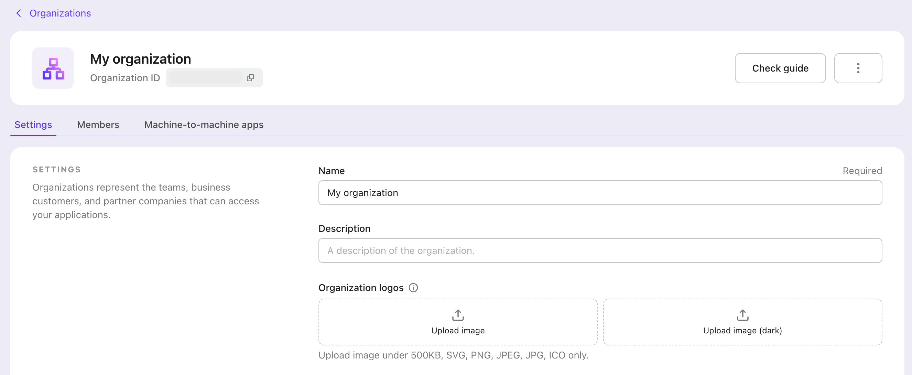

import Availability from '@components/Availability';

# Match your brand

To customize the sign-in page for the core brand element, go to "Sign-in Experience > Brand > Brand Area" in the Logto Console. This section is straightforward. Change something to see what happens.


## Brand color

- _Brand color_ will affect the primary color of components, including but not limited to CTA buttons, links, etc. Feel free to replace the Logto purple-blue with your brand color.
- If dark mode is enabled, you'll see an additional brand color input named _Brand color (dark)_.

:::tip
You may notice the auto-generated Brand color (dark) is slightly different compared to the original Brand color. Because Logto just took care of the visual difference between light and dark and computes a brand color exclusively for dark mode. If you are unsatisfied with the color, you’re also free to customize it.
:::

## Company logo

The logo will be displayed on the sign-in homepage, sign-up home, loading page, and other interfaces with our expansion.

- There are some limitations for images: they must be under 500KB and in SVG, PNG, JPG, JPEG, or ICO format.
- If you leave the logo field blank, the logo will not display in the interface.
- You can also edit the company logo for dark mode if dark mode is enabled.

## Favicon

A favicon is a small icon representing a website and is displayed in the browser tab, bookmarks, and other areas of the browser interface.

- The image must be under 500KB and in SVG, PNG, JPG, JPEG, or ICO format. Uploading a square image is recommended to ensure a good presentation effect.
- Currently, only one universal favicon can be uploaded for different browser themes.
- Besides, the browser title for different flows (Sign in/Sign up/Forgot password, etc.) is now used instead of a custom title.

## Dark mode

The _Enable dark mode_ switch controls if the UI has a "dark feeling" when Logto detects related system preference.


## App-specific branding

<Availability cloud oss={{ major: 1, minor: 19 }} />

If your multi-app business needs app-level sign-in experiences, you can configure this in the application details page.



By switching on "app-level sign-in experience", you can set up specific branding and colors for each app. When a sign-in initiated from an app with app-level branding enabled, the sign-in experience will be customized according to the app-level branding settings; otherwise, it will default to the omni sign-in experience settings.

Both light and dark mode settings are available for app-level branding. Dark mode settings will only take effect when the dark mode is enabled in the omni sign-in experience settings.

## Organization-specific logos

<Availability cloud oss={{ major: 1, minor: 19 }} />

To dynamically show your client’s organization logo in the sign-in experience, you can upload the organization logos in the organization settings page.



Then, when triggering a sign-in, you can pass the organization ID in the `organization_id` parameter to tell Logto which organization logo to display. For example, to show the organization logo for organization ID `123456`:

- If you are using Logto SDK, you can pass the `organization_id` parameter in the `extraParams` object of the `signIn` method.
- If you are using an OIDC client, you can pass the `organization_id` parameter when requesting the [authorization endpoint](https://openid.net/specs/openid-connect-core-1_0.html#AuthorizationEndpoint).

Both light and dark mode settings are available for organization-level branding. Dark mode settings will only take effect when the dark mode is enabled in the omni sign-in experience settings.

Here's an example of how to pass the `organization_id` parameter in the `signIn` method using [Logto browser SDK](https://docs.logto.io/quick-starts/vanilla-js/#implement-sign-in-and-sign-out):

```ts title="index.ts"
logtoClient.signIn({
  // ...other parameters
  redirectUri: 'https://your-redirect-uri',
  extraParams: {
    organization_id: '123456',
  },
});
```

:::info
We are gradually rolling out the `extraParams` feature to all Logto SDKs. If you don't see it in your SDK yet, please contact us.
:::
