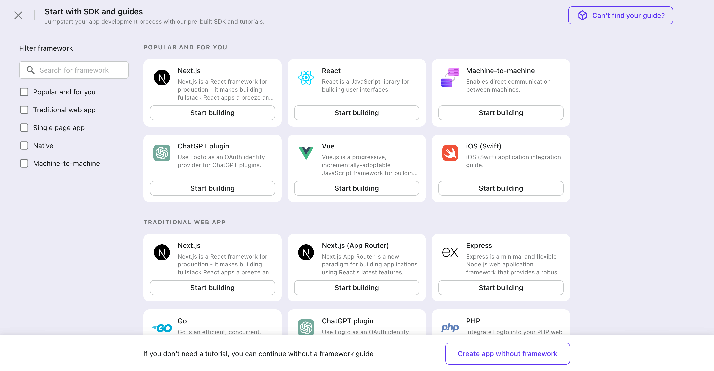
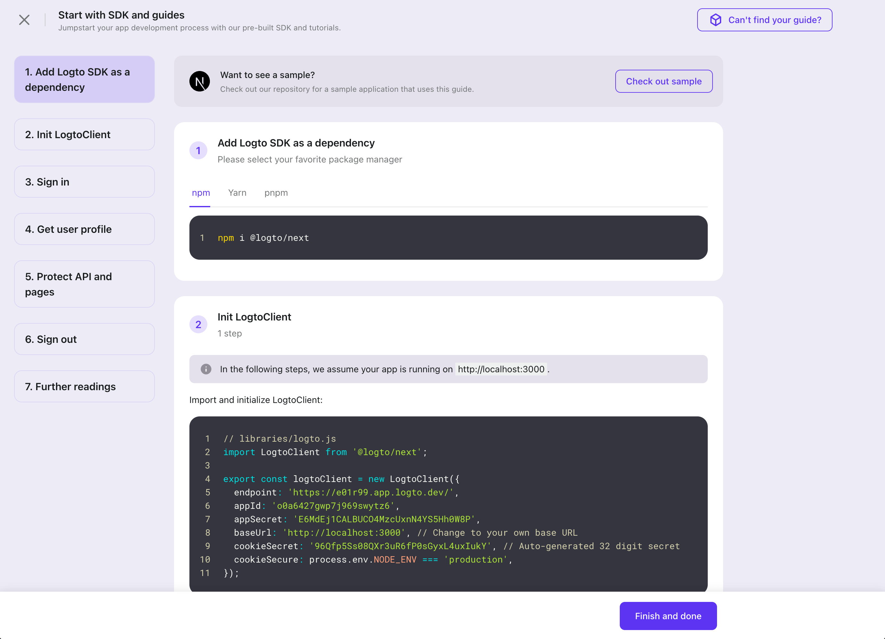

# 🔗 Integrate Logto in your application

We provide a bunch of SDKs to let you integrate Logto with your clients with ease. If the list doesn't cover your desired platform / framework, please file a feature request or contribute a new SDK.

## Native App

An app that runs in a native environment.

- [iOS](../../../sdk/ios/README.mdx)
- [Android](../../../sdk/android/README.mdx)
- [Flutter](../../../sdk/flutter/README.mdx)

Usually, Native apps need to talk to an API (resource). Please refer to [Protect your API](../protect-your-api/README.mdx) for authenticating in your API.

## Single Page App

An app that runs in a web browser and dynamically updates data in place.

- [Vanilla JS](../../../sdk/vanilla-js/README.mdx)
- [React](../../../sdk/react/README.mdx)
- [Vue](../../../sdk/vue.mdx)

Usually, SPAs need to talk to an API (resource). Please refer to [Protect your API](../protect-your-api/README.mdx) for authenticating in your API.

## Traditional Web

An app that renders and updates pages by the web server alone. E.g., server-side rending.

- [Traditional Web general guide](../../../sdk/traditional.mdx)
- [Next.js](../../../sdk/next-js/README.mdx)
- [Next.js 13 App Router](../../../sdk/next-js-13/README.mdx)
- [Express](../../../sdk/express/README.mdx)
- [Go](../../../sdk/go/README.mdx)

## Machine-to-machine

An app (usually without UI) that directly talks to resources.

- [Machine-to-machine](../../../sdk/machine-to-machine.mdx)

## Configuration steps

Follow these steps to create the application:

1. Go to "Application" tab in Logto Console.

2. To add a new application, click the "Create application" button.

3. Select the application framework to start building. You can also create an app without selecting framework by click the button in bottom right.
   

4. Follow the guides prepared for different application types, and they'll be helpful.
   

5. After finishing the guide, you'll see the details page for further configuration or modification. If you skip the guide modal by accident, you can also pick it from the docs below or click "Check guide" in this details page.
   
