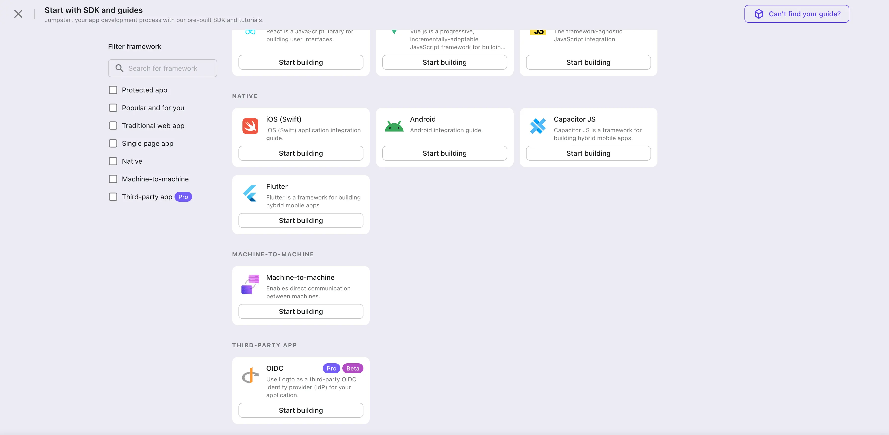
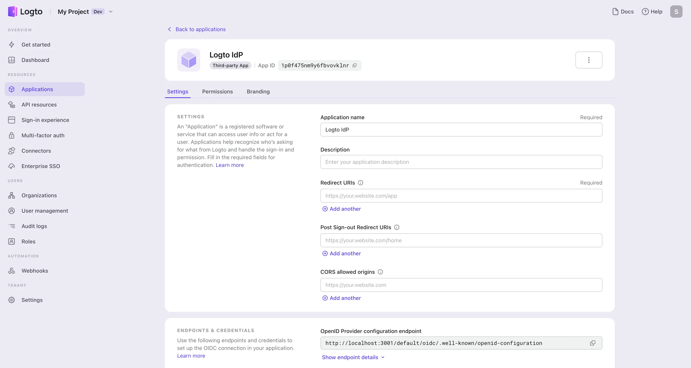
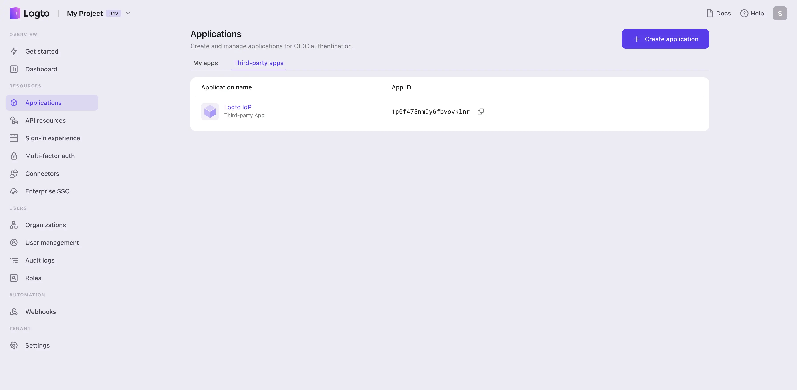

{/* This is a re-usable fragment that currently being referenced by both the recipe and the connector guide */}
import ClientCredentials from '../assets/client-credentials.webp';
import DiscoveryEndpoint from '../assets/discovery-endpoint.webp';
import EndpointDetails from '../assets/endpoint-details.webp';
import RedirectUri from '../assets/redirect-uri.webp';

Just like how you create a first-party application in Logto, you can also create an application for third-party services that support OIDC. This application will act as an IdP for your third-party applications.

1. Go to the **Logto Console** and navigate to the **Applications** page.

2. Select "Third-party app -> OIDC" as the application type.

   If this is the first time you create an application, click on the **View all** link to see all application types.
   

   Otherwise, click on the **Create application** button on the top right corner of the page and select "Third-party app -> OIDC" as the application type.
   

3. Just like creating a Logto first-party application, enter a **name** and **description** for your application and click on the **Create** button. A new third-party OIDC application will be created.

   

## Setup the OIDC configurations

In order to set up Logto as an IdP for your third-party applications, you need to configure the OIDC settings under the application details page.

1. Provide the **redirect URI** of your third-party application. This is the URL that the third-party application will redirect users to after they are authenticated by Logto. You can usually find this information in the third-party application's IdP connection settings page.

   :::note
   Logto supports multiple redirect URIs. You can add more redirect URIs by clicking on the **Add another** button.
   :::

   

2. Retrieve the **client ID** and **client secret** from Logto application details page and enter them into your service provider's IdP connection settings page.

   

3. Retrieve the **authorization endpoint** and **token endpoint** from Logto application details page and provide them to your service provider.

   If your service provider supports OIDC discovery, you can simply copy the **discovery endpoint** from Logto application details page and provide it to your service provider. The service provider will be able to retrieve all the up to date OIDC authentication information from the discovery endpoint automatically.

   

   Otherwise, click on the **Show endpoint details** button to view all the OIDC authentication endpoints.

   

## Manage your third-party applications

All third-party applications will be catalogued on the **Applications** page, specifically under the **Third-party apps** tab. This arrangement distinguishes them from first-party applications for you, ensuring easy management.

