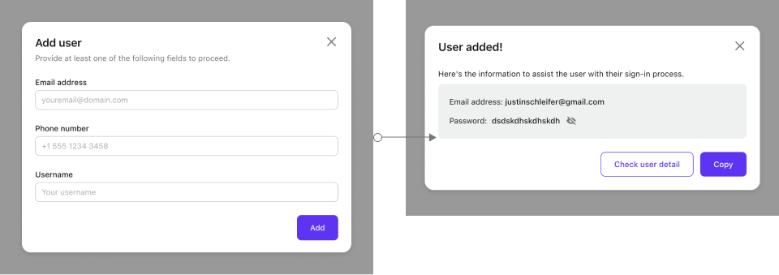

# Manage users using Admin Console

## List and search users

In Admin Console, click the **User Management** tab on the left, and you'll see a user table view on the right.

There are three columns in the table:

- **User**: The user info may include the avatar, full name, username, phone number, email, etc.
- **From application**: The name of the application that the user initially registered with.
- **Latest sign in**: The timestamp when the user signed in last time.

Input a keyword in the search box above the user table, click the "Search" button, and you'll see the matching users in the table.

Support the partial search on the user properties: name, username, email, or phone number.

## Add user

Admin users could create a new account through Admin Console in the name of an end-user.

Click the "+ Add User" button in the upper right corner.
In the opening modal, fill out the username and full name, and click the "Add User" button to confirm.

After you add the user, copy the **username** and **initial password** to send to the end-user.

:::caution
Once the "Add User" modal is closed, you can no longer view the password.
If you forget to keep it, you can [reset the password](#reset-user-password).
:::

## View and update user profile

Click the user table row to jump to the "**User details**" panel.
You'll see the user profile, including the avatar, full name, user ID, email, phone, username, social connections, etc.

"Social connections" is a list of social connectors the user has connected to. Suppose the user has signed in with Facebook using the social connector; a "Facebook" item will be on the list.
See [identities](../../references/users/social-identities.md) for details.

The full name, avatar image URL, and custom data are editable, the social connections are removable, and the other properties are read-only.

:::danger
Before removing the social connection, you SHOULD confirm the user has another sign-in method, such as another social connection, phone number, email, or username-with-password. Otherwise, the user CANNOT sign in to this account again.
:::

:::info
Don't forget to click "Save changes" after updating.
:::

## View user activities

On the "User details" panel, switch to the "**User logs**" sub-tab.
You'll see the user's recent activities in the table, including the action, result, related application, and the time when the user acted.

Click the table row to see more details in the user log, e.g., IP address, user agent, raw data, etc.

## Delete user

On the "User details" panel, click "MORE OPTIONS" -> "Delete" button.

:::danger
Be careful! The user data deletion CANNOT be undone.
:::

## Reset user password

On the "User details" panel, click "MORE OPTIONS" -> "Reset password" button.

After you reset the password, copy and send it to the end-user.

:::caution
Once the "Reset password" modal is closed, you can no longer view the password.
If you forget to keep it, you can reset it again.
:::

