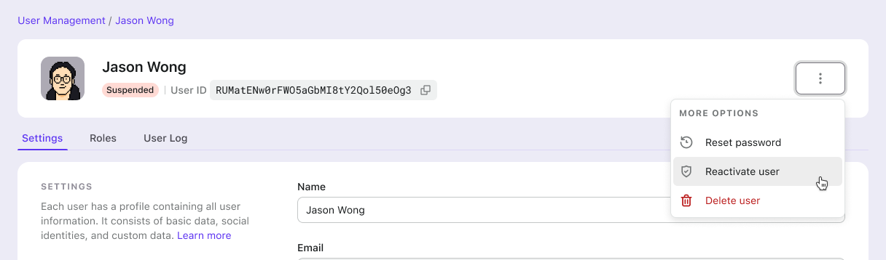
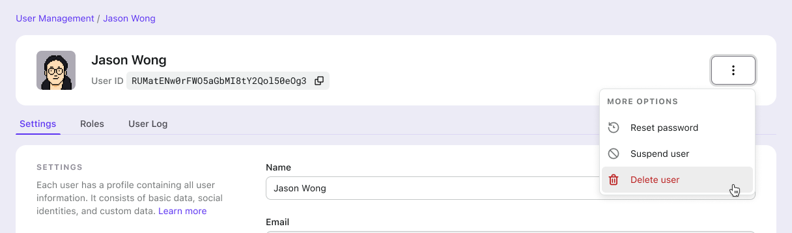
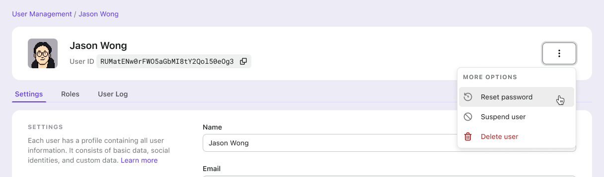

# Manage users using Admin Console

## Browse and search users

To access the user management functionality in the Admin Console, navigate to the "User Management" tab on the left-hand side of the screen. Once there, you will see a table view of all the users on the right-hand side of the screen.

The table consists of three columns:

- "User", which displays information about the user, such as their avatar, full name, username, phone number, and email
- "From application", which displays the name of the application that the user initially registered with
- "Latest sign-in", which displays the timestamp of the user's most recent sign-in.

To search for a specific user, enter a keyword related to their name, username, email, or phone number in the search box above the user table. Once you have entered your keyword, click the "Search" button. The search is partial, meaning it will match any user property that contains the keyword you entered.

After clicking the "Search" button, the table will display all users matching the keyword you entered. You can then view their information in the table, including their avatar, full name, username, phone number, email, the application they registered with, and the timestamp of their latest sign-in.

## Add user

Using the Admin Console, administrators can create new accounts for end-users. To do so, click on the "+ Add User" button in the screen's upper right corner. A modal window will appear, where you can enter the username and full name of the new user. Once you've filled out the required fields, click on the "Add User" button to confirm.

After the new user has been created, you can copy their **username** and **initial password** to send to them. This will allow them to log in to the system and start using it.

:::caution
If you fail to retain the password after closing the "Add User" modal, you will not be able to view it again. If you forget to keep it, you can [reset the password](#reset-user-password).
:::

## View and update user profile

To view the details of a user, simply click on the corresponding row in the user table. This will take you to the "**User details**" page where you can find the user's profile information, such as their avatar, full name, user ID, email, phone number, username, and social connections. The "Social connections" section displays a list of social connectors that the user has linked to their account. For example, if the user has signed in using their Facebook account, you will see a "Facebook" item in the list. You can refer to the [identities](https://docs.logto.io/docs/references/users/social-identities) documentation for more information.

Please note that while the full name, avatar image URL, and custom data can be edited, the social connections can be removed, and the other properties are read-only.

:::danger
It is important to confirm that the user has an alternative sign-in method before removing a social connection, such as another social connection, phone number, email, or username-with-password. If the user does not have any other sign-in method, they will not be able to access their account again once the social connection is removed.
:::

:::info
Don't forget to click "Save changes" after updating.
:::

## View user activities

To view the recent activities of a user, navigate to the "User logs" sub-tab on the "User details" page. Here, you can find a table that displays the user's recent activities, including the action performed, the result of the action, the related application, and the time that the user acted.

Click the table row to see more details in the user log, e.g., IP address, user agent, raw data, etc.

## Suspend user

On the "User details" page, click "Three Dots" -> "Suspend User" button.

Once a user is suspended, the user will be unable to sign in to your app and won't be able to obtain a new access token after the current one expires. Additionally, any API requests made by this user will fail.

If you want to reactive this user, you can do so by clicking "Three Dots" -> "Reactivate User" button.

## Delete user

On the "User details" page, click "Three Dots" -> "Delete" button.

:::danger
Be careful! The user data deletion CANNOT be undone.
:::

## Reset user password

On the "User details" page, click "Three Dots" -> "Reset password" button.

After you reset the password, copy and send it to the end-user.

:::caution
Once the "Reset password" modal is closed, you can no longer view the password.
If you forget to keep it, you can reset it again.
:::

## Mange roles of users

In the "Roles" tab of the user details page, you can easily assign or remove roles to meet your desired outcome. Check RBAC - Manage a user's roles to learn more

