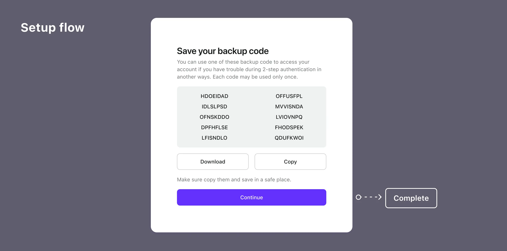
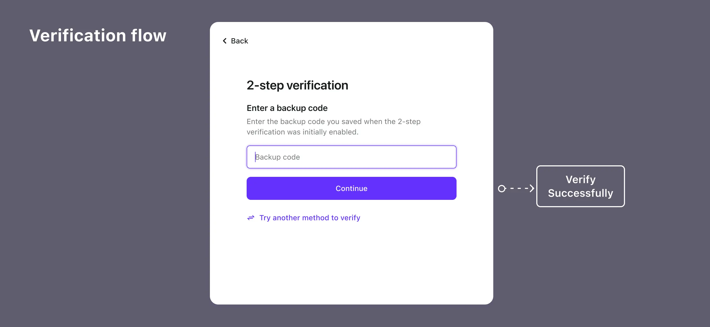

# Backup code

_Added in v1.11.0_

## Concepts

Backup code, also known as Recovery code, is a one-time use code for MFA, acting as a backup in case the user's primary authentication factors (e.g., authenticator app or hardware token) are unavailable.

Losing them can lead to account recovery challenges. Therefore, it's recommended to set up an additional primary factor before enabling Backup Codes, giving it priority.

Logto automatically generates 10 Backup Codes for users once they configure an additional factor. Each code is single-use. Users are advised to regenerate a new set of codes in the User Account Settings (accessible through the [Management API](/docs/recipes/interact-with-management-api/)) before using up all the existing codes.

## Auth flows

- **Setup flows**

- **Verification flow**

