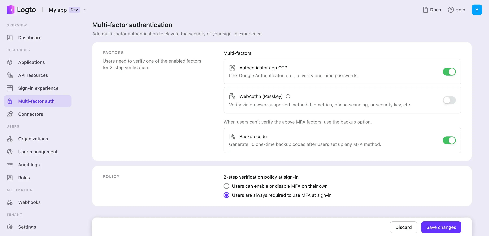
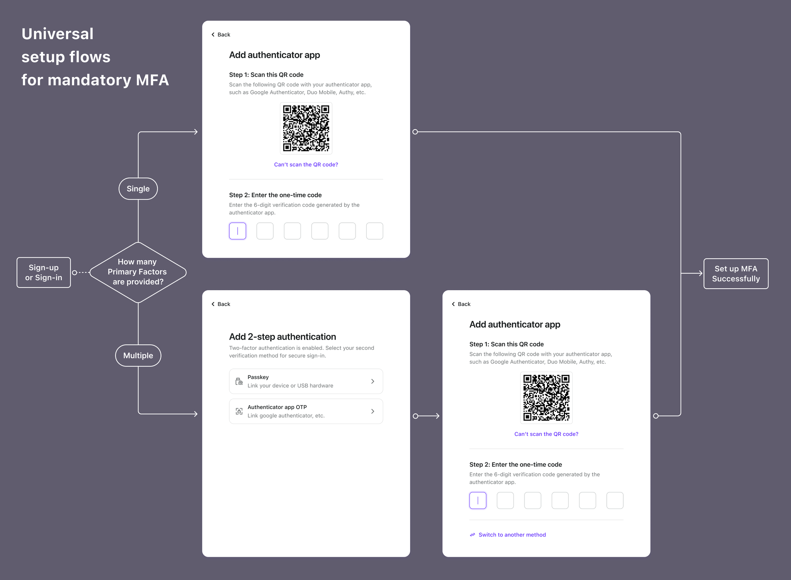
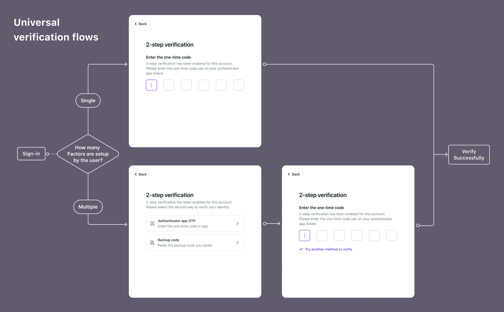

# Configure MFA

## Configure MFA in Logto

To configure your MFA in the Logto Console, follow these steps:

1. Navigate to the "Multi-factor auth" in the Logto Console.
2. **Enable the Factors for 2-step verification** available for users. You have the following options:
   1. **Primary factors**
      - [Authenticator App OTP](../authenticator-app-otp): This is the most common and widely accepted method.
      - [WebAuthn (Passkeys)](../webauthn): A high-security option suitable for web products supporting device biometrics or security keys, etc., ensuring robust protection.
   2. **Backup factors**
      - [Backup codes](../backup-codes): This serves as a backup option when users can't verify any of the primary factors mentioned above. Enabling this option reduces friction for users' access successfully.
3. **Select a 2-step verification policy** after enabling factors. There are two choices:
   1. **User-controlled MFA**: Users can enable or disable MFA on their own.
      - After saving changes, during new users’ sign-up or old users’ first sign-in, users can choose to set up MFA voluntarily or skip it, and this set-up flow will only occur once per user.
      - Or the user can enable/disable it in the User Account Settings of your apps which can be integrated by Logto [Management API](/docs/recipes/interact-with-management-api/).
   2. **Mandatory MFA**: Users are always required to use MFA at sign-in.
      - Users must set up MFA the first time at sign-in or sign-up, and use it for all future sign-ins.
      - Users can also change it in the User Account Settings of your apps which can be integrated by Logto [Management API](/docs/recipes/interact-with-management-api/).

## Universal authentication flows for MFA

When MFA is enabled, the second-step verification flow will typically operate after the first-step verification. The MFA set-up flow will also take place after users have set up their first verification factors, such as a password or email verification code.

### MFA set-up flows

1. Users will set up the primary factors (Authenticator app OTP or Passkeys) after registering or signing in with the first factor.
   - If multiple primary factors are provided, users need to select their preferred primary factor and set it up.
   - If only a single primary factor is provided, users will be asked to set it up directly.
2. Users can save backup codes if this option is enabled.

If the Mandatory MFA policy is configured, users must set up MFA. If the user-controlled MFA policy is configured, users can skip these flows, and they will only occur once.

If MFA is removed for some users, don't worry. Logto will prompt them to set up MFA again during their next sign-in.

### MFA sign-in flow

Users who have already set up MFA will be asked to verify the second factor after verifying the first factor during sign-in. The verification method will depend on the configuration in the Logto Console and the user settings.

If a user has set up only one factor, they will verify it directly.

If a user has set up multiple factors as 2FA, they will need to choose one to verify. For user convenience, during the next sign-in, they will be directly redirected to the last-used factor for a faster sign-in process.

