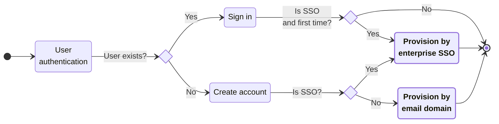
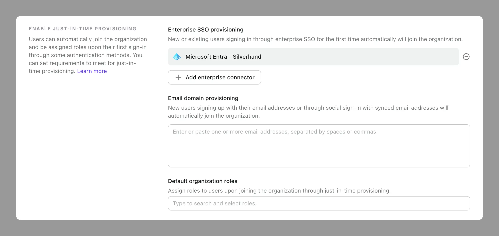
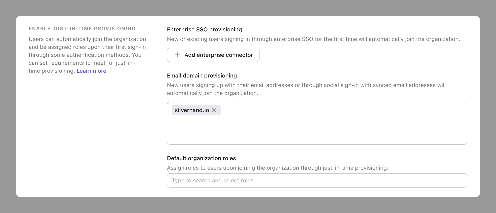
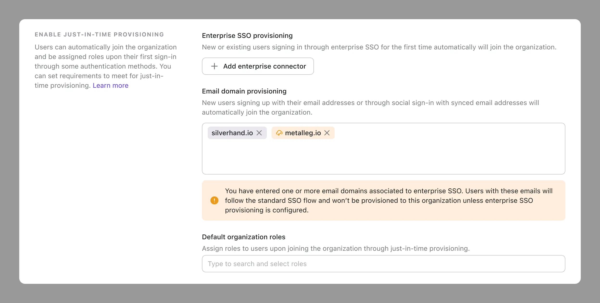

import Availability from '@components/Availability';

# Just-in-time provisioning

<Availability cloud oss={{ major: 1, minor: 18 }} />

In Logto, just-in-time (JIT) provisioning is a process used to assign organization memberships and roles to users on-the-fly as they sign in to the system for the first time. Instead of pre-provisioning accounts for users in advance, JIT provisioning configures the necessary user accounts dynamically when a user authenticates.

## How it works

Here’s a high-level overview of the JIT provisioning process:

1. **User authentication**: The user attempts to sign in to an application or service, and the identity provider (Logto) authenticates the user.
2. **Account sign-in or creation**: Depending on the user’s status, Logto either signs in the user, creates a new account, or add a new identity to an existing account.
3. **Provisioning**: If the user or their identity is new, Logto triggers the provisioning process.

Here's a detailed flowchart of JIT provisioning:

JIT provisioning is a useful feature for B2B and multi-tenancy products. It makes onboarding tenant members smooth and requires no administrative involvement.

For example, if you’ve onboarded a business and want its employees to securely sign into your product and join the organization with the correct role access, there are several ways to achieve this. Let’s explore the possible solutions Logto provides and how JIT can help.

| Scenario                               | User types       | Automated? | Behavior                                                                                        |
| -------------------------------------- | ---------------- | ---------- | ----------------------------------------------------------------------------------------------- |
| Admin invite                           | New and existing |            | Users can receive an email invitation to join the organization.                                 |
| Management API user creation or import | New and existing |            | Users can use a pre-created user account to join the organization.                              |
| SSO just-in-time provisioning          | New and existing | ✅         | Users who signs in with SSO for the first time can join the organization.                       |
| Email domain just-in-time provisioning | New              | ✅         | Users with specific verified domains who signs in for the first time can join the organization. |
| Directory sync                         | New and existing | ✅         | Use the IdP’s directory sync functionality to pre-provision users in the app in advance.        |

Currently, Logto supports **SSO just-in-time provisioning** and **email domain just-in-time provisioning**.

### Benefits of JIT provisioning

JIT provisioning offers several benefits:

1. **Efficiency**: Reduces the administrative overhead of manually creating and managing user accounts.
2. **Scalability**: Automatically handles account creation for large numbers of users without prior setup.
3. **Real-time**: Ensures users can access resources as soon as they authenticate, without delays.

We have implemented the JIT features at their most scalable and secure level to simplify and speed up the provisioning process for you. However, since provisioning systems can be complex and tailored to your clients’ specific needs, it is essential to combine Logto’s pre-built JIT features, your careful system design, and the Logto Management API. This integrated approach will help you build a robust and efficient provisioning system.

### Differences between JIT and directory sync

- **JIT provisioning** is triggered by user-initiated actions, while **Directory sync** can be both user-initiated and system-initiated (scheduled or real-time).
- **JIT provisioning** does not enforce the membership or role assignment, while **Directory sync** can enforce them.
- **JIT provisioning** is more suitable for onboarding new users regardless of the user’s identity source, while **Directory sync** is more suitable for managed user accounts.

In short, JIT provisioning is a more flexible and user-friendly approach to onboarding users, as it can give users the freedom to join or leave organizations and let you handle the existing users at your discretion.

:::note
If you need the directory sync feature, please contact Logto team.
:::

## Just-in-time provisioning in Logto

:::info
Just-in-time (JIT) provisioning only triggers for user-initiated actions and does not affect interactions with the Logto Management API.
:::

### Enterprise SSO provisioning

If you have Enterprise SSO set up in Logto, you can select your organization enterprise SSO to enable just-in-time provisioning.

When one of the following conditions is met:

- New users sign in through enterprise SSO;
- Existing users sign in through enterprise SSO for the first time.

They will automatically join the organization and get default organization roles.

### Email domain provisioning

If your client doesn’t have a dedicated enterprise SSO, you can still use email domains for just-in-time provisioning.

When a user signs up, if their verified email address match the configured JIT email domains at the organization level, they will be provisioned to the appropriate organizations with the corresponding roles.

The address matching can recognize the verified email address from all non-enterprise SSO identity sources, including:

1. Email sign-up authentication
2. Social sign-up authentication

:::note

**Why doesn’t email domain provisioning apply to the existing user sign-in process?**

Existing user sign-in requires further control to determine if they can be provisioned to a specific organization or granted a role. This process is dynamic and depends on specific use cases and business needs, such as sign-in frequency and organization-level policies.

For example, if you enable email domain provisioning for an existing user and later want to onboard another group of users with a different role, should the previously onboarded user be assigned the new role you set up? This creates a complex scenario for “just-in-time updates”. The exact behavior often depends on how the application and IdP integration are configured. We give this control to you, allowing you to design your provisioning system freely and handle the most frequent scenarios for new account creation and organization onboarding.

:::

#### Email sign-in experience when email domain provisioning is enabled

| User status                                                                   | Description                                                                                    |
| ----------------------------------------------------------------------------- | ---------------------------------------------------------------------------------------------- |
| User does not exist and signs up with email                                   | User is created and automatically joins the corresponding organization with appropriate roles. |
| User exists with the same verified email address as provisioned email domains | Normal email sign-in experience.                                                               |

#### Social sign-in experience when email domain provisioning is enabled

| User status                                                                                                           | Description                                                                                    |
| --------------------------------------------------------------------------------------------------------------------- | ---------------------------------------------------------------------------------------------- |
| User does not exist, signs up with social account using a verified email                                              | User is created and automatically joins the corresponding organization with appropriate roles. |
| User does not exist, signs up with social account using an unverified email or no email                               | Normal social sign-up experience.                                                              |
| User exists with the same verified email address as provisioned email domains, signs in through a new social identity | Normal social sign-in experience.                                                              |

### Handling the potential conflict between JIT provisioning methods

If you initially set up email domain provisioning and later configure an enterprise SSO with the same email domain, here's what happens:

When a user enters their email address, they will be redirected to the SSO identity provider, bypassing the email authentication. This means the email domain provisioning won’t be triggered.

To address this, we will show a warning message when configuration. Ensure you handle this case by selecting the correct SSO connector to enable enterprise SSO provisioning, and do not rely on email domain provisioning.

## Default organization roles

When provisioning users in an organization, you can set their default organization roles. The role list comes from the organization template, and you can choose a role or leave it empty.
