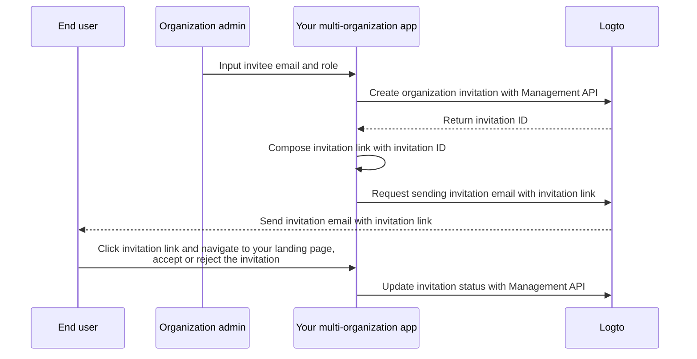

import organizationRoles from './assets/organization-roles.webp';

<head>
  <link
    rel="canonical"
    href="https://docs.logto.io/end-user-flows/organization-experience/invite-organization-members/"
  />
</head>

# Implement organization invitation

As a multi-organization application, one common requirement is to invite members to your organization. In this guide, we will walk you through the steps and technical details to implement this feature in your application.

## Flow overview

The overall process is illustrated in the diagram below:



## Create organization roles

Before inviting members to your organization, you need to create organization roles. Check out the [Configure organizations](/docs/recipes/organizations/configuration/) guide for detailed instructions.

In this guide, let's create two typical organization roles: `admin` and `member`.

The `admin` role has full access to all resources in the organization, while the `member` role has limited access. For example, each role can have a set of permissions as follows:

- `admin` role:
  - `read:data` - Read access to all organization data resources.
  - `write:data` - Write access to all organization data resources.
  - `delete:data` - Delete access to all organization data resources.
  - `invite:member` - Invite members to the organization.
  - `manage:member` - Manage members in the organization.
  - `delete:member` - Remove members from the organization.
- `member` role:
  - `read:data` - Read access to all organization data resources.
  - `write:data` - Write access to all organization data resources.
  - `invite:member` - Invite members to the organization.

This can be done easily in the Logto Admin Console. You can also use the Logto Management API to create organization roles programmatically.

<center>
  
</center>

## Configure your email connector

Since invitations are sent via email, ensure your email connector is properly configured. To send invitations, you need to configure a newly introduced email template usage type - `OrganizationInvitation`.

:::note
Logto Cloud's built-in "Logto email service" does not support the `OrganizationInvitation` usage type at the moment. Instead, you need to configure your email connector (e.g. Sendgrid) and set up the `OrganizationInvitation` template.
:::

A sample email template for the `OrganizationInvitation` usage type is shown below:

```json
{
  "subject": "Welcome to my organization",
  "content": "<p>Join my organization by this <a href=\"{{link}}\" target=\"_blank\">link</a>.</p>",
  "usageType": "OrganizationInvitation",
  "type": "text/html"
}
```

The `{{link}}` placeholder in the email content will be replaced with the actual invitation link when sending the email. In this guide, let's say it would be `https://your-app.com/invitation/accept/{your-invitation-id}`.

You can check out the [Configure popular email service](/docs/recipes/configure-connectors/email-connector/configure-popular-email-service/) guide for more details on setting up email connectors.

## Handle invitations with Logto Management API

:::note
If you haven't set up the Logto Management API yet, check out [Interact with Management API](/docs/recipes/interact-with-management-api/) for details.
:::

We've provided a set of invitation-related Management APIs in the organizations feature. With these APIs, you can:

- `POST /api/organization-invitations` create an organization invitation with an assigned organization role.
- `POST /api/organization-invitations/{id}/message` send the organization invitation to invitee via email.

  Note: This API payload supports a `link` property, you can compose your invitation link based on the invitation ID. For example:

  ```json
  {
    "link": "https://your-app.com/invitation/accept/{your-invitation-id}"
  }
  ```

  Accordingly, you need to implement a landing page when your invitee navigates through the invitation link to your application.

- `GET /api/organization-invitations` & `GET /api/organization-invitations/{id}` get all your invitations or a specific one by ID.

  On your landing page, use these APIs to list all invitations or details of an invitation that a user has received.

- `PUT /api/organization-invitations/{id}/status` accept or reject the invitation by updating the invitation status.

  Use this API to handle the user's response to the invitation.

Please be noted that all the APIs listed above requires a valid "organization access token". Check this [guide](/docs/recipes/organizations/integration/#step-2-fetch-the-organization-token) to learn how to obtain the organization access token.

## Use organization role-based access control (RBAC) to manage user permissions

With the above setups, you can now send invitations via email, and invitees can join the organization with the assigned role.

Users with different organization roles will have different scopes (permissions) in their organization access tokens. Thus, both your client app and backend services should check these scopes to determine visible features and permitted actions.

## Handle scope updates in access tokens

Managing scope updates in access tokens involves:

- Revoking existing scopes: For instance, demoting an admin to a non-admin member automatically shrinks scopes in the new access token obtained with the existing refresh token.
- Granting new scopes: Conversely, promoting a user to admin requires triggering a re-login or re-consent process to reflect the change in user access tokens.

Logto provides Management API to fetch real-time user permissions in the organization.

- `GET /api/organizations/{id}/users/{userId}/scopes`

You can then compare the scopes in the user's access token with the real-time permissions to determine if the user has been promoted or demoted.

- If promoted, trigger a re-login or re-consent process to update the user's access token. Let's take the React SDK for example:

  ```js
  const { clearAllTokens, signIn } = useLogto();

  ...
  // If fetched real-time scopes have newly assigned scopes than the organization access token scopes
  await clearAllTokens();
  signIn({
    redirectUri: '<your-sign-in-redirect-uri>',
    prompt: 'consent',
  });
  ```

  The above code will trigger a page navigation to the consent page and auto-redirect back to your app, with updated scopes in the user's organization access token.

- If demoted, you can simply clear the cached access token and the SDK will automatically issue a new one with the updated scopes.

  ```js
  const { clearAccessToken } = useLogto();

  ...
  // If fetched real-time scopes have fewer scopes than the organization access token scopes
  await clearAccessToken();
  ```

  This does not require a re-login or re-consent process. New access tokens will be issued automatically by the Logto SDK.
