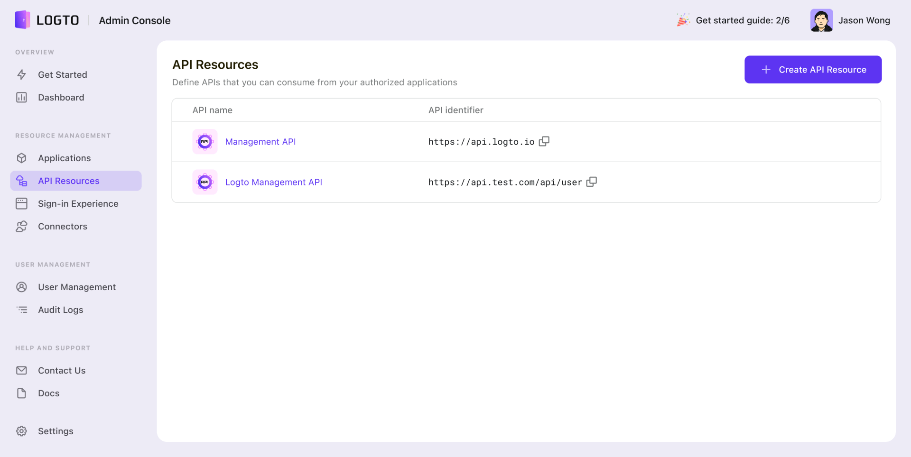
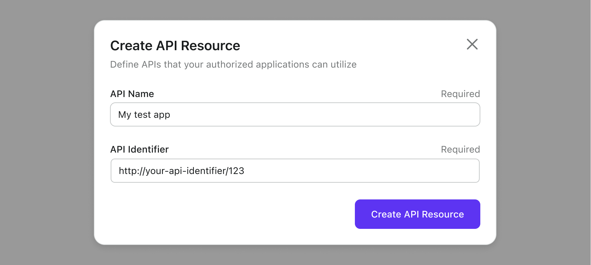
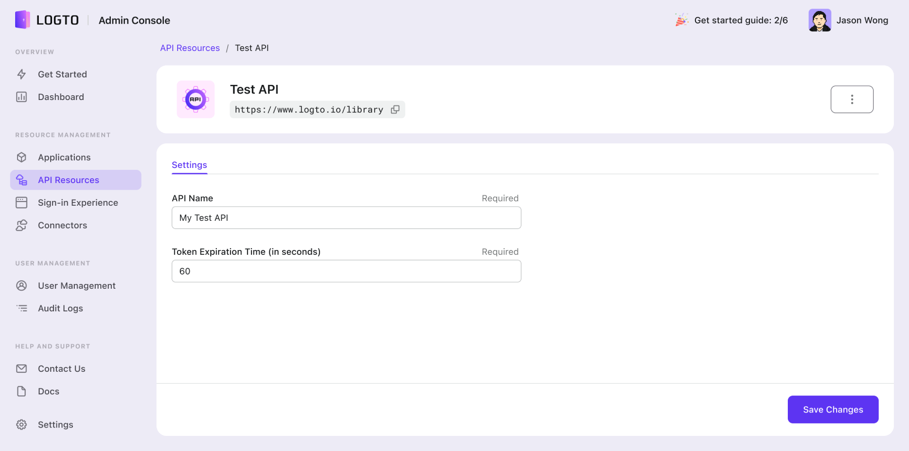

# ⚔️ Protect your API

Logto is an off-the-shelf authorization service that enables you to enforce authorization on your backend [API resources](../../references/resources/README.md) , enhancing their privacy protection.

## Register the API resources

To obtain an audience-restricted `access_token` from Logto, you must register your backend APIs. When an authorization request is received, Logto will identify the registered [API resources](../../references/resources/README.md) and grant access accordingly.

To register your APIs, navigate to the API Resources section in the console. You will see a built-in resource with the API identifier displayed as `https://tenantid.logto.app/api`. This resource encompasses all the management APIs of Logto and ensures that they are protected and accessible only to authorized users of Logto.

Click on the **Create API Resource** button and following the interactive form to create your own API resources:

- A human-readable **API Name** that may better helps you to identify this entity.
- A unique **API Identifier** (a.k.a. [Resource Indicator](../../references/resources/README.md#resource-indicator)) in URI format. It represents the identity of the API resource.

:::caution
The API Identifier is unique and used as the single source of truth for Logto, and it's **NOT** editable once created. Be careful when you create it.
:::

The new API will show up on the list once created. You may manage or delete it at the API details page by clicking on the entity.

See [API Resource Logto Schema](../../references/resources/README.md#logto-api-resource-schema) for detailed API setting definitions.

:::info
The API Resources registered in Logto Admin Console will be shared across all your applications.
:::

### Permissions and RBAC

See [🔐 RBAC](/docs/recipes/rbac) for details.

## Validate the API request's authorization token

Logto issues a standard [JWT](https://datatracker.ietf.org/doc/html/rfc7519) format authorization token for each authorized API request. The token is encrypted and signed as a [JWS](https://datatracker.ietf.org/doc/html/rfc7515) token.

### Understanding JWS token

An encoded [JWS](https://datatracker.ietf.org/doc/html/rfc7515) token is constructed with three parts:

- JOSE Header: Declares the code type and encoding algorithm
- JWS Payload: Includes all the token's claims
- JWS Signature: Signature signed with [JWK](https://datatracker.ietf.org/doc/html/rfc7517)

A standard schema of Logto issued JWS Payload: (claims may vary, based on your custom OIDC config)

| key       | description                       |
| --------- | --------------------------------- |
| jti       | unique JWT ID                     |
| sub       | subject, usually user-id          |
| iat       | timestamp token issues at         |
| exp       | timestamp token expires at        |
| client_id | application id                    |
| iss       | token issuer identity             |
| aud       | audience of the token             |
| scope     | scopes (permissions) of the token |

:::info
For development, to visually inspect a JWT token, you could visit [jwt.io](https://jwt.io/) to decode and check the tokens you received. Be careful with or never use the tokens from a production environment. As this is a third party provided public online service, your token may be exposed.
:::

### Validate the authorization token

1. [Validating a JWT](https://datatracker.ietf.org/doc/html/rfc7519#section-7.2)
2. [Validating the JWS signature](https://datatracker.ietf.org/doc/html/rfc7515#section-5.2)
3. The token's issuer is `https://<your-logto-domain>/oidc` (issued by your Logto auth server)
4. The token's audience is equal to the current receiver's resource indicator registered in Logto Admin Console
5. The token is within its expiration time
6. ([🔐 RBAC](/docs/recipes/rbac/) only) The token has the desired `scope`

There are various open-source libraries and packages that can help you to validate and decode a JWT token easily. You may pick one and integrate with your backend application based on the language and framework you are using. Please check some of the examples we have:

- [Node (Express)](./node)
- [Spring Boot](./spring-boot)
- [Python](./python)

## Reference

Logto uses the code-based OAuth 2.0 Authorization Protocol to make your API request safe. If you are interested in the strategy behind it, refer to OAuth 2.0's [specification](https://datatracker.ietf.org/doc/html/rfc6749#section-1.3.1) for more details.
