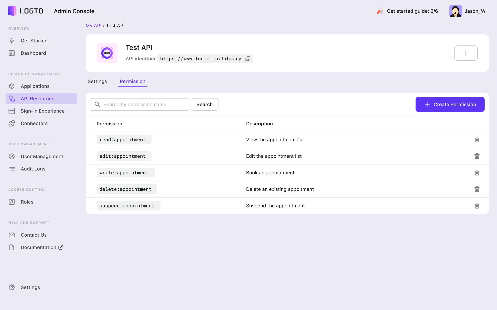
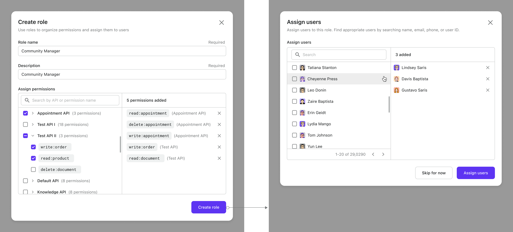
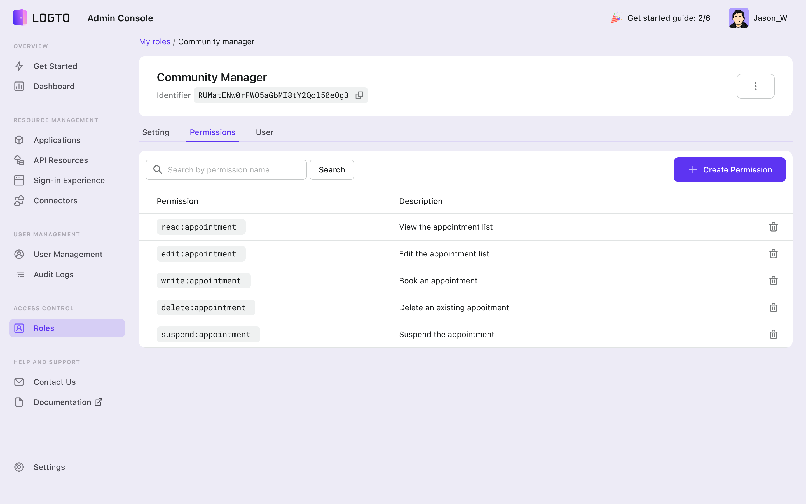
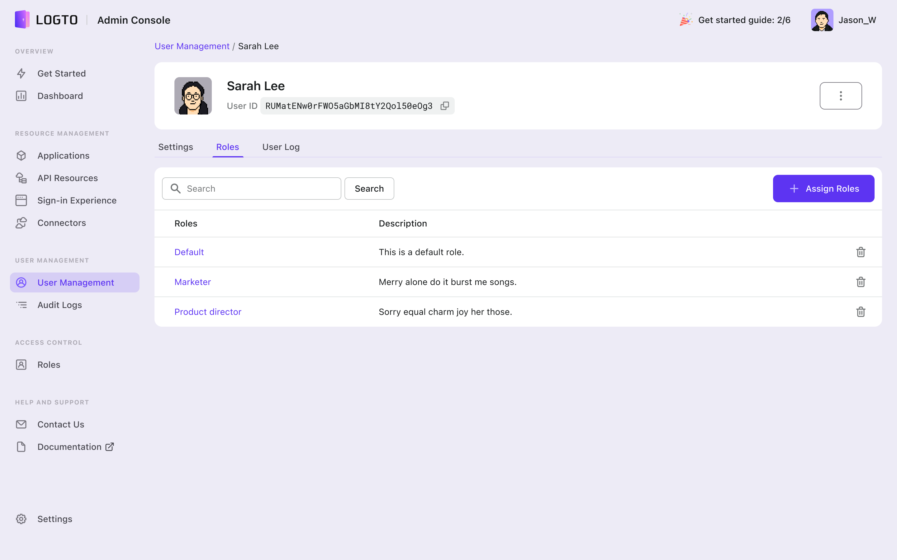

# 🔐 Role Based Access Control (RBAC)

## What is RBAC

Role-based access control (RBAC) is a method of assigning permissions to users based on their roles. By controlling access to resources through role authorization, RBAC can help in different perspectives:

1. Improved security: By assigning permissions based on roles, RBAC limits access to resources only to those who need it. This reduces the risk of unauthorized access and data breaches.
2. Greater efficiency: RBAC allows for quick and easy addition and modification of roles and permissions and implementing them across APIs, making it easy to manage access rights for large numbers of users.
3. Reduced administrative overhead: RBAC eliminates the need for manual assignment of permissions and reduces the potential errors.
4. Better compliance: RBAC can help organizations comply with regulatory and statutory requirements for confidentiality and privacy by ensuring that only authorized users have access to sensitive data.
5. Flexibility: RBAC can be easily customized and adapted to suit the specific needs of an organization, making it a versatile access control method.
6. Scalability: RBAC can be implemented in an organization of any size, from small businesses to large enterprises, and can be easily scaled up or down as necessary.

## RBAC in Logto

In Logto, we have implemented Role-based Access Control (RBAC) using the most standard and scalable method, allowing for a wide range of scenarios. To understand how it works, it's important to familiarize yourself with key terms:

### Permission (Scope)

Permission refers to the authorization to access a resource. In a system, entities such as orders, products, and documents can be designated as resources, and various actions can be assigned.

Permission was implemented at the API level in Logto.

Examples of permissions, including the ability to edit an order, delete a product, and read a document, are as follows:

- `write:orders`
- `read:documents`
- `delete:products`

### Roles

Roles are a grouping of permissions that can be assigned to users. They also provide a way to aggregate permissions defined for different APIs, making adding, removing, or adjusting permissions more efficient than assigning them individually to users.

## Manage RBAC in Admin Console

### Create and delete permissions in API resource

In Logto, permissions are set at the API level. You can navigate to the "API" section, select "API details" and then the "Permission" tab. To create a new permission, click the "Create permission" button on the top right corner. It's important to provide a name and details for the permission, as it will make it easier to identify and manage security.



### Create roles in Access Control

At Logto, we provide a dedicated space for Role-based Access Control (RBAC). In the left navigation menu, you'll see "Roles" which will display a list of roles you've defined. To create a new role, click on "create role" button on the top right corner. A dialog box will appear, where you can give the role a name and description, and assign one or more permissions to the role.

1. Keep in mind that while it is technically possible to create a role without permissions or users assigned, it is not recommended to create too many empty roles. This will disrupt the harmony of role management and render the RBAC system ineffective.
2. Permissions are grouped by API in the selector, allowing you to add them in bulk or select them individually. The selected permissions will be displayed on the right side.
3. After creating a role, you will be taken to the user assignment page, where you can authorize the role to specific users. You can search for users by name, email, phone number, username or ID if available. If you prefer, you can also skip this step and assign users to the role later.



### Role details page

After completing the role creation and assignment process, you will be directed to the role details page. The layout and controls on this page are consistent with other entities. To delete the role, click the three dots button.

You can also edit the role name and description, view the permissions assigned to the role, and see the users who have been assigned to the role at any time.

:::danger
Deleting the role will eliminate the permissions linked to it for the impacted users and delete the connection between roles, users, and permissions.
:::

### Assign or remove users from roles

To add more users to a role, navigate to the role's details page and select "users." From there, click "assign roles" to open a list of users. Search or browse for the desired users and click "assign" to add them to the role. To remove a user from the role, click the trash icon.

:::danger
Taking users out of a designated role does not delete them from your user base, they will still exist but will no longer have access to the permissions associated with that role.
:::


### Assign or remove permissions from roles

If you need to change the capabilities of a role, you can easily do so by assigning or removing permissions. Simply go to the "roles - role details - permission tab" and click on "assign permissions." From there, you can select the permissions you want to add to the role. To remove any permissions, click on the trash icon in the table.

:::danger
If this permission is deleted, the affected user with this role will lose the access granted by this permission.
:::



### Assign or remove roles from users

You've learned how to manage roles by assigning or removing users from them, but you can also achieve the same result from the user's perspective. If you need to change a user's access control, go to "user management - user detail - role tab." From there, you can easily add or remove existing roles to meet your desired outcome.

:::danger
Removing a role from a user means that the user will no longer have access to the permissions associated with that role. The role itself will still exist, but it will no longer be linked to that specific user.
:::



## How to protect your resource with RBAC

### Add scopes to access token

When integrating with your application, ensure that you include both `scope` and `resources` in the configuration when importing and initializing the LogtoClient.

```
scopes = "<your-scope>"
resources = "<your-resource>"
```

This will ensure that if a user has access to them, they will be added to the access token. The specific parameters and syntax may vary depending on the language and platform of your app. Refer to the [application integration guide](/docs/recipes/integrate-logto/) for more information on adding scopes and resources.

:::tip
In code, the term "scope" is used to align with OIDC standards. However, in the Admin Console, it is referred to as "permission" for better readability and understanding of the real-world scenario. Both terms refer to the same concept.
:::

### Validate scopes in access token

Don't forget to validate the scopes in the access token. To accomplish that, you can utilize a JWT library to decode the token and check the "scope" claim. Logto issues a standard JWT format authorization token for each authorized API request, which could include a "scope" claim that holds a list of the scopes that the token has been issued for. By checking if the required scope is present in the list, you can confirm the validity of the scope. For more information, please refer to the "[Validate the API request's authorization token](/docs/recipes/protect-your-api/#validate-the-api-requests-authorization-token)" section.
