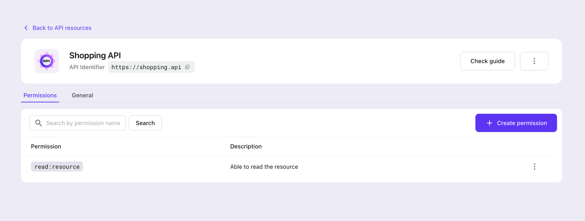
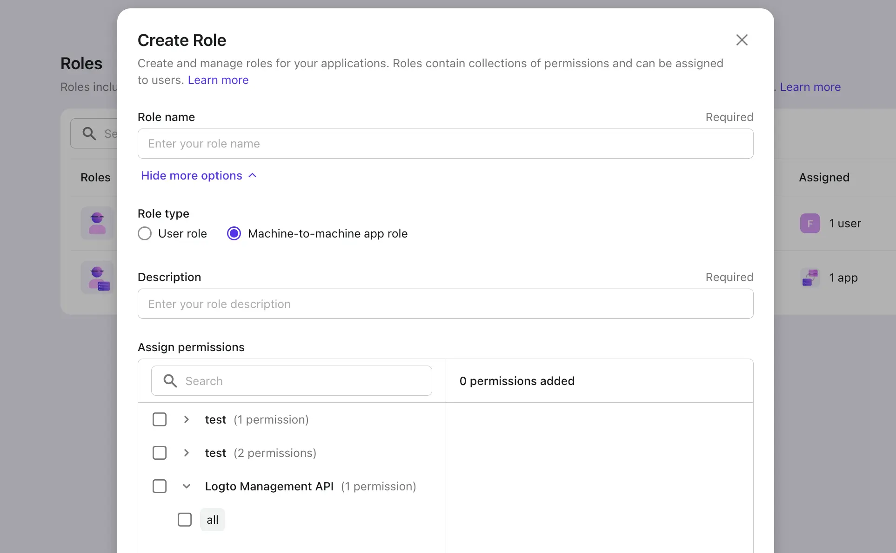
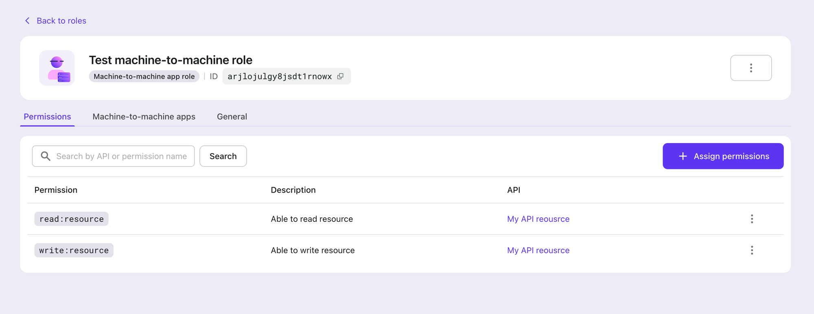
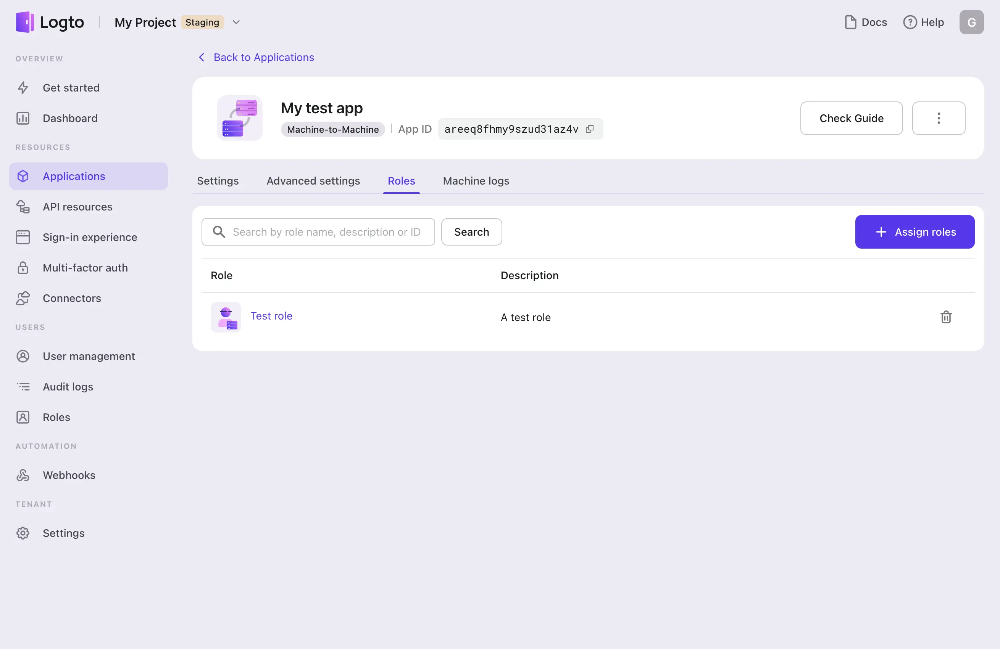

# Manage permissions and roles

:::info
This page is for managing permissions and roles via Admin Console. For managing them via Logto Management API, please refer to [API reference](/api) and [🚝 Interact with Management API](../interact-with-management-api/README.md).
:::

## Manage API resource permissions

:::note
The Logto Management API resource is immutable. A new API Resource is needed if you want to protect your API with a different set of permissions.
:::

Permissions are set **in the API resource level**. Navigate to the "API resources" tab, click the API resource you want to manage, and then go to the "Permissions" tab.

To create a new permission, click the "Create permission" button in the top right corner. It's important to provide a name and details for the permission, as it will make it easier to identify and manage permissions.

To delete a permission, click the trash bin icon in the very right of the row.

## Manage roles

### Create and define a new role

A role is a group of permissions. Navigate to the "Roles" tab, and you'll see a list of roles you've defined.

To create a new role, click the "Create Role" button in the top right corner. A dialog box will appear, where you can give the role a name and description, and assign one or more permissions to the role.

1. Keep in mind that while it is technically possible to create a role _without_ permissions or users assigned, it is not recommended to create too many empty roles. This will disrupt the harmony of role management and render the RBAC system ineffective.
2. Permissions are grouped by API in the selector, allowing you to add them in bulk or select them individually. The selected permissions will be displayed on the right side.
3. A new role has two available types: "User role" or "Machine-to-machine app role".

**Constraints**

- After creating a role, you cannot modify its type.
- The Logto Management API resource can only be accessed by machine-to-machine application roles.

Depending the type of role you choose, you will be able to assign users or machine-to-machine applications to the role once it is created.

### View or update a role

After completing the role creation and assignment process or click a role name in the roles list, you will be directed to the role details page. The layout and controls on this page are consistent with other entities. To delete the role, click the three dots button.

You can also edit the role name and description, inspect and manage the permissions and users assigned to the role at any time.

:::danger
Deleting the role will eliminate all the permissions linked to it for the impacted users and delete the connection between roles, users or apps, and permissions.
:::

### Manage users or apps in roles

Depending on the type of role you choose, you will be able to assign or remove users or machine-to-machine applications in the role details page.

Click the "Users" or "Machine-to-machine apps" tab to view the users or apps assigned to the role. To add user(s) or app(s) to the role, click the "Assign users" or "Assign applications" button in the top right corner.

To remove a user or app from the role, click the trash bin icon in the very right of the row.

### Manage role permissions

If you need to change the capabilities of a role, you can easily do so by assigning or removing permissions.

- To assign new permissions, simply go to the "Permissions" and click "Assign Permissions." From there, you can select the permissions you want to add to the role.
- To remove existing permissions, click on the trash bin icon in the very right of the row.

:::caution
If a permission is deleted, users with this role will lose the access granted by this permission.
:::

## Manage roles from the details page of a user or app

You can find a "roles" tab in the details page of a user or app. Click the tab to view and manage the roles assigned to the user or app.

