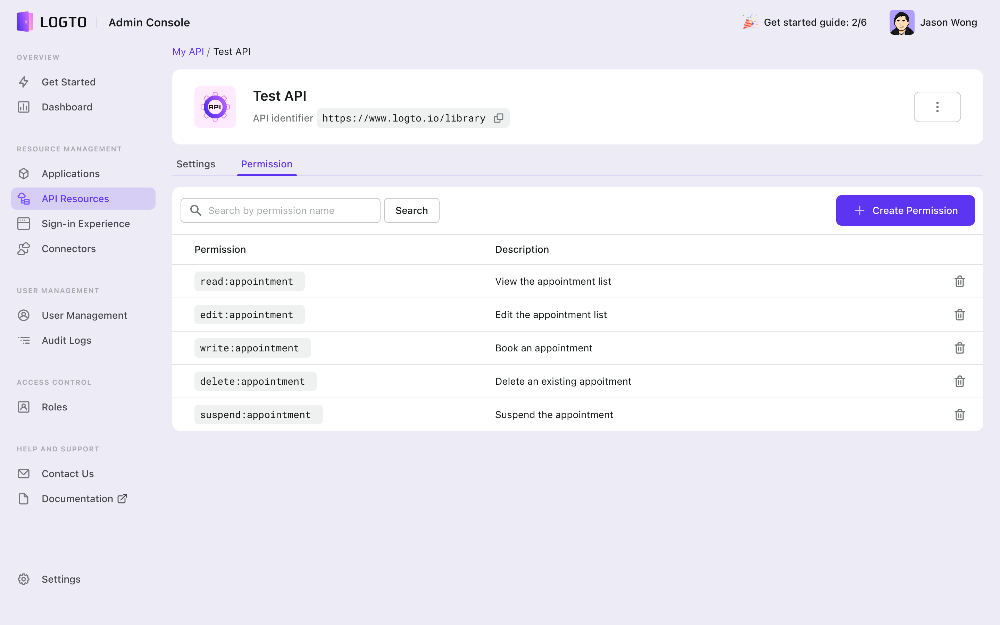
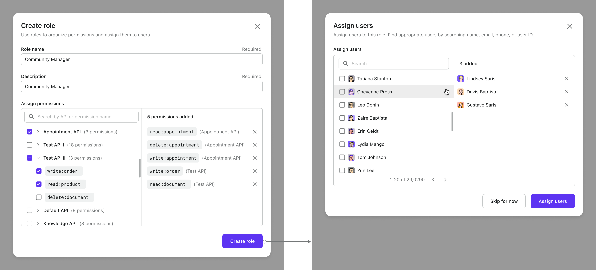
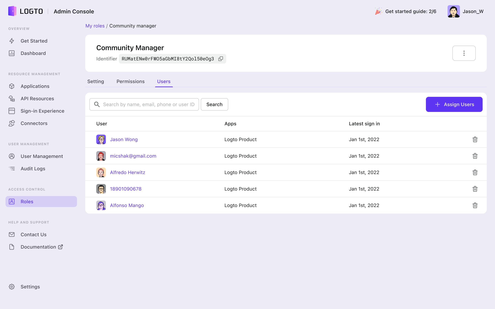
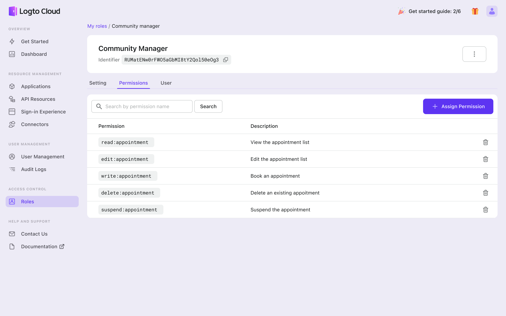
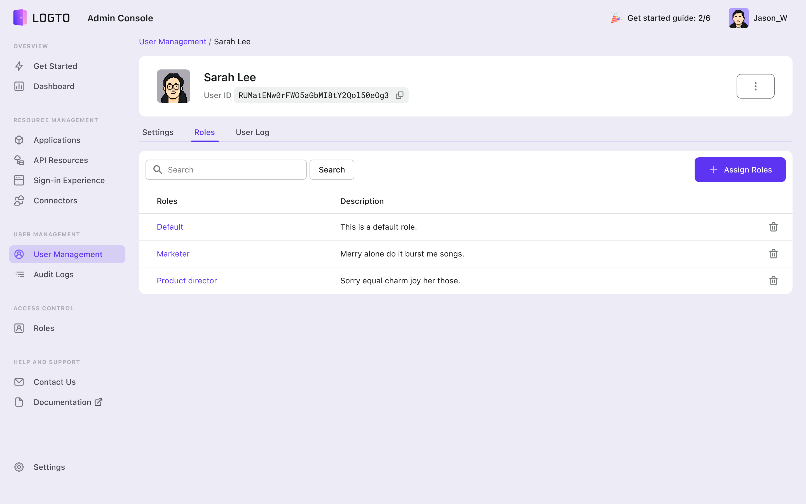

# Manage permissions and roles

:::info
This page is for managing permissions and roles via Admin Console. Visit [API Reference](/api) for RESTful APIs.
:::

## Manage API Resource permissions

:::note
The pre-defined Logto Management API is immutable. A new API Resource is needed to proceed.
:::

Permissions are set in the API Resource level. Navigate to the "API Resources" tab, click the API Resource you want to manage, and then go to the "Permissions" tab.

To create a new permission, click the "Create permission" button in the top right corner. It's important to provide a name and details for the permission, as it will make it easier to identify and manage permissions.

To delete a permission, click the trash bin icon in the very right of the row.

## Manage roles

### Create and define a new role

A role is a group of permissions. Navigate to the "Roles" tab, and you'll see a list of roles you've defined.

To create a new role, click the "Create Role" button in the top right corner. A dialog box will appear, where you can give the role a name and description, and assign one or more permissions to the role.

1. Keep in mind that while it is technically possible to create a role _without_ permissions or users assigned, it is not recommended to create too many empty roles. This will disrupt the harmony of role management and render the RBAC system ineffective.
2. Permissions are grouped by API in the selector, allowing you to add them in bulk or select them individually. The selected permissions will be displayed on the right side.
3. After creating a role, you will be taken to the user assignment page, where you can authorize the role to specific users. You can search for users by name, email, phone number, username or ID if available. If you prefer, you can also skip this step and assign users to the role later.

### View or update a role

After completing the role creation and assignment process or click a role name in the roles list, you will be directed to the role details page. The layout and controls on this page are consistent with other entities. To delete the role, click the three dots button.

You can also edit the role name and description, inspect and manage the permissions and users assigned to the role at any time.

:::danger
Deleting the role will eliminate all the permissions linked to it for the impacted users and delete the connection between roles, users, and permissions.
:::

### Add users to roles

To add more users to a role, navigate to the role's details page and click the "Users" tab. Then, click "Assign Users" to open the dialog.

Search or browse for the desired users and click "Assign Users" to add them to the role.

### Remove users from roles

To remove a user from the role, under the "Users" tab, click the trash bin icon in the very right of the row.

:::info
Taking users out of a designated role does not delete them from your user base, they will still exist but will no longer have access to the permissions associated with that role.
:::

### Manage role permissions

If you need to change the capabilities of a role, you can easily do so by assigning or removing permissions.

- To assign new permissions, simply go to the "Permissions" and click "Assign Permissions." From there, you can select the permissions you want to add to the role.
- To remove existing permissions, click on the trash bin icon in the very right of the row.

:::caution
If a permission is deleted, users with this role will lose the access granted by this permission.
:::

## Manage a user's roles

You've learned how to manage roles by assigning or removing users from them, but you can also achieve the same result from the user's perspective.

If you need to change a user's access, go to the "User Management" tab and click the desired user name. In the "Roles" tab of the user details page, you can easily assign or remove roles to meet your desired outcome.

:::caution
Removing a role from a user means that the user will no longer have access to all the permissions associated with that role. The role itself will still exist, but it will no longer be linked to that specific user.
:::

